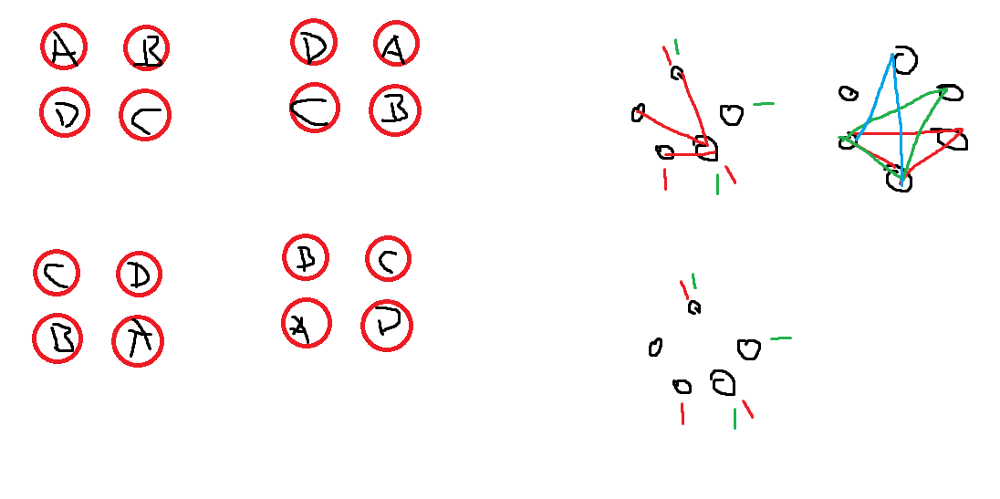

- příklady z první hodiny
	- 1b – hledáme nejtěžší minci (n – 1)
		- proč to nejde rychleji?
		- k vytvoření souvislého grafu o n vrcholech je potřeba n–1 hran (-> strom)
	- 1c – hledáme druhou nejtěžší minci
		- vážení po dvojicích, najdeme nejtěžší, mince, které jsme s ní porovnávali, si dáme stranou a hledáme nejtěžší mezi nimi
	- 1d – robot se 3 rukama (2n – 3)
		- proč to nejde rychleji?
		- robot musí držet dosud 2 nejtěžší -> použije 2 ruce
		- nevíme, která mince je správná, takže musíme vzít všechny
		- kandidáta poměříme s 1. nebo 2.
		- lze vynutit poměření kandidáta s oběma (v nejhorším případě)
	- 1e – nejtěžší poštou
		- vážení každého s každým → $\frac{n^2-n}{2}$
	- 2 – průchod tunelu (12 minut)
		- 2 otec s matkou
		- 1 otec
		- 5 syn s dcerou
		- 2 matka
		- 2 otec s matkou
	- 3 – kelímkomat
		- 

## Přednáška

- prezentaci budeme mít k dispozici online, často bude rozšířená oproti přednášce, budou tam ukázkové programy
- kurz v Moodlu
- zkouška
	- společné pořadavky a zkušební termíny pro obě paralelky
	- přihlašování přes SIS
	- je nutné mít zápočet
	- povinná písemná část, nepovinná ústní
- materiály
	- Pavel Töpfer: Algoritmy a programovací techniky
	- programátorské kuchařky KSP
	- https://pruvodce.ucw.cz

### Algoritmus

- Konečná posloupnost elementárních příkazů, jejichž provádění umožňuje pro každá přípustná vstupní data mechanickým způsobem získat po konečném počtu kroků příslušná výstupní data.
- vlastnosti algoritmu – konečnost, hromadnost, resultativnost, jednoznačnost, determinismus (nebude na zkoušce :)
	- determinismus – po provedení každého kroku je jednoznačně určeno, který krok se bude provádět dále
- formální modely algoritmu – rekurzivní funkce, Turingův stroj, lambda kalkul, RAM počítač
- popis a zápis algoritmu – slovní popis v přirozeném jazyce, pseudokód, program (zjednodušená konstrukce programovacího jazyka)
- největší společný dělitel
- správnost Eukleidova algoritmu
	1. konečnost = výpočet pro jakákoliv vstupní data skončí
		- na začátku výpočtu i stále v jeho průběhu je x > 0, y > 0
		- v každém kroku výpočtu se hodnota x+y sníží alespoň o 1 -> nejpozději po x+y krocích výpočet skončí, je tedy konečný
	2. parciální správnost
- problém stabilních manželství
- složitost – časová a prostorová
- efektivita algoritmu – funkce velikosti vstupních dat
	- přesné vyjádření časové složitosti je obtížné a zbytečné, podstatná je řádová rychlost růstu této funkce pro rostoucí N
	- zanedbáním pomaleji rostoucích členů a konstant získáme **asymptotickou časovou složitost**, např. $O(N^2)$
		- symbol "velké O"
		- $f\in O(g)$
			- funkce f se dá shora odhadnout funkcí g (až na multiplikativní konstantu a pro dostatečně velká n)
			- $f,g: \mathbb{N}→\mathbb{R}^+$
			- $f\in O(g) \iff \exists c > 0\ \exists n_0\ \forall n>n_0: 0\leq f(n) \leq c \cdot g(n)$
		- jde o odhad shora
	- opačný odhad zdola $f \in \Omega(g)$
	- přesný odhad $f \in \Theta(g)$
		- $f \in \Theta(g) \iff f \in O(g)\land f \in \Omega(g)$
- asymptotická časová složitost
	- typické třídy asymptotické časové složitosti algoritmů $\Theta(1), \Theta(\log{N}), \Theta(n), \Theta(N \cdot \log{N}), \Theta(N^2), \Theta(N^3), \dots, \Theta(2^N), \Theta(N!)$
	- problém batohu
	- někdy se používá f = O(g), což není formálně zcela správné, protože O(g) je třída funkcí
- složitost algoritmu v různých případech – v nejlepším (prakticky se nepoužívá), nejhorším (používá se nejčastěji) a průměrném (je obtížné odvodit tuto složitost)
	- algoritmus problému stabilních manželství – v nejhorším případě $\Theta(n)$, v nejlepším případě $\Theta(n^2)$
- složitost problému – složitost nejlepšího algoritmu (z hlediska časové složitosti), kterým lze řešit daný problém; odvození bývá často obtížné, pro řadu problémů neznáme
	- složitost problému vnitřního třídění – $O(n \cdot \log{n})$
- rozklad čísla na cifry
- test prvočíselnosti
	- zkouším všechny dělitele od 2 do $N-1 → O(N)$
	- zkouším všechny dělitele od 2 do $N/2 → O(N)$
	- zkouším všechny dělitele od 2 do $\sqrt{N} → O(\sqrt{N}) = O(N^\frac{1}{2})$ – asymptoticky lepší
		- nepoužíváme odmocninu, ale druhou mocninu (násobení)
	- přestanu při nalezení prvního dělitele – také $O(\sqrt{N})$
	- stačí zkusit číslo 2 a pak jen liché dělitele lichých čísel
- hledání všech prvočísel od 2 do N
	- pomalý způsob $O(N^\frac{3}{2})$ – pro každé číslo zkouším, jestli je prvočíslo (viz výše)
	- Eratosthenovo síto – vyškrtáváme násobky prvočísel
		- složitost $O(N\cdot \log{\log{N}})$
- dlouhá čísla
	- Python to umí sám
	- číslo uložíme po cifrách – seznam cifer (uložíme jako pole čísel)
	- operace po cifrách jako na základní škole
	- lze ukládat cifry po trojicích apod.
	- desetinné číslo – evidujeme polohu desetinné čárky

## Cviko

- elementární krok se dá zvládnout na konstatní počet kroků (?)
- koza, zelí, vlk, lodička – převážím na lodi, do lodě se vejde jenom jedno z toho, nesmím kozu se zelím ani kozu s vlkem nechat pohromadě

- kelímkomat
	- pozorování
		- můžeme táhnout 1) vedle sebe, 2) úhlopříčně
		- umíme sáhnout na 3 různé kelímky, kelímkomat nám může 1 kelímek skrýt
		- chceme úhlopříčně kelímky
	- b) robot
		- plní příkazy – otoč kelímek, otoč dnem vzhůru, otoč dnem dolů, nech tak
		- nepoví nám stav
		- kroky 1 a 2 jsou stejné – všechny dnem vzhůru kromě jednoho
		- krok 3 – vedle sebe jeden otoč
		- krok 4 – úhlopříčně oba otoč
		- krok 5 – vedle sebe oba otoč
	- c) pět kelímků – neexistuje poslední krok
	- d) ukázat totéž
	- e) ?
- vážení mince
	- logaritmus o základu dva – kolikrát musím rozpůlit hromádku věcí, aby mi zbyla jedna věc
	- dolní odhad – tu nejtěžší chci vážit s co nejméně mincemi
- doma rozmyslet 3d, 3e, 1e (proč nemůže chybět jeden)