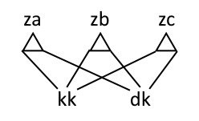

# Zkouška

## Vyhledávání v textu

- Definice: Terminologie okolo řetězců (podslova, prefixy, suffixy)
	- slovo $\alpha$ … konečná posloupnost znaků z abecedy $\Sigma$
	- prázdný řetězec $\varepsilon$
	- $i$-tý znak $\alpha[i]$ (počítáme od nuly)
	- podřetězec/podslovo $\alpha[i:j]$ (od i-tého znaku do (j-1). znaku včetně)
	- prefix $\alpha[:j]=\alpha[0:j]$
	- suffix $\alpha[i:]=\alpha[i:|\alpha|]$
	- $\alpha[:]=\alpha$
- Algoritmus: Knuth-Morris-Pratt (jedna jehla v seně)
	- udržujeme si informaci o tom, jakým nejdelším prefixem jehly končí zatím přečtená část sena
	- tento prefix postupně zvětšujeme – pokud nejde zvětšit, pomocí zpětné funkce získáme menší prefix jehly a zkusíme zvětšit ten
	- pro získání zpětné funkce stačí postavit vyhledávací automat nad jehlou
		- vrcholy (stavy) = prefixy jehly (od prázdného prefixu $\varepsilon$ k celé jehle)
		- dopředné hrany … spojují prefixy zleva doprava
		- zpětné hrany … odpovídají zpětné funkci (např. z `barba` vede zpětná hrana do `ba`)
	- algoritmus rozdělíme na tři
		- KmpKrok
			- spouštíme pro nově přečtený znak a aktuální stav, vrátí nám nový stav
			- algoritmus projde po zpětných hranách (postupně zkouší kratší a kratší prefixy), dokud nedojde do stavu 0 ($\varepsilon$) nebo nenajde prefix, který pokračuje tím přečteným znakem
			- pokud ten prefix najde, tak stav zvýší o jedna
			- implementační detail: za poslední znak jehly musíme připojit fiktivní znak (takový, který se v seně nevyskytuje)
		- KmpHledej
			- spouštíme pro seno a automat nad jehlou, postupně jsou hlášeny jednotlivé výskyty
			- iterujeme přes všechny znaky sena a spouštíme KmpKrok
			- pokud se stav rovná délce jehly, ohlásíme výskyt
			- časová složitost $\Theta(S)$
				- pro každý znak se prochází nejvýše po jedné dopředné hraně
				- každá zpětná hrana vede aspoň o jeden stav doleva – tedy průchodů po zpětných hranách bude nejvýše tolik, po kolika dopředných hranách jsme prošli
		- KmpKonstrukce
			- nastavíme zpětnou hranu ze stavu 1 do stavu 0
			- provádíme jakoby KmpHledej, akorát jako seno použijeme jehlu bez prvního znaku
			- na základě výsledného stavu z každého kroku algoritmu nastavíme zpětnou hranu
			- časová složitost $\Theta(J)$
	- celkem čas $\Theta(J+S)$
- Algoritmus: Aho-Corasicková (více jehel v seně)
	- automat = trie
		- stavy = prefixy jehel
		- dopředné hrany = přidání jednoho znaku na konec ($\alpha\to\alpha x$)
		- konce jehel (označíme v trii)
		- zpětné hrany – vedou z $\alpha$ do nejdelšího vlastního suffixu $\alpha$, který je stavem (tohle obvykle v trii nebývá)
		- zkratkové hrany – vedou z $\alpha$ do nejbližšího stavu dosažitelného po zpětných hranách, kde končí jehla (použijeme při hlášení výskytů)
	- reprezentace automatu
		- stavy očíslujeme – kořen má číslo 0, ostatní vrcholy libovolná různá
		- pole Dopředu(stav, písmenko) – obsahuje další stav (podle dopředné hrany)
		- pole Slovo(stav) – končí v daném stavu slovo?
		- pole Zpět(stav) – číslo stavu, kam vede zpětná hrana (kromě kořene je vždy právě jedno)
		- pole Zkratka(stav) – číslo stavu, kam vede zkratková hrana
	- algoritmy/procedury
		- AcKrok
			- na vstupu aktuální stav a přečtený znak, na výstupu nový stav
			- projde dopředu po jedné hraně z aktuálního stavu nebo zkouší procházet po zpětných hranách, dokud nebude moct projít dopředu (přinejhorším vrátí kořen)
		- AcHledej
			- na vstupu seno a automat, postupně ohlašuje výskyty
			- spouští AcKrok pro každý znak sena
			- pokud je v daném stavu označen konec jehly, hlásí výskyt
			- prochází po zkratkových hranách a hlásí jednotlivé výskyty
			- složitost $\Theta(S+V)$, kde $S$ je délka sena a $V$ je počet výskytů
		- AcKonstrukce
			- nejdříve sestrojíme trii
			- zpětné hrany můžou vést křížem mezi větvemi stromu
			- proto je konstruujeme po hladinách (BFS, pomocí fronty)
			- pro vrchol $v$ a rodiče $r$ zkusíme k vrcholu Zpět(r) přidat písmeno na hraně $rv$, čímž dostaneme Zpět(v)
			- pokud pokud je Zpět(v) konec jehly, tak Zkratka(v) nastavíme na Zpět(v), jinak nastavíme Zkratka(v) na Zkratka(Zpět(v))
			- algoritmus jakoby hledá všechny jehly (jako u KMP)
			- složitost $\Theta(J)$, kde $J$ je součet délek jednotlivých jehel
	- celkem čas $\Theta(J+S+V)$
- Algoritmus: Rabin-Karp (okénkové hešování)
	- hledání jedné jehly
	- zahashuju si posloupnost $J$ znaků a porovnám s hashem jehly
	- hashovací funkce pro řetězec $x_1\dots x_J$
		- $h(x_1,\dots,x_J)=x_1P^{J-1}+x_2P^{J-2}+\dots+x_JP^0\mod M$
	- postupně přehashovávám pro každý takový úsek sena (hashování v lineárním čase, přehashování v konstantním)
		- $h(x_2,\dots,x_{J+1})=P\cdot h(x_1,\dots,x_j)-x_1 P^J+x_{J+1}\mod M$
	- pokud se hash posloupnosti znaků shoduje s hashem jehly, ověříme, zda je to opravdu jehla
	- průměrná časová složitost $\Theta(J+S+JV+{SJ\over M})$ pro rovnoměrnou hashovací funkci
		- jehlu hashujeme lineárně Hornerovým schématem
		- provádíme $S$ přepočítání hashovací funkce
		- nahlášení každého výskytu trvá $JV$ (ověřujeme, zda je to jehla)
		- pro dvě různé posloupnosti znaků se hashe shodují s pravděpodobností $1/M$ (viz věta o počtu kolizí) – takže průměrně $\Theta({SJ\over M})$ strávíme kontrolou falešně pozitivních výsledků
		- chceme $M\in\Omega(SJ)$, abychom minimalizovali vliv kolizí
	- naše polynomiální hashovací funkce není dokonale rovnoměrná (místo $1/M$ bude pravděpodobnost kolize $J/M$), ale podrobnější analýza nebude zkoušena
- Věta: Počet kolizí u okénkového hešování
	- pro dokonale rovnoměrnou hashovací funkci $1/M$ pro $M$ okének
	- přesnější odhad nebude na zkoušce

## Toky v sítích

- Definice: Síť, tok, přebytek, velikost toku
	- síť je čtveřice
		- orientovaný graf $(V,E)$
			- BÚNO symetrický ($uv\in E\implies vu\in E$)
			- chybějící hrana má jakoby nulovou kapacitu
		- zdroj $z\in V$
		- spotřebič $s\in V,\,s\neq z$
		- kapacity $c:E\to\mathbb R_0^+$
	- tok je funkce $f:E\in\mathbb R_0^+$ taková, že
		- $\forall e\in E:f(e)\leq c(e)$
		- Kirchhoffův zákon
			- zákon zachování, tekutina se nám nikam neztrácí
			- $\forall v\in V\setminus\set{z,s}:f^\Delta(v)=0$
	- pro $v\in V$
		- přítok $f^+(v)\coloneqq \sum_{uv\in E} f(uv)$
		- odtok $f^-(v)\coloneqq \sum_{vw\in E}f(vw)$
		- přebytek $f^\Delta(v)\coloneqq f^+(v)-f^-(v)$
	- velikost toku $|f|\coloneqq f^\Delta(s)$
- Definice: Řez, kapacita řezu
	- $E(A,B)\coloneqq E\cap (A\times B)$
	- tedy $E(A,B)=\set{uv\in E\mid u\in A\land v\in B}$
	- řez je $E(A,B)$ pro $A\subseteq V,\;B=V\setminus A$
		- přičemž $z\in A,\;s\in B$
	- kapacita řezu $c(A,B)\coloneqq \sum_{e\in E(A,B)} c(e)$
	- $f(A,B)\coloneqq \sum_{e\in E(A,B)} f(e)$
	- $f^\Delta(A,B)\coloneqq f(A,B)-f(B,A)$
- Věta: Velikost toku se dá měřit na každém řezu
	- lemma: pro každý řez $E(A,B)$ a každý tok $f$ platí $f^\Delta(A,B)=|f|$
	- důkaz
		- $\sum_{v\in B}f^\Delta(v)=f^\Delta(s)=|f|$
			- podle Kirchhoffova zákona
		- $\sum_{v\in B}f^\Delta(v)=f(A,B)-f(B,A)=f^\Delta(A,B)$
			- hrany zleva doprava přispívají kladně
			- hrany zprava doleva přispívají záporně
			- ostatní hrany nepřispívají
- Definice: Rezerva hrany, nasycená hrana
	- rezerva hrany $uv$
		- $r(uv)\coloneqq c(uv)-f(uv)+f(vu)$
	- hrana je nasycená $\equiv$ má nulovou rezervu
	- hrana je nenasycená $\equiv$ má kladnou rezervu
- Algoritmus: Ford-Fulkerson (zlepšující cesty)
	- cesta je nenasycená $\equiv$ žádná její hrana není nasycená / všechny mají kladné rezervy
	- algoritmus
		- iterujeme, dokud existuje nenasycená cesta ze zdroje do stoku
		- spočítáme rezervu celé cesty (minimum přes rezervy hran cesty)
		- pro každou hranu upravíme tok – v protisměru odečteme co nejvíc, zbytek přičteme po směru
	- pro celočíselné kapacity vrátí celočíselný tok
	- racionální kapacity převedeme na celočíselné
	- pro iracionální kapacity se může rozbít
	- lemma: pokud se algoritmus zastaví, vydá maximální tok
		- algoritmus se zastavil
		- množinu vrcholů, do nichž existuje nenasycená cesta ze zdroje označíme jako $A$, ostatní vrcholy budou v množině $B$
		- všimneme si, že $E(A,B)$ je řez
		- hrany řezu mají zjevně nulovou rezervu
		- po hranách řezu vedoucích z A do B teče tok rovný kapacitě, po hranách z B do A neteče nic
		- nalezli jsme tedy řez $E(A,B)$, pro nějž $f^\Delta(A,B)=c(A,B)$
		- tedy tento řez je minimální a tok $f$ maximální
	- věta: pro každou síť s racionálními kapacitami se Fordův-Fulkersonův algoritmus zastaví a vydá maximální tok a minimální řez
		- vzhledem k operacím, které algoritmus provádí, nemůže z celých čísel vytvořit necelá
	- důsledek: velikost maximálního toku je rovna kapacitě minimálního řezu
	- důsledek: síť s celočíselnými kapacitami má aspoň jeden z maximálních toků celočíselný a Fordův-Fulkersonův algoritmus takový tok najde
- Věta: Minimální řez je stejně velký jako maximální tok
	- pro každý tok $f$ a každý řez $E(A,B)$ platí $|f|\leq c(A,B)$
	- důkaz: $|f|=f^\Delta(A,B)=f(A,B)-f(B,A)\leq f(A,B)\leq c(A,B)$
	- pokud $|f|=c(A,B)$, pak je tok $f$ maximální a řez $E(A,B)$ minimální
	- z analýzy Fordova-Fulkersonova algoritmu plyne, že velikost maximálního toku je rovna kapacitě minimálního řezu
- Definice: Průtok (čistý tok)
	- toku $f$ přiřadíme průtok $f^*$ takto: $f^*(uv)\coloneqq f(uv)-f(vu)$
	- pozorování
		- $f^*(uv)=-f^*(vu)$
		- $f^*(uv)\leq c(uv)$
		- $-c(vu)\leq f^*(uv)$
		- $\forall v\neq z,s:\sum_{uv\in E}f^*(uv)=0$
			- tzn. pro takové $v$ platí $\sum_{uv\in E}f^*(uv)=f^\Delta(v)$
	- lemma: pokud funkce $f^*:E\to\mathbb R$ splňuje tato pozorování, pak existuje tok $f$, jehož průtokem je $f^*$
	- důkaz lemmatu
		- mějme $uv,vu\in E$
		- BÚNO $f^*(uv)\geq 0$
		- $f(uv)\coloneqq f^*(uv)$
		- $f(vu)=0$
	- takže můžeme místo s toky počítat s průtoky, přičemž si to pak ekvivalentně převedeme na toky
- Příklad: Celočíselná síť má celočíselný maximální tok
	- vzhledem k operacím, které Fordův-Fulkersonův algoritmus provádí, nemůže z celých čísel vytvořit necelá
	- z analýzy Fordova-Fulkersonova algoritmu plyne, že síť s celočíselnými kapacitami má aspoň jeden z maximálních toků celočíselný a Fordův-Fulkersonův algoritmus takový tok najde
- Algoritmus: Největší párování v bipartitním grafu
	- z bipartitního grafu vytvoříme síť
		- nalezneme partity grafu, budeme jim říkat levá a pravá
		- hrany zorientujeme zleva doprava
		- přidáme zdroj a vedeme z něj hrany do všech vrcholů levé partity
		- přidáme spotřebič a vedeme do něj hrany ze všech vrcholů pravé partity
		- všem hranám nastavíme jednotkovou kapacitu
	- najdeme maximální celočíselný tok
	- je to párování?
		- kdyby nebylo, dvě hrany by měly společný vrchol
		- z každého vrcholu levé partity může vytékat maximálně jedna jednotka (víc jich nemůže přitéct)
		- podobně pro vrchol pravé partity
		- tedy dvě hrany nemůžou mít společný vrchol
	- je párování největší?
		- z každého toku umíme vytvořit párování, z každého párování umíme vytvořit tok
		- tedy existuje bijekce, ta zachovává velikost
		- největší tok proto musí odpovídat největšímu párování
	- časová složitost
		- úvodní konstrukce v čase $O(n+m)$
		- jedna iterace v čase $O(n+m)$ – nenasycenou cestu najdeme pomocí BFS, tok zlepšíme v čase lineárním s délkou cesty
		- každá iterací zlepší tok aspoň o 1, takže iterací bude nejvýš $n$
		- celkem $O(nm)$
- Definice: Blokující tok, vrstevnatá síť
	- tok $f$ je blokující $\equiv$ pro každou cestu $P$ ze $z$ do $s$ existuje $e\in P$ taková, že $f(e)=c(e)$
	- síť $S$ je vrstevnatá (pročištěná) $\equiv$ každý vrchol i hrana leží na nějaké nejkratší cestě ze $z$ do $s$
- Algoritmus: Dinicův algoritmus (zlepšující toky)
	- k síti $(V,E,z,s,c)$ a toku $f$ v ní je síť rezerv $(V,E,z,s,r)$, kde $r(uv)=c(uv)-f^*(uv)$
	- lemma o zlepšování toků: pro tok $f$ v síti a tok $g$ v odpovídající síti rezerv existuje tok $h$ v původní síti takový, že $|h|=|f|+|g|$ a lze ho najít v čase $O(m)$
		- toky přímo sčítat nemůžeme (mohli bychom se dostat přes kapacitu hrany), ale průtoky ano
	- algoritmus
		- začneme s nulovým tokem $f$
		- opakujeme (tyto kroky tvoří jednu fázi)
			- sestrojíme síť rezerv a smažeme z ní nulové hrany
			- pročistíme síť rezerv (pokud je prázdná, skončíme)
			- najdeme v síti rezerv blokující tok $g$
			- vylepšíme $f$ pomocí $g$
		- vrátíme $f$
	- pročištění sítě rezerv
		- pomocí BFS ze zdroje rozdělíme graf na vrstvy
		- smažeme vrstvy za stokem
		- smažeme hrany, které nevedou o vrstvu vpřed
		- smažeme slepé uličky
			- všechny vrcholy, které nemají odchozí hrany, naházíme do fronty
			- vrcholy ve frontě postupně mažeme
			- pokud jsme přitom vytvořili další vrchol bez odchozích hran, vložíme ho do fronty
			- každý vrchol a každá hrana se účastní nejvýš jednou – v čase $O(m)$
		- čas $O(m)$
	- nalezení blokujícího toku
		- začneme s nulovým tokem $g$
		- dokud existuje $P$ cesta ze $z$ do $s$ v $R$
			- $\varepsilon\leftarrow\min_{e\in P}(r(e)-g(e))$
			- $\forall e\in P: g(e)\leftarrow g(e)+\varepsilon$ a pokud $g(e)=r(e)$, hranu $e$ smažeme
			- dočistíme síť (kdykoliv smažu hranu, musím se zbavit slepých uliček)
		- vrátíme $g$
		- čas $O(nm)$
			- síť je vrstevnatá $\implies$ krok cyklu (bez čistění) v $O(n)$
			- cyklus poběží nejvýše $m$-krát, protože pokaždé smažu alespoň jednu hranu
			- čištění sítě je za všechny iterace $O(m)$
	- lemma: pokud se algoritmus zastaví, vydá maximální tok
		- algoritmus se zastaví, když už neexistuje cesta ze zdroje do stoku po hranách s kladnou rezervou
		- tehdy by se zastavil i Fordův-Fulkersonův algoritmus, který je korektní
	- lemma: během každé fáze vzroste počet vrstev pročištěné sítě aspoň o jedna
		- důsledek: počet fází $\leq n$
		- intuitivní důkaz (zablokovali jsme cesty dané délky) nefunguje – mezi fázemi nám mohly vzrůst rezervy
		- rezerva vzroste těm hranám, které vedou o vrstvu zpět
		- nahlédneme, že žádná cesta, která použije alespoň jednu zpětnou hranu nemůže být krátká
			- nově vzniklá cesta bude mít aspoň o 2 větší délku než nejkratší cesty
	- fáze trvá $O(nm)$, takže Dinicův algoritmus najde maximální tok v čase $O(n^2m)$
- Definice: Vlna, převedení přebytku po hraně
	- $f$ je vlna $\equiv$
		- $\forall e\in E:f(e)\leq c(e)$
		- $\forall v\neq z,s: f^\Delta(v)\geq 0$
	- převedení přebytku
		- $f^\Delta(u)\gt 0$
		- $r(uv)\gt 0$
		- $\delta\coloneqq \min(f^\Delta(u),r(uv))$
		- po hraně $uv$ navíc pošleme $\delta$
			- $f^*(uv)\mathrel{+}=\delta$
		- důsledky
			- $f$ zůstane vlnou
			- $f^\Delta(u)\mathrel{-}=\delta,\;f^\Delta(v)\mathrel{+}=\delta$
			- $r(uv)\mathrel{-}=\delta,\;r(vu)\mathrel{+}=\delta$
- Algoritmus: Goldbergův algoritmus (výšky a přebytky)
	- výška $h:V\to\mathbb N$
	- algoritmus
		- nastavíme počáteční výšky – zdroji nastavíme výšku $n$, ostatním vrcholům 0
		- vytvoříme počáteční vlnu – $f$ je všude nulová kromě hran ze zdroje, ty nastavíme na maximum (tedy nechť se $f$ rovná jejich kapacitě)
		- dokud existuje vrchol $u\neq z,s$, který má $f^\Delta(u)\gt 0:$
			- pokud může přebytek někam „stéct“ (existuje hrana $uv$ s nenulovou rezervou a $u$ je výš než $v$), převedeme přebytek po $uv$
			- pokud přebytek nemůže nikam stéct, zvedneme $u$ o 1
	- invariant A (základní)
		- $f$ je vlna
		- výška vrcholů neklesá
		- výška zdroje a stoku se nemění
		- přebytek ve všech vrcholech kromě zdroje je větší roven 0
	- invariant S (o spádu)
		- neexistuje hrana s nenulovou rezervou, která by vedla o více než jednu úroveň dolů
			- na začátku to platí
			- rozbít se to můžu zvednutím (to se nestane – místo toho se provede převedení) nebo převedením (ale to zvyšuje rezervu jenom do kopce – takže se to taky nemůže stát)
	- lemma K (o korektnosti)
		- pokud se algoritmus zastaví, finální $f$ je maximální tok
			- $f$ je tok
			- $f$ je maximální
			- kdyby nebyl maximální, pak podle Fordova-Fulkersonova algoritmu existuje nenasycená cesta ze zdroje do spotřebiče
			- zdroj je ve výšce $n$, spotřebič ve výšce 0, délka cesty je maximálně $n-1$, tudíž tam bude hrana se spádem aspoň dva, která ale na nenasycené cestě nemůže existovat
	- invariant C (cesta do zdroje)
		- mějme vrchol, jehož přebytek je kladný
		- pak existuje nenasycená cesta z tohoto vrcholu do zdroje
		- důkaz
			- $A:=\set{t\in V\mid\exists\text{ nenasycená cesta }v\to t}$
			- chceme ukázat $z\in A$
			- $\sum_{a\in A}f^\Delta(a)=\underbrace{f(\overline A,A)}_{0}-\underbrace{f(A,\overline A)}_{\geq 0}$
				- $f(\overline A,A)=0$, protože jinak by existovala nenasycená cesta $v\to x$, kde $x$ je nějaký vrchol v $\overline A$, což by byl spor
			- tudíž suma je nekladná
			- ale v sumě je aspoň jeden prvek kladný
			- takže tam musí být záporný člen – to je pouze zdroj
	- invariant V (o výšce)
		- $\forall v: h(v)\leq 2n$
		- invariant C $\implies$ invariant V
			- uvažme první porušení – zvedáme $v\in V$ z výšky $2n$
			- tehdy $f^\Delta(v)\gt 0\implies\exists P$ nenasycená cesta $v\to z$
				- $z$ ve výšce $n$, $v$ ve výšce $2n$, umíme dostat spor podobně jako v důkazu lemmatu K
	- lemma Z (zvednutí)
		- počet zvednutí je nejvýš $2n^2$
		- protože každý z $n$ vrcholů vystoupá nejvýše do výšky $2n$ (z invariantu V)
	- lemma S (sytá převedení)
		- převedení je nasycené (syté) $\equiv$ vynuluje rezervu
		- pozorování: nenasycené převedení po hraně $uv$ vynuluje $f^\Delta(u)$
		- lemma: počet sytých převedení $\leq n\cdot m$
		- důkaz
			- uvažme hranu $uv$
			- těsně po sytém převedení je $r(uv)=0$ a $uv$ vede z kopce
			- před dalším sytým převedení $r(uv)\gt 0$
			- mezitím se muselo převést v protisměru … tedy $uv$ do kopce
			- tzn. posloupnost
				- syté převedení u→v
				- aspoň 2 zvednutí $v$
				- převedení v→u
				- aspoň 2 zvednutí $u$
				- až pak může přijít další syté převedení u→v
			- podle invariantu V toto max. $n$-krát
	- potenciál $\Phi$ definujeme jako součet výšek vrcholů různých od zdroje a stoku, které mají kladný přebytek
		- na počátku je nulový
		- zvednutí ho zvýší o 1
			- celkem $\leq 2n^2$
		- syté převedení po hraně $uv$ ho možná sníží o $h(u)$ a možná zvýší o $h(v)$, takže se $\Phi$ zvýší nejvýš o $2n$
			- celkem $\leq 2n^2m$
		- nenasycené převedení po hraně $uv$ o určitě sníží o $h(u)$ a možná ho zvýší o $h(v)$, přičemž $h(u)=h(v)+1$, takže se $\Phi$ sníží aspoň o 1
	- lemma N (nenasycená převedení)
		- počet nenasycených převedení $\in O(n^2m)$
		- rozbor viz potenciál (snižovat o 1 můžeme nejvýš tolikrát, kolikrát jsme zvyšovali o 1)
	- implementace
		- seznam vrcholů s kladným přebytkem
			- údržba v $O(1)$ při změně přebytku
			- nalezení nějakého vrcholu s kladným přebytkem v $O(1)$
		- pro každý vrchol seznam hran s kladnou rezervou, které z něj vedou z kopce
			- převedení v $O(1)$
			- zvednutí vrcholu v $O(n)$
	- složitost
		- inicializace v čase $O(m)$
		- $\leq 2n^2$ zvedání v $O(n)$
		- $\leq mn$ sytých převedení v $O(1)$
		- $O(n^2m)$ nenasycených převedení v $O(1)$
		- celkem čas $O(n^2m)$
- Algoritmus: Goldbergův algoritmus s výběrem nejvyššího vrcholu
	- rozšíření původního Goldbergova algoritmu
	- lemma N'
		- když vybereme vždy nejvyšší $v$ s kladným přebytkem, tak nastane $O(n^3)$ nenasycených převedení
	- důkaz
		- $H$ … výška nejvyššího vrcholu s kladným přebytkem
		- fáze končí změnou $H$
			- zvýšení zvednutím
				- max. $2n^2$-krát
				- $H$ vždy roste o 1
			- snížení aspoň o 1
				- max. $2n^2$-krát (klesá právě tolikrát, kolikrát roste)
		- pozorování: během jedné fáze se každý vrchol účastní maximálně jednoho nenasyceného převedení
			- nenasycené převedení vynuluje přebytek
			- převádí se z kopce → nemůže se zvýšit jeho přebytek
		- tudíž během fáze je všech nenasycených převedení nejvýš $n$
		- fází je $O(n^2)$, takže nenasycených převedení je $O(n^3)$
	- složitost algoritmu je $O(n^3)$
		- odhad není optimální, lze ukázat $O(n^2\sqrt m)$

## Algebraické algoritmy

- Věta: Reprezentace polynomu grafem
	- graf … vyhodnocení polynomu v několika bodech (vektor)
		- mějme pevné $x_0,\dots,x_{n-1}$
		- mějme polynom $P$ stupně $n-1$ (tedy velikosti $n$)
		- jeho graf je vektor $(P(x_0),\dots,P(x_{n-1}))$
	- věta
		- buďte $P,Q$ polynomy stupně nejvýše $d$
		- pokud platí $P(x_i)=Q(x_i)$ pro navzájem různá čísla $x_0,\dots,x_d$, pak $P$ a $Q$ jsou identické
			- tedy polynom stupně $d$ je určený $d+1$ body
	- lemma (důkaz případně v Průvodci): pro polynom $P$ stupně $d\geq 0$ je počet $x$ takových, že $P(x)=0$, nejvýše $d$
	- důkaz věty
		- $R(x)\coloneqq P(x)-Q(x)$
		- $\forall j: R(x_j)=P(x_j)-Q(x_j)=0$
		- stupeň $R\leq d$
		- podle lemmatu $R\equiv 0$, takže $P\equiv Q$
			- kdyby byl $d\geq 0$, tak by to byl spor s lemmatem, protože se $R(x)$ rovná nule v $d+1$ bodech $\implies d=-1\implies R\equiv 0$
- Definice: Primitivní n-tá odmocnina z jedničky
	- komplexní číslo $x$ je primitivní $n$-tá odmocnina z 1, pokud $x^n=1$ a žádné z čísel $x^1,x^2,\dots,x^{n-1}$ není rovno 1
- Věta: Rychlá Fourierova transformace a její inverze
	- algoritmus násobení polynomů
		- jsou dány polynomy $P,Q$ velikosti $n$ určené svými koeficienty
		- BÚNO horních $n/2$ koeficientů je nulových, takže jejich součin bude polynom velikosti $n$
		- zvolíme navzájem různá čísla $x_0,\dots,x_{n-1}$
		- spočítáme grafy polynomů $P$ a $Q$
		- z toho vypočteme graf součinu $R$ vynásobením po složkách $R(x_i)=P(x_i)\cdot Q(x_i)$
		- podle grafu najdeme koeficienty polynomu $R$
	- algoritmus vyhodnocení polynomů
		- použijeme metodu Rozděl a panuj
		- polynom $P$ velikosti $n$ chceme vyhodnotit v $n$ bodech
		- body zvolíme tak, aby byly spárované = tvořily dvojice lišící se znaménkem: $\pm x_0,\pm x_1,\dots,\pm x_{n/2-1}$
		- polynom $P$ rozložíme na dva polynomy $P_s$ a $P_\ell$
			- $P(x)=p_0x^0+p_1x^1+\dots+p_{n-1}x^{n-1}$
			- $P(x)=(p_0x^0+p_2x^2+\dots+p_{n-2}x^{n-2})$ $+\,(p_1x^1+p_3x^3+\dots+p_{n-1}x^{n-1})$
			- $P(x)=(p_0x^0+p_2x^2+\dots+p_{n-2}x^{n-2})$ $+\,x\cdot (p_1x^0+p_3x^2+\dots+p_{n-1}x^{n-2})$
			- $P(x)=P_s(x^2)+x\cdot P_\ell(x^2)$
		- navíc $P(-x)=P_s(x^2)-x\cdot P_\ell(x^2)$
		- vyhodnocení polynomu $P$ v bodech $\pm x_0,\dots,\pm x_{n/2-1}$ lze tedy převést na vyhodnocení polynomů $P_s,P_\ell$ poloviční velikosti v bodech $x_0^2,\dots,x^2_{n/2-1}$
		- na to bychom mohli rekurzivně použít stejný algoritmus
		- to by vedlo na algoritmus s časovou složitosti $T(n)=2T(n/2)+\Theta(n)$
			- tedy $T(n)=\Theta(n\log n)$ podle Master theorem
		- v $\mathbb R$ jsou však druhé mocniny nezáporné, tedy je uvnitř rekurze nelze spárovat
	- rychlá Fourierova transformace
		- polynomy doplníme nulami tak, aby jejich velikost $n$ byla mocninou dvojky
		- zvolíme nějakou primitivní $n$-tou odmocninu z jedničky $\omega$
			- pro obecné $n\gt 2$ existují alespoň dvě primitivní odmocniny: $\omega=e^{2\pi i/n},\,\overline\omega=e^{-2\pi i/n}$
		- polynom vyhodnocujeme v bodech $\omega^0,\omega^1,\dots,\omega^{n-1}$
		- $\omega^{n/2},\dots,\omega^{n-1}$ se od $\omega^0,\dots,\omega^{n/2-1}$ liší pouze znaménkem, tedy jsou správně spárované
		- $\omega^2$ je primitivní $(n/2)$-tá odmocnina z jedničky, takže i v rekurzi bude existovat správné párování
		- použijeme původní algoritmus vyhodnocení polynomů, teď již běží v $\Theta(n\log n)$
		- algoritmu chybí ještě základní případ pro $n=1$, ten je potřeba doplnit, aby to fungovalo (graf konstantní funkce pro libovolné $x$ odpovídá koeficientu konstantního členu)
	- inverze FFT
		- nahlédneme, že diskrétní Fourierova transformace (DFT) je zobrazení $\mathcal F:\mathbb C^n\to \mathbb C^n$, které vektoru $x$ přiřadí vektor $y$ daný předpisem $y_j=\sum_{k=0}^{n-1}x_k\cdot\omega^{jk}$
			- $y$ se označuje jako Fourierův obraz vektoru $x$
			- $\omega$ je nějaká pevně zvolená primitivní $n$-tá odmocnina z jedné
		- v našem případě – pro $p$ vektor koeficientů polynomu je $\mathcal F(p)$ graf tohoto polynomu
		- DFT (tedy $\mathcal F$) je lineární zobrazení, takže ho lze zapsat jako násobení $x$ maticí $\Omega$, kde $\Omega_{jk}=\omega^{jk}$
		- hledáme $\Omega^{-1}$, abychom mohli najít inverzní funkci
		- platí $\omega^{-1}=\overline \omega$ (protože $\omega$ je komplexní jednotka)
		- lemma: $\Omega^{-1}=\frac1n\cdot\overline\Omega$
		- důkaz
			- chceme $\Omega\cdot\overline\Omega=n\cdot E_n$
			- $(\Omega\cdot\overline\Omega)_{jk}=\sum_\ell(\Omega_{j\ell}\cdot\overline\Omega_{\ell k})=\sum\omega^{j\ell}\omega^{-\ell k}=\sum\omega^{(j-k)\ell}$
			- poslední suma je geometrická řada
			- když $j=k$, jsou všechny členy rovny jedné, takže se sečtou na $n$
			- když $j\neq k$ použijeme vzorec pro součet geometrické řady pro $q=\omega^{j-k}$
				- $\sum_\ell q^\ell=\frac{q^n-1}{q-1}=\frac{\omega^{(j-k)n}-1}{\omega^{j-k}-1}=\frac{1^{j-k}-1}{\omega^{j-k}-1}=0$
				- protože $\omega^n=1$
		- $\overline\omega=\omega^{-1}$ je také primitivní $n$-tou odmocninou z jedničky, takže inverzi FFT lze spočítat stejným algoritmem, jenom výsledek musíme vydělit $n$
	- věta: je-li $n$ mocnina dvojky, lze v čase $\Theta(n\log n)$ spočítat DFT v $\mathbb C^n$ i její inverzi
- Věta: Násobení polynomů pomocí Fourierovy transformace
	- věta: polynomy velikosti $n$ nad tělesem $\mathbb C$ lze násobit v čase $\Theta(n\log n)$
	- důkaz
		- nejprve vektory koeficientů doplníme nulami tak, aby jejich délka byla mocnina dvojky (a aspoň $2n$)
		- pomocí DFT v čase $\Theta(n\log n)$ převedeme oba polynomy na grafy
		- v $\Theta(n)$ vynásobíme grafy po složkách
		- pomocí inverzní DFT v čase $\Theta(n\log n)$ převedeme výsledný graf zpátky na koeficienty polynomu

## Paralelní algoritmy

- Definice: Hradlová síť
	- hradlo arity $k$ má $k$ vstupů a jeden výstup
		- počítá funkci $f:\Sigma^k\to\Sigma$
	- $\Sigma$ … konečná abeceda, typicky $\set{0,1}$
	- booleovská hradla
		- binární: AND, OR, XOR, $\leq$ (implikace), … (je jich 16)
		- unární: NOT (a „buffer“)
		- nulární, konstanty: 0, 1
	- hradlová síť obsahuje
		- hradla
		- vstupní porty
		- výstupní porty
		- acyklické propojení
	- výpočet probíhá v taktech
		- 0\. takt: ohodnotíme vstupní porty a konstanty
		- $(i+1).$ takt: ohodnotíme hradla a porty, jejichž vstupy byly ohodnoceny nejpozději v $i.$ taktu
	- tak dostáváme rozklad sítě na vrstvy, kde v $i$-té vrstvě jsou hradla a porty, které byly ohodnoceny v $i.$ taktu
	- čas = počet vrstev
	- prostor = počet hradel
		- nemohli bychom použít počet hradel v největší vrstvě, protože ne všechny hrany vedou o jednu vrstvu (někdy je potřeba, aby si hradlo pamatovalo svůj výsledek během několika taktů)
	- je nutné omezit počet vstupů a výstupů – jinak bychom mohli cokoliv počítat v konstantním čase
	- kombinační obvody … na obecné abecedě $\Sigma$
	- booleovské obvody … $\Sigma=\set{0,1}$
	- hradlová síť má pevnou velikost vstupu
	- tedy ekvivalent programu ve světě hradlových sítí by byla sada různých hradlových sítí pro různé velikosti vstupu
		- tedy výpočetní model je neuniformní
	- chceme tyto sítě efektivně generovat – ale stačí nám polynomiální čas
	- co se týče časové složitosti hradlových sítí – obvykle chceme polylogaritmickou složitost (tedy nějakou mocninu logaritmu)
- Algoritmus: Sčítání přirozených čísel hradlovou sítí
	- čísla označíme $x,y$, jejich výsledek jako $z$
	- $c_i$ … přenos z $(i-1)$-ního řádu do $i$-tého
	- $z_i=x_i\oplus y_i\oplus c_i$
		- kde $\oplus$ je XOR
	- $c_{i+1}=\text{Majorita}(x_i,y_i,c_i)$
		- $\text{Majorita}(x, y, z)=(x\land y)\lor(x\land z)\lor(y\land z)$
	- jednoduchá implementace má $\Theta(n)$ hladin a $\Theta(n)$ hradel – musíme čekat na přenosy ($c_i$)
	- jak předpovídat přenosy?
	- blok = souvislá posloupnost bitů
		- počítá součet bitů $x_i\dots x_j$ a $y_i\dots y_j$
	- chování bloku – závislost $c_\text{out}$ na $c_{\text{in}}$
		- na blok se můžeme dívat jako na funkci, která dostane přenos zespoda a vydá přenos nahoru
		- takové funkce (tedy „chování bloku“) existují čtyři
			- $f(x)=0$
			- $f(x)=1$
			- $f(x)=x$
			- $f(x)=\neg x$
		- jednobitové bloky se chovají jednoduše
			- hodnoty … odpovídající funkce
			- 00 … 0
			- 01 … x
			- 10 … x
			- 11 … 1
		- větší blok můžeme rozdělit na dva podbloky – horní (levý) a dolní (pravý)
			- když hornímu podbloku odpovídá konstantní funkce, tak výsledná funkce pro celý blok je opět konstantní
			- naopak když hornímu podbloku odpovídá funkce identita (tzn. $f(x)=x$, tedy horní podblok kopíruje přenos), tak výsledná funkce pro celý blok odpovídá funkci spodního podbloku
	- nejdříve tedy v logaritmickém čase zanalyzujeme chování podbloků
		- od jednotkových k jednomu velkém bloku
	- pak v logaritmickém čase spočítáme všechny přenosy
		- od jednoho bloku k jednotkovým
	- nakonec v konstantním čase provedeme samotné XORování
	- takže umíme sčítat v čase $O(\log n)$
- Algoritmus: Násobení přirozených čísel hradlovou sítí
	- pomocí ANDu a bitového posunu v $O(1)$ dostaneme $n$ mezivýsledků, ty chceme sčítat
	- kdybychom sčítali po dvojicích, dostali bychom se na $O(\log^2n)$
	- ale my ke sčítání použijeme kompresor – ze 3 sčítanců uděláme dva
		- kompresor funguje tak, že pro tři sčítané bity na $i$-té pozici spočítá součet a carry – součty se píšou do jednoho řádku, carry do druhého (tak vzniknou dva sčítance)
		- v první vrstvě $n$ čísel, v druhé $\frac 23 n$ čísel, ve třetí $(\frac 23)^2 n$ čísel, …, v poslední 2 čísla, ty sečteme klasickou sčítačkou
		- kompresorových vrstev bude $O(\log n)$, hloubka kompresoru je $O(1)$
		- závěrečná sčítačka bude $O(\log n)$
	- takže celková složitost násobení bude $O(\log n)$
	- v reálných počítačích se používá hradlová síť založena na Fourierově transformaci, protože má menší prostorovou složitost
- Definice: Komparátorová síť
	- má $n$ vstupů a $n$ výstupů
	- výstupem je setříděná posloupnost vstupních dat
	- mezi vrstvami se vždy převádí permutace vstupu – BÚNO výstupy se nevětví
	- bubble sort lze paralelizovat v $\Theta(n)$ vrstvách
- Algoritmus: Bitonické třídění komparátorovou sítí
	- posloupnost $x_0,\dots,x_{n-1}$ je
		- čistě bitonická $\equiv\exists k:x_0\lt x_1\lt \dots\lt x_k\gt \dots\gt x_{n-1}$
		- bitonická $\equiv$ má čistě bitonickou rotaci
			- tedy $\exists l: x_l,x_{l+1},\dots,x_{l+n-1}$ (kde indexy jsou modulo $n$) je čistě bitonická
	- separátor $S_n$
		- na vstupu bitonická posloupnost
		- na výstupu dvě poloviční bitonické posloupnosti, kde všechny prvky jedné jsou menší než všechny prvky druhé
		- princip
			- rozdělím vstup na poloviny
			- nainstaluju komparátory vždy mezi $i$-tým prvkem v levé polovině a $i$-tým prvkem v pravé polovině
				- takže vlastně mezi $x_i$ a $x_{n/2+i}$
		- proč to funguje
			- prvky rozdělím na horu ($n/2$ největších prvků) a údolí ($n/2$ nejmenších prvků)
			- hora i údolí jsou souvislé
			- $x_k$ … prvek, kterým začíná hora
			- $x_{k+n/2}$ … prvek, kterým končí hora
			- $k$ je BÚNO menší než $n/2$
			- jak fungují komparátory?
				- pro $i\lt k$ neprohazujeme
				- pro $i\geq k$ prohazujeme
				- levý výstup = rotace údolí
				- pravý výstup = rotace hory
		- čas $O(1)$
		- prostor $O(n)$
	- bitonická třídička $B_n$
		- na vstupu bitonická posloupnost
		- na výstupu rostoucí posloupnost
		- $\log n$ pater separátorů
			- na začátku jeden separátor délky $n$
			- každý z výsledků pošleme do separátoru délky $n/2$
			- nakonec dostaneme $n$ posloupností délky 1, které jsou vzájemně setříděné
		- čas $O(\log n)$
		- prostor $O(n\log n)$
	- slévačka $M_n$
		- vstup: dvě monotónní rostoucí posloupnosti o $n$ prvcích
		- výstup: monotónní posloupnost o $2n$ prvcích
		- jednu z nich otočíme na klesající → dostaneme bitonickou posloupnost, proženeme ji $B_{2n}$
	- třídička $S_n$
		- na vstupu je $n$ prvků
		- na výstupu je monotónní rostoucí posloupnost $n$ prvků
		- budeme mít $\log n$ pater slévaček, každá má nejhůř $\log n$ pater, takže celkem $O(\log^2n)$
		- prostorová složitost $O(n\log^2n)$
		- pozorování: prostorová složitost komparátorové sítě může být nejhůř $n$-krát větší než časová složitost
	- pozorování: z dolního odhadu složitosti třídění plyne, že hloubka každé třídicí sítě je $\Omega(\log n)$
		- dá se to $O(\log n)$, ale konstanta je obrovská
	- algoritmy odvozené od komparátorových sítí se velmi snadno vektorizují

## Geometrické algoritmy

- Algoritmus: Konvexní obal
	- princip
		- nejlevější bod určitě bude součástí obalu
		- ukotvíme v něm polopřímku, otáčíme jí, než se dotkne dalšího bodu
		- tenhle postup opakujeme, nakonec dostaneme konvexní obal množiny $x_1,\dots,x_n\in\mathbb R^2$
	- předpokládáme body v obecné poloze
	- budeme „zametat“ rovinu – rovinu přejíždíme přímkou, body na jedné straně jsme zpracovali, body na druhé budeme zpracovávat, bod na přímce právě zpracováváme
	- máme konvexní obal zpracovaných bodů
		- $H$ … horní obálka – stáčí se doprava
		- $D$ … dolní obálka – stáčí se doleva
	- přidáváme bod
		- pro obě obálky zkontrolujeme, zda do nich bod můžeme přidat, aniž bychom porušili konvexnost
		- jinak z dané obálky odstraňujeme body tak dlouho, dokud bod nepůjde napojit
		- bod přidáme do obou obálek (z jedné nebo z obou z nich ho později možná odstraníme)
	- časová složitost
		- třídění bodů podle $x$-ové souřadnice v $\Theta(n\log n)$
		- odstraňování bodů v $O(n)$ … každý bod odstraníme nejvýše jednou
	- jak poznat, zda můžu napojit bod (neboli kam se křivka stáčí) – pomocí znaménka determinantu matice složené ze souřadnic posledních dvou vektorů
	- jak řešit body, které nejsou v obecné poloze?
		- představíme si pootočení soustavy souřadnic o $\varepsilon$
		- tedy nebudeme třídit body zleva doprava, ale lexikograficky podle souřadnic (zleva doprava, shora dolů)
- Algoritmus: Průsečíky úseček
	- průsečíků je $\Theta(n^2)$
	- chceme složitost $O(\text{hezká funkce}(n+p))$
	- $p$ … počet průsečíků
	- předpokládáme obecnou polohu úseček (v daném bodě se protínají právě dvě přímky, žádná z nich nekončí v průsečíku)
	- zametáme přímkou shora dolů
		- události: začátky, konce, průsečíky
			- budeme mít kalendář událostí
		- v danou chvíli máme průřez $\equiv$ množina úseček proťatých zametací přímkou
		- průřez je seřazen zleva doprava
	- pozorování: těsně před zametením průsečíku sousedí protínající se úsečky v průřezu (takže na žádný průsečík nezapomeneme)
	- algoritmus
		- inicializujeme průřez na $\emptyset$
		- do kalendáře vložíme začátky a konce všech úseček
		- dokud kalendář není prázdný
			- odebereme nejvyšší událost
			- je to začátek úsečky → zatřídíme novou úsečku do průřezu
			- je to konec úsečky → odebereme ji z průřezu
			- je to průsečík → nahlásíme ho a prohodíme tyto dvě úsečky v průřezu
			- přepočítáme průsečíkové události v kalendáři (protože změna v průřezu mohla změnit sousednosti)
				- pokud jsme zrušili sousednost, zrušíme průsečík z kalendáře (pokud existoval)
					- tohle není potřeba z hlediska korektnosti algoritmu (viz [strana 7, poznámka 1](https://people.scs.carleton.ca/~michiel/lecturenotes/ALGGEOM/bentley-ottmann.pdf)), použijeme to pouze při analýze složitosti
				- pokud jsme přidali sousednost, přidáme průsečík do kalendáře
				- takto odebereme nejvýše dvě události a nejvýše dvě přidáme
	- reprezentace
		- průřez
			- BVS s úsečkami jako klíči nad lineárním uspořádáním úseček, kde $x\lt y\equiv$ $x$ je vlevo od $y$
			- maximálně $n$ úseček
			- každá operace v $O(\log n)$
		- kalendář
			- halda nebo BVS
			- maximálně $3n$ událostí
				- začátky a konce úseček ($2n$)
				- průsečíky pro každou dvojici sousedních úseček v průřezu (úseček je nejvýš $n$, takže počet průsečíků $\lt n$)
			- každá operace v $O(\log n)$
				- tady se vlastně ukazuje, že asymptoticky stejné složitosti bychom dosáhli, i kdybychom v kalendáři měli všechny průsečíky
	- při vyhodnocení každé události provedeme konstantní počet logaritmických operací s datovými strukturami
	- celkem $O((n+p)\log n)$ čas
	- $O(n)$ paměť
	- umí se $O(n\log n+p)$ čas
- Definice: Voroného diagram
	- místa a oblasti
	- oblast $o_i$ odpovídá místu $x_i$, je to část roviny, jejíž body jsou k místu $x_i$ blíže než k libovolnému jinému místu
	- Voroného diagram je rozkladem roviny na mnohoúhelníkové oblasti, z nichž některé jsou otevřené do nekonečna
		- mezi nekonečnými paprsky se dá binárně vyhledávat, takže si to zjednodušíme na konečnou verzi
	- oblast je určena průnikem polorovin
	- lze zkonstruovat v čase $O(n\log n)$, ale algoritmus přeskočíme
- Algoritmus: Lokalizace bodu v mnohoúhelníkové síti
	- datová struktura pro rozklad roviny na oblasti – mnohoúhelníky
	- dotaz: do jaké oblasti patří zadaný bod?
	- přístup 1
		- nařežeme rozklad roviny na vodorovné pásy podle vrcholů mnohoúhelníků (těch je $n$)
		- použijeme algoritmus z průsečíků přímek – pro každý pás uložíme „průřez“
		- takže pro daný dotaz nejdříve binárně vyhledáváme, ve kterém pásu se bod nachází
		- a potom v pásu binárně vyhledáváme, mezi jaké dvě přímky se bod trefil
			- uvnitř pásu se žádné přímky nekříží
		- dotaz v $O(\log n)$
		- paměť $O(n^2)$ – to je moc
			- předzpracování v čase $O(n^2)$
	- přístup 2
		- použijeme semipersistentní binární vyhledávací strom
		- budeme udržovat průřez v persistentním stromu
		- pro každý pás uložíme identifikátor verze persistentního stromu
		- předzpracování Voroného diagramu a vytvoření persistentního stromu
			- $O(n)$ operací s průřezem → čas $O(n \log n)$
			- $O(n)$ verzí → prostor $O(n\log n)$
		- dotaz v $O(\log n)$
			- nejprve vyhledáme správný pás
			- pak se příslušné verze stromu zeptáme na přímky
- Algoritmus: Semipersistentní binární vyhledávací strom
	- (semi)persistentní datová struktura
		- pamatuje si historii
		- provedením operace, která mění stav datové struktury, vzniká nová verze
	- semipersistentní BVS
		- jeho vrcholy nebudeme měnit
		- místo toho si vždycky pořídíme kopii vrcholu a tu změníme
		- musíme změnit i ukazatel na daný vrchol, aby ukazoval na kopii
		- tedy zkopírujeme otce vrcholu a upravíme v něm ukazatel
		- takhle postupně zkopírujeme všechny předky až ke kořeni (a upravíme ukazatele)
			- tedy zkopírujeme celou cestu $P$ z upravovaného vrcholu do kořene, ta má délku $O(\log n)$
			- tato cesta se odkazuje na podstromy z minulé verze
		- kopie kořene se stane identifikátorem nové verze
		- $O(\log n)$ čas na operaci
		- $O(\log n)$ paměť na verzi
			- umí se i $O(1)$ amortizovaně
		- po každé operaci následuje vyvážení stromu, ale to upravuje pouze vrcholy v konstantní vzdálenosti od cesty $P$, takže to složitost nemění

## Převody problémů

- Definice: Rozhodovací problém
	- rozhodovací problém $\equiv$ funkce $f:\set{0,1}^*\to\set{0,1}$
- Příklad: Bipartitní párování jako rozhodovací problém, kódování vstupu
	- problém: existuje v zadaném grafu párování, které obsahuje alespoň $k$ hran?
		- je jedno, jestli chceme alespoň $k$ hran nebo právě $k$ hran, protože podmnožina párování je párování
	- vstup musíme zapsat řetězcem bitů
		- na začátku kódu budou jedničky a nula, počet jedniček určí, v kolika bitech je uloženo $n$ a $k$
		- následují dvojkově zapsané $n$ a $k$ a matice sousednosti grafu
	- budeme kontrolovat syntaxi vstupu, na všechny chybné vstupy odpovíme nulou
- Definice: Převod mezi problémy
	- mějme rozhodovací problémy $A,B$
	- problém $A$ je převoditelný na problém $B$ právě tehdy, když existuje funkce $f:\set{0,1}^*\to\set{0,1}^*$ taková, že $\forall\alpha\in\set{0,1}^*:A(\alpha)=B(f(\alpha))$ a $f$ lze spočítat v čase polynomiálním vzhledem k $|\alpha|$
	- značíme $A\to B$ nebo $A\leq_P B$
	- funkci $f$ říkáme převod (případně redukce)
- Věta: Vlastnosti převoditelnosti (reflexivita, tranzitivita apod.)
	- je reflexivní $(A\to A)$ … $f$ je identita
	- je tranzitivní $(A\to B\land B\to C\implies A\to C)$ … když $f$ převádí $A$ na $B$ a $g$ převádí $B$ na $C$, tak $f\circ g$ převádí $A$ na $C$ (přičemž složení polynomiálně vyčíslitelných funkcí je polynomiálně vyčíslitelná funkce)
	- není antisymetrická – např. problémy „vstup má sudou délku“ a „vstup má lichou délku“ lze mezi sebou převádět oběma směry
	- existují navzájem nepřevoditelné problémy – např. mezi problémy „na každý vstup odpověz 0“ a „na každý vstup odpověz 1“ nemůže existovat převod
	- převoditelnost je částečné kvaziuspořádání na množině všech problémů
- Definice: Problémy: klika, nezávislá množina, SAT, 3-SAT, 3,3-SAT, 3D-párování
	- klika: existuje úplný podgraf grafu $G$ na alespoň $k$ vrcholech?
	- nezávislá množina: existuje nezávislá množina vrcholů grafu $G$ velikosti aspoň $k$?
		- množina vrcholů grafu je nezávislá $\equiv$ žádné dva vrcholy ležící v této množině nejsou spojeny hranou
	- SAT: existuje dosazení 0 a 1 za proměnné tak, aby $\psi(\dots)=1$?
		- kde $\psi$ je v CNF
	- 3-SAT: jako SAT, akorát každá klauzule formule $\psi$ obsahuje nejvýše tři literály
	- 3,3-SAT: jako 3-SAT, akorát se každá proměnná vyskytuje v maximálně třech literálech
	- 3D-párování
		- vstup: tři množiny $A,B,C$ a množina kompatibilních trojic $T\subseteq A\times B\times C$
		- výstup: existuje perfektní podmnožina trojic? tzn. existuje taková podmnožina, v níž se každý prvek množin $A,B,C$ účastní právě jedné trojice
- Algoritmus: Převod klika ↔ nezávislá množina
	- pokud v grafu prohodíme hrany a nehrany, stane se z každé kliky nezávislá množina a naopak
	- převodní funkce zneguje hrany
- Algoritmus: Převod SAT → 3-SAT → 3,3-SAT
	- vyrábíme ekvisplnitelnou formuli
	- SAT → 3-SAT
		- $(\alpha\lor\beta)\to(\alpha\lor\zeta)\land(\beta\lor\neg\zeta)$
		- převod funguje i naopak (viz rezoluce)
		- jak rozštípnout dlouhou klauzuli délky $\ell$?
			- $\alpha$ nechť má délku 2
			- $\beta$ nechť má délku $\ell-2$
			- po přidání $\zeta$ dostanu konjunkci klauzulí délky 3 a $\ell-1$
			- klauzuli délky $\ell-1$ štípu dál (pokud je moc dlouhá)
		- počet štípnutí je shora omezen délkou formule
		- v polynomiálním čase postupně rozštípeme všechny dlouhé klauzule při zachování splnitelnosti
	- 3-SAT → 3,3-SAT
		- nechť $x$ je proměnná s $k\gt 3$ výskyty
		- pro každý výskyt si pořídíme nové proměnné $x_1,\dots,x_k$
		- ekvivalenci všech $x_i$ zajistíme řetězcem implikací
			- $x_1\implies x_2$
			- $x_2\implies x_3$
			- $\quad\vdots$
			- $x_k\implies x_1$
		- každá proměnná $x_i$ se tudíž vyskytne třikrát
	- 3,3-SAT* … navíc každý literál max. 2×
		- použijeme předchozí algoritmus pro všechny proměnné s $k \geq 3$ výskyty
- Algoritmus: Převod 3-SAT → nezávislá množina
	- pro každou z $k$ klauzulí formule vytvoříme trojúhelník a jeho vrcholům přiřadíme literály klauzule
		- pokud klauzule obsahuje méně než tři literály, tak přebývající vrcholy smažeme
	- spojíme hranami všechny dvojice konfliktních literálů
	- v takovém grafu existuje nezávislá množina velikosti alespoň $k$ právě tehdy, když je formule splnitelná
		- máme-li splňující ohodnocení, můžeme z každé klauzule vybrat jeden pravdivý literál – ty umístíme do nezávislé množiny
		- máme-li nezávislou množinu velikosti $k$, vybereme literály odpovídající těmto vrcholům a podle nich nastavíme odpovídající proměnné
			- v nezávislé množině velikosti $k$ nemůžou být dva vrcholy ze stejného trojúhelníku – tedy z každého trojúhelníku (klauzule) bude v množině právě jeden vrchol
			- v nezávislé množině nemohou být dva vrcholy s opačnými literály, protože takové vrcholy jsou spojeny hranou
- Algoritmus: Převod nezávislá množina (NzMna) → SAT
	- BÚNO $V(G)=[n]$ (očíslujeme vrcholy grafu 1 až $n$)
	- $\forall i\in[n]:x_i=1\iff i\in$ NzMna
	- $\forall ij\in E:(\neg x_i\lor\neg x_j)$ … zajistí, že vrcholy v nezávislé množině nebudou spojeny hranou
	- navíc potřebujeme zkontrolovat, že NzMna je dostatečně velká
	- vytvoříme si tabulku pro nezávislou množinu
		- $y_{ij}=1\equiv$ vrchol $j$ je $i$-tým v NzMna
			- $i=1,\dots,k$
			- $j=1,\dots,n$
		- ve sloupci je maximálně 1 jednička
			- $\forall i,i',j:(\neg y_{ij}\lor\neg y_{i'j})$
		- v řádku je právě jedna jednička
			- $\forall i,j,j':(\neg y_{ij}\lor\neg y_{ij'})$
			- $\forall i:(y_{i1}\lor y_{i2}\lor\dots\lor y_{in})$
	- propojíme klauzule
		- $\forall ij:(y_{ij}\implies x_j)\sim(\neg y_{ij}\lor x_j)$
- Algoritmus: Převod 3,3-SAT → 3D-párování
	- $K$ kluci, $D$ děvčata, $Z$ zvířátka
	- $T$ … kompatibilní trojice
	- BÚNO každý literál se vyskytuje maximálně dvakrát
		- kdyby se vyskytoval třikrát, mohli bychom proměnnou v ohodnocení nastavit na 0/1 (podle literálu) a všechny výskyty ve formuli smazat (respektive smazat celé takové klauzule – jde v podstatě o jednotkovou propagaci)
	- gadget pro proměnnou
		- 2 kluci, 2 děvčata, 4 zvířátka
		- volba kompatibilních dvojic odpovídá trojúhelníčkům
		- 
		- 2 stavy
			- 0 … $\blacktriangle$, z2 a z4 jsou volné
			- 1 … $\triangle$, z1 a z3 jsou volné
	- gadget pro klauzuli
		- pro klauzuli $k$ přidáme 1 kluka a 1 děvče a připojíme je (jako kompatibilní trojice) ke třem (již existujícím) zvířátkům
		- tato tři zvířátka odpovídají třem literálům v klauzuli
		- např. $z_a$ tedy bude zvířátko, které je volné, když je první literál v klauzuli splněn
		- 
	- nějaká zvířátka zbydou
		- zbude zvířátek: 2 × počet proměnných – počet klauzulí
			- každá proměnná přidá čtyři zvířátka, z toho dvě ubytuje
			- každá klauzule ubytuje právě jedno zvířátko
		- přidáme tolik párů $k,d$
		- pro každý takový pár přidáme trojice se všemi zvířátky
		- poznámka: v Průvodci je chyba

## NP-úplnost

- Definice: Třídy složitosti P a NP
	- problém $L\in \text P\equiv\exists A$ algoritmus $\exists p$ polynom takový, že $\forall x$ vstup platí, že $A(x)$ doběhne do $p(|x|)$ kroků $\land\;A(x)=L(x)$
	- problém $L\in \text{NP}\equiv\exists V\in P$ (verifikátor) $\exists g$ polynom (omezení délky certifikátů) $\forall x:L(x)=1\iff$ $\exists y$ certifikát $|y|\leq g(|x|)$ (krátký) $\land\;V(x,y)=1$ (schválený)
	- $\text P\subseteq\text{NP}$ (rovnost se neví)
- Definice: NP-těžké a NP-úplné problémy
	- $L$ je NP-těžký $\equiv\forall K\in\text{NP}:K\to L$
	- $L$ je NP-úplný $\equiv L$ je NP-těžký $\land\;L\in\text{NP}$
- Věta: Pokud $A\to B$ a $B\in \text P$, pak $A\in \text P$
	- máme převodní funkci $f$, kterou lze spočítat v $O(n^c)$
	- máme algoritmus pro $B$, který běží v $O(m^d)$
		- kde $m$ je délka převedeného vstupu
	- tedy $m$ je délka výstupu převodní funkce
	- algoritmus běžící v čase $t$ nemůže vyrobit výstup delší než $t$
	- takže $m\in O(n^c)$
	- tudíž $f$ složená s algoritmem pro $B$ běží v čase $O(n^c+(n^c)^d)\subseteq O(n^{cd})$
- Věta: Pokud $A→B$, $B\in \text{NP}$ a $A$ je NP-úplný, pak $B$ je NP-úplný
	- $\forall Z\in\text{NP}:Z\to A$
	- převoditelnost je tranzitivní, takže $Z\to B$
- Věta: (Cook, Levin) SAT je NP-úplný (náznak důkazu)
	- ukážeme, že $L\in\text{NP}$ lze převést na obvodový SAT
	- obvodový SAT převedeme na SAT
	- lemma: pro každý problém $L\in \text P$ existuje polynomiální algoritmus, který pro každou délku vstupu sestaví hradlovou síť řešící $L$
	- důkaz lemmatu odmáváme
		- počítače jsou velké hradlové sítě
		- budeme mít polynomiálně mnoho kopií počítače
		- s každým tikem hodin pošle jedna kopie mezivýsledek té druhé
		- počítač potřebuje polynomiálně mnoho paměti
	- věta: obvodový SAT je NP-úplný
	- důkaz
		- evidentně obvodový SAT $\in$ NP
		- mějme $L\in\text{NP}$
		- máme verifikátor $V$ a omezující polynom $g$ dle definice NP
		- BÚNO chceme certifikáty délky rovné $g(n)$
			- $n$ je délka vstupu
			- certifikáty doplníme o jedničku a samé nuly
		- z použití lemmatu na $V$ dostaneme hradlovou síť s $n+g(n)$ vstupy
			- tato hradlová síť kontroluje, zda je certifikát správný
		- do hradlové sítě zadrátujeme konkrétní vstup
		- vyjde nám hradlová síť, která má $g(n)$ vstupů a 1 výstup (výsledná hodnota „formule“)
			- jakmile najdeme splňující ohodnocení vstupů, našli jsme řešení problému
	- nakonec použijeme lemma o převodu obvodového SATu na 3-SAT
- Algoritmus: Převod obvodového SATu na SAT
	- lemma: obvodový SAT lze převést na 3-SAT
	- důkaz
		- převedeme obvod, aby měl jen AND a NOT
		- zavedeme proměnné pro výstupy hradel
		- $x\to\boxed{\neg}\to z$
			- přidáme klauzule:
			- $x\implies\neg z$
			- $\neg x\implies z$
		- $x,y\to\boxed{\land}\to z$
			- přidáme klauzule:
			- $x\land y\implies z$
			- $\neg x\implies\neg z$
			- $\neg y\implies\neg z$
		- implikace převedeme na disjunkce
- Příklad: Klasické NP-úplné problémy
	- logické: (CNF) SAT, 3-SAT, 3,3-SAT, obvodový SAT
	- grafové: nezávislá množina, klika, $k$-obarvitelnost (pro $k\geq 3$), hamiltonovská cesta/kružnice, 3D-párování
	- číselné: součet podmnožiny, batoh, 2 loupežníci, nulajedničkové řešení soustavy lineárních rovnic (v $\mathbb Z$)

## Jak zvládnout těžký problém

- Algoritmus: Nezávislá množina ve stromu
	- lemma: Je-li $T$ strom a $\ell$ jeho list, pak aspoň jedna největší nezávislá množina obsahuje $\ell$.
	- důkaz
		- nechť $M$ je nějaká největší nezávislá množina
		- pokud $\ell\in M$, pak máme hotovo
		- pokud $\ell\notin M$, pak $\ell$ má souseda $s$
			- pokud $s\notin M$, můžu $\ell$ přidat do $M$, což je spor, protože $M$ je největší
			- pokud $s\in M$, můžu z $M$ odebrat $s$ a přidat tam $\ell$, čímž zachovám velikost
	- hladový algoritmus
	- algoritmus (DFS) pro vrchol $v$
		- přidáme $v$ do NzMna
		- pro každého syna $s$ vrcholu $v$
			- rekurzivně spustíme algoritmus pro $s$
			- pokud $s\in$ NzMna, odebereme $v$ z NzMna
	- složitost $O(n)$
- Algoritmus: Barvení intervalového grafu
	- známe časový plán přednášek (jednotlivé intervaly)
	- zjišťujeme, kolik potřebujeme poslucháren
	- chceme intervalový graf omezit nejmenším počtem barviček
		- $V:=$ intervaly
		- $\set{u,v}\in E\equiv u\cap v\neq\emptyset$
	- budeme zametat přímku bodem
	- předpokládejme, že intervaly nezačínají/nekončí stejně (obecná poloha) – z analýzy algoritmu vyplývá, že:
		- když začínají stejně, nezáleží na pořadí
		- když končí stejně, nezáleží na pořadí
		- když jeden začíná a druhý končí ve stejnou chvíli, pořadí zpracování vyplývá z rozhodnutí, jak s takovou situací nakládat (můžeme intervaly chápat jako uzavřené nebo jako otevřené)
	- udržujeme množinu volných barviček, postupně procházíme po přímce
		- pokud potkáme začátek intervalu, vezmeme barvičku (když není žádná volná přidáme novou)
		- pokud potkáme konec intervalu, vrátíme barvičku
	- procházení po přímce = procházení kalendáře událostí
		- události = začátky a konce intervalů
	- třídění v $O(n\log n)$
	- průchod začátků a konců v $2n$ krocích
	- takže celkem $O(n\log n)$
- Algoritmus: Pseudopolynomiální algoritmus pro problém batohu
	- máme
		- předměty $1,\dots,n$
		- hmotnosti $h_1,\dots,h_n$
		- ceny $c_1,\dots,c_n$
		- nosnost batohu $H$
	- chceme $I\subseteq\set{1,\dots,n}$ takovou, že $h(I)\leq H$, $c(I)$ je maximální
	- chceme algoritmus polynomiální v $n$, $C=\sum_i c_i$
	- $A_k(c):=$ minimální hmotnost podmnožiny z $\set{1,\dots,k}$, která má cenu $c$
		- může být $+\infty$, pokud taková podmnožina neexistuje
	- sestavujeme tabulku z hodnot $A_k(c)$, kde po řádcích roste $k$ a po sloupcích roste $c$
		- v prvním sloupci $c=0$, v prvním řádku $k=0$
		- v posledním sloupci $c=C$, v posledním řádku $k=n$
	- $A_0(0)=0$
	- $A_0(c)=+\infty$ pro $c\gt 0$
	- $A_k(c)=\min(A_{k-1}(c),A_{k-1}(c-c_k)+h_k)$
		- první varianta: předmět $k$ nepoužijeme
		- druhá varianta: předmět $k$ použijeme
			- připadá v úvahu, jen pokud $c-c_k\geq 0$
	- celou tabulku vyplníme v čase $O(nC)$
	- maximální dosažitelná cena $c^*:=\max\set{c\mid A_n(c)\leq H}$
	- rekonstrukce optimální množiny
		- tak, že si u každého políčka tabulky pamatujeme maximální prvek dané podmnožiny
		- stačí projít konstrukci pozpátku (nejsou potřeba ukazatele, stačí jít zpátky odečtením ceny aktuálního maximálního prvku)
		- nebo se to dá udělat pomocí ukazatelů
	- problém batohu řešíme v čase $O(nC)$ … pseudopolynomiální
	- celý algoritmus lze otočit na počítání maximální ceny pro určitou hmotnost a počet předmětů, pak to bude $O(nH)$
- Definice: Aproximační algoritmus
	- máme množinu přípustných řešení, mezi nimi nějaké optimum
	- máme cenovou funkci $c$, která jednotlivá řešení ohodnocuje reálnými čísly
	- chceme přípustné řešení s minimální cenou $c^*$
		- vystačíme si s jeho $\alpha$-aproximací, tedy s přípustným řešením s cenou $c'\leq\alpha c^*$ pro nějakou konstantu $\alpha\gt 1$
		- tedy relativní chyba $\frac{c'-c^*}{c^*}$ nepřekročí $\alpha-1$
			- $c'\leq\alpha c^*$
			- $c'-c^*\leq\alpha c^*-c^*$
			- $\frac{c'-c^*}{c^*}\leq\alpha-1$
		- $\alpha$ … aproximační poměr
		- $\alpha-1=\varepsilon$ … relativní chyba aproximace
	- jindy chceme maximalizovat cenu $c^*$
		- $\alpha$-aproximace je řešení s cenou $c'\geq\alpha c^*$ pro $\alpha\in (0,1)$
		- $\frac{c^*-c'}{c^*}\leq1-\alpha$
		- $1-\alpha=\varepsilon$
	- $c$ minimalizujeme u TSP, naopak ho maximalizujeme u batohu
- Algoritmus: 2-aproximace obchodního cestujícího v metrickém prostoru
	- mějme úplný graf
	- nechť platí trojúhelníková nerovnost
	- do jednoho vrcholu se nesmíme vrátit víckrát (kromě toho, kde jsme začali)
	- najdeme minimální kostru
	- $T$ … součet délek hran minimální kostry
	- obchodní cestující ať obejde minimální kostru
		- nachodí $2T$
		- vrcholy navštěvuje víckrát
	- přidáme zkratky
		- z posloupnosti měst $A,B,A,C$ uděláme $A,B,C$
		- díky trojúhelníkové nerovnosti si tím neublížíme
		- obchodní cestující nachodí $\leq 2T$
	- pozorování: $T\leq$ optimum
	- výstup $\leq 2T\leq 2$ opt.
	- tedy jsme našli $2$-aproximaci
	- umí se $1.5$-aproximace
- Věta: Neaproximovatelnost obchodního cestujícího bez trojúhelníkové nerovnosti
	- věta: pokud pro $t\geq 1$ existuje algoritmus $t$-aproximující TSP v úplných grafech bez trojúhelníkové nerovnosti v polynomiálním čase, pak $\text P=\text {NP}$
	- princip důkazu: $t$-aproximace $\implies$ polynomiální algoritmus pro hamiltonovskou kružnici $\implies\text P=\text{NP}$
		- TSP v podstatě odpovídá hledání vhodné hamiltonovské kružnice v úplném grafu
		- hamiltonovská kružnice (tedy zda v daném grafu existuje) je NP-úplná, takže kdyby existoval polynomiální algoritmus, tak by pro libovolný problém z NP existoval polynomiální algoritmus (protože je převoditelný na hamiltonovskou kružnici)
	- důkaz
		- mějme algoritmus, který v polynomiální čase $t$-aproximuje TSP v úplných grafech bez trojúhelníkové nerovnosti
		- zadaný graf $G$ doplníme na $G'$ úplný graf s ohodnocením hran
		- hrana v $G$ → hrana v $G'$ délky 1
		- nehrana v $G$ → hrana v $G'$ délky $c$
		- původní hamiltonovské kružnice budou mít délku $n$ (počet vrcholů)
		- nové hamiltonovské kružnice budou mít délku $\geq n-1+c$
		- podle délky nejkratší hamiltonovské kružnice poznáme, zda v $G$ existuje
			- potřebujeme $tn\lt n-1+c$, abychom to poznali i přes zkreslení způsobené aproximací
			- $c\gt tn-n+1=(t-1)n+1$
			- splníme $c=tn$
- Definice: Polynomiální aproximační schéma (PTAS)
	- PTAS $\equiv$ algoritmus, který pro vstup velikosti $n$ a $\varepsilon\gt 0$ najde aproximaci s chybou $\leq\varepsilon$ v čase $O(\text{polynom}(n))$ pro každé $\varepsilon$
	- složitost se může výrazně měnit v závislosti na $\varepsilon$
		- proto se zavádí FPTAS, kde je složitost polynomiální i vůči $\frac 1\varepsilon$
- Definice: Plně polynomiální aproximační schéma (FPTAS)
	- FPTAS $\equiv$ algoritmus, který pro vstup velikosti $n$ a $\varepsilon\gt 0$ najde aproximaci s chybou $\leq\varepsilon$ v čase $O(\text{polynom}(n,\frac1\varepsilon))$
- Algoritmus: FPTAS pro problém batohu
	- umíme řešit v čase $O(nC)$, kde $C=\sum_ic_i,\;C\leq n\cdot c_\text{max}$
	- chceme menší $C$
	- idea: $\set{0,\dots,c_\text{max}}\to\set{0,\dots,M}$
		- $\hat c_i:= c_i\cdot\frac M{c_\text{max}}$
		- $\hat c_i$ … přeškálovaná cena $i$-tého předmětu
	- chyba pro jeden předmět $\leq\frac{c_\text{max}}M$
		- když dělíme nějakým $k$, tak je to ekvivalentní zaokrouhlení na násobky $k$, takže chyba je nejvýš $k$
	- chyba celkem $\leq n\cdot \frac{c_\text{max}}M\overset{\text{chceme}}\leq\varepsilon\cdot c^*$
	- pozorování: po zahození předmětů s $h_i\gt H$ bude $c^*\geq c_\text{max}$
		- chyba celkem $\leq n\cdot\frac{c_\text{max}}M\leq n\cdot\frac{c^*}{M}\overset{\text{chceme}}\leq\varepsilon\cdot c^*$
		- takže musíme zvolit $M\geq \frac n\varepsilon$
	- časová složitost
		- škálování v lineárním čase
		- nově $C\leq n\cdot M$
		- takže algoritmus poběží v $O(n^2M)=O(n^3/\varepsilon)$
	- ceny můžeme zaokrouhlovat (dostaneme aproximaci), hmotnosti ne, protože by se nám to rozbilo
	- tak jsme získali $(1-\varepsilon)$-aproximaci batohu
		- jen je při implementaci potřeba dávat pozor na horní a dolní celé části
	- algoritmus
		- odstraníme předměty s $h_i\gt H$
		- najdeme $c_\text{max}$
		- určíme $M$ jako $\lceil n/\varepsilon\rceil$
		- určíme $\hat c_i$ jako $\left\lfloor c_i\cdot \frac M{c_\text{max}}\right\rfloor$
		- použijeme dynamické programování (tedy nám známý pseudopolynomiální algoritmus)
	- analýza chyby
		- P … optimální řešení původní úlohy
		- Q … optimální přeškálované úlohy
		- chceme $c(Q)\geq(1-\varepsilon)\cdot c(P)$
		- $\hat c(P)=\sum_{i\in P}\left\lfloor c_i\cdot \frac M{c_\text{max}}\right\rfloor\geq\sum_{i\in P}(c_i\cdot\frac M{c_\text{max}}-1)\geq$
		- $\geq(\frac M{c_\text{max}}\underbrace{\sum_{i\in P}c_i}_{c(P)})-n$
			- protože $|P|\leq n$
		- $c(Q)=\sum_{i\in Q}c_i\geq\sum_{i\in Q}\hat c_i\cdot\frac{c_\text{max}}M=\frac{c_\text{max}}M\cdot\hat c(Q)\geq\frac{c_\text{max}}M\cdot\hat c(P)$
			- poslední nerovnost platí, protože $Q$ je optimální řešení přeškálované úlohy, zatímco $P$ je *nějaké* řešení přeškálované úlohy
		- dohromady dostaneme
			- $c(Q)\geq\frac{c_\text{max}}M\left(\frac M{c_\text{max}}c(P)-n\right)=c(P)-n\cdot\frac{c_\text{max}}M$
			- $\geq c(P)-\varepsilon c_\text{max}$
				- protože $M\geq n/\varepsilon$
			- $\geq c(P)-\varepsilon c(P)$
				- protože $c(P)\geq c_\text{max}$
			- tudíž $c(Q)\geq(1-\varepsilon)\cdot c(P)$, což jsme chtěli
	- takto jsme vyrobili plně polynomiální aproximační schéma, protože algoritmus má složitost $O(n^3/\varepsilon)$
