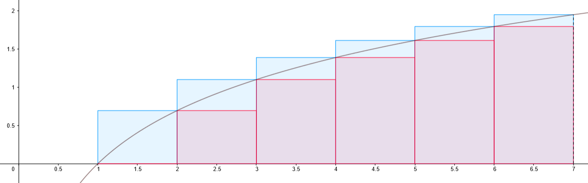

# Zkouška

Kromě uvedených [pojmů](#pojmy) a [tvrzení](#tvrzení) se u zkoušky můžete setkat i s počítacími nebo teoretickými příklady.

## Pojmy

U následujících pojmů byste měli umět zformulovat definici a na jednoduchém příkladu ukázat, že té definici rozumíte.

- vytvořující funkce
	- vytvořující funkce posloupnosti $(a_n)_{n=0}^\infty$ reálných čísel je funkce proměnné $x$ definovaná jako součet $f(x)=\sum_{n=0}^\infty a_nx^n$
- Catalanova čísla
	- binární strom je zakořeněný strom, jehož každý vnitřní vrchol má 2 potomky, na pořadí potomků záleží
	- $C_n$ … počet binárních stromů s $n$ vnitřními vrcholy
	- $(C_n)_{n=0}^\infty$ jsou Catalanova čísla
	- rekurentní tvar
		- $C_0=1$
		- $C_{n+1}=\sum_{i=0}^n C_iC_{n-i}$ pro $n\gt 0$
	- explicitní vzorec: $C_n=\frac1{n+1}{2n\choose n}$
- projektivní rovina
	- projektivní rovina je hypergraf $(X,\mathcal P)$ takový, že platí tři axiomy:
	- A1: $(\forall x,y\in X,\;x\neq y)(\exists! p\in\mathcal P):\set{x,y}\subseteq p$
		- dva různé body určují právě jednu přímku
	- A2: $\forall p,q\in\mathcal P,\;p\neq q:|p\cap q|=1$
		- každé dvě přímky mají jeden průsečík
	- A3: $(\exists Č\subseteq X,\;|Č|=4)(\forall p\in\mathcal P):|p\cap Č|\leq 2$
		- existuje množina čtyř bodů „v obecné poloze“ (žádné tři z nich neleží na přímce)
	- prvky $X$ … body
	- prvky $\mathcal P$ … přímky
- řád konečné projektivní roviny
	- KPR má řád $n\in\mathbb N$, pokud každá její přímka má $n+1$ bodů
	- tedy řád KPR := velikost přímky – 1
- hypergraf
	- hypergraf je dvojice $(V,H)$, kde $H$ je množina podmnožin $V$, tj. $H\subseteq\mathcal P(V)$
- incidenční graf hypergrafu
	- graf incidence hypergrafu $(V,H)$ je bipartitní graf s partitami $V$ a $H$, kde mezi $x\in V$ a $h\in H$ vede hrana $\iff x\in h$
- dualita projektivních rovin
	- mějme projektivní rovinu $(X,\mathcal P)$; potom duální projektivní rovina k $(X,\mathcal P)$ je hypergraf $(X^*,\mathcal P^*)$, kde
		- $X^*=\mathcal P$,
		- pro $x\in X$ definujme $x^*\coloneqq\set{p\in\mathcal P:x\in p}$
			- $x^*$ … přímky, které procházejí $x$
		- $\mathcal P^*=\set{x^*\mid x\in X}$
	- v podstatě obrátíme incidenční graf
- toková síť
	- tokovou síť tvoří
		- $V$ … množina vrcholů
		- $E$ … množina orientovaných hran, $E\subseteq V\times V$
		- $z\in V$ … zdroj
		- $s\in V\setminus\set{z}$ … spotřebič / stok
		- $c:E\to [0,+\infty)$ … $c(e)$ je kapacita hrany $e$
	- definice umožňuje mít hrany oběma směry, připouští také smyčky, ty však z hlediska toků v sítích nejsou nijak užitečné
	- poznámka: ze stoku může vycházet orientovaná hrana, podobně do zdroje může vést hrana
- tok
	- tok v síti $(V,E,z,s,c)$ je funkce $f:E\to[0,+\infty)$ splňující
		- $\forall e\in E:0\leq f(e)\leq c(e)$
		- $\forall x\in V\setminus \set{z,s}:$ součet toků do vrcholu $x$ se rovná součtu toků z vrcholu (formálně pomocí sum) … Kirchhoffův zákon
- velikost toku
	- velikost toku $f$ v síti $(V,E,z,s,c)$ je $w(f)\coloneqq f[\text{Out}(z)]-f[\text{In}(z)]$
	- kde Out(z) a In(z) jsou množiny hran do, respektive ze zdroje a $f[A]\coloneqq\sum_{e\in A}f(e)$ pro $A\subseteq E$
- maximální tok
	- maximální tok je tok, který má největší velikost
- řez v síti
	- řez v síti $(V,E,z,s,c)$ je množina hran $R\subseteq E$ taková, že každá orientovaná cesta ze $z$ do $s$ obsahuje aspoň jednu hranu $R$
- kapacita řezu
	- kapacita řezu $R$ … $c(R)=\sum_{e\in R}c(e)$
- elementární řez
	- $E(A,B)\coloneqq E\cap (A\times B)$
	- tedy $E(A,B)=\set{uv\in E\mid u\in A\land v\in B}$
	- elementární řez je $E(A,B)$ pro $A\subseteq V,\;B=V\setminus A$
		- přičemž $z\in A,\;s\in B$
- minimální řez
	- minimální řez je řez, který má nejmenší kapacitu
- nenasycená a zlepšující cesta
	- nenasycená cesta pro $f$ je neorientovaná cesta $x_1e_1x_2e_2\dots x_ke_kx_{k+1}$, kde $\forall i:$ buď $e_i=(x_i,x_{i+1})$ ($e_i$ je dopředná hrana), nebo $e_i=(x_{i+1},x_i)$ ($e_i$ je zpětná hrana) a navíc platí
		- pro každou dopřednou hranu $e_i$ platí $f(e_i)\lt c(e_i)$
		- pro každou zpětnou hranu $e_i$ platí $f(e_i)\gt 0$
	- zlepšující cesta pro $f$ je nenasycená cesta ze $z$ do $s$
- párování v grafu
	- párování v grafu $G=(V,E)$ je množina hran $M\subseteq E$ taková, že žádný vrchol nepatří do více než jedné hrany $M$
- vrcholové pokrytí v grafu
	- vrcholové pokrytí v $G=(V,E)$ je množina vrcholů $C\subseteq V$ taková, že každá hrana obsahuje aspoň 1 vrchol z $C$
- systém různých reprezentantů v hypergrafu
	- systém různých reprezentantů (SRR) v hypergrafu $H=(V,E)$ je funkce $r:E\to V$ taková, že
		- $\forall e\in E: r(e)\in e$
		- $\forall e,f\in E:e\neq f\implies r(e)\neq r(f)$ … tj. $r$ je prostá
	- $r(e)$ … „reprezentant hyperhrany $e$“
	- analogie s předsedy spolků
- hranový a vrcholový řez v grafu
	- $F\subseteq E$ je hranový řez v $G$, pokud $G-F$ je nesouvislý
		- kde $G-F\coloneqq(V,E\setminus F)$
	- $A\subseteq V$ je vrcholový řez, pokud $G-A$ je nesouvislý
		- kde $G-A=(V\setminus A,E\cap {V\setminus A\choose 2})$
- hranová a vrcholová souvislost grafu
	- stupeň hranové souvislosti (nebo jen hranová souvislost) grafu $G$, značený $k_e(G)$, je největší $k$ takové, že $G$ je hranově $k$-souvislý
		- pozorování: $k_e(G)=$ velikost nejmenšího hranového řezu v $G$
	- vrcholová souvislost grafu $G$, značená $k_v(G)$, je největší $k$ takové, že $G$ je vrcholově $k$-souvislý
		- pozorování: $k_v(K_n)=n-1$
		- pozorování: $G$ není úplný … $k_v(G)=$ velikost nejmenšího vrcholového řezu
- hranově a vrcholově $k$-souvislý graf
	- graf je hranově $k$-souvislý, pokud neobsahuje žádný hranový řez velikosti menší než $k$
	- graf je vrcholově $k$-souvislý, pokud má aspoň $k+1$ vrcholů a neobsahuje žádný vrcholový řez velikosti menší než $k$
- klika a nezávislá množina v grafu
	- klika v grafu je množina vrcholů taková, že každé dva jsou spojené hranou
	- nezávislá množina v grafu je množina vrcholů taková, že žádné dva vrcholy nejsou spojené hranou
- Hammingova vzdálenost a Hammingova váha
	- slovo $x\in\mathbb Z^n_2$ lze chápat jako řádkový vektor $x=(x_1,x_2,\dots,x_n)$
	- Hammingova vzdálenost $d(x,y)\coloneqq$ počet $i$ takových, že $x_i\neq y_i$
	- Hammingova váha $\Vert x\Vert\coloneqq$ počet $i$ takových, že $x_i\neq 0$
- minimální vzdálenost kódu
	- pro kód $C\subseteq\mathbb Z_2^n$ je minimální vzdálenost $\Delta(C)\coloneqq\min^{x, y\in C}_{x\neq y} d(x,y)$
- $(n, k, d)$-kód
	- $(n,k,d)$-kód je množina $C\subseteq\mathbb Z_2^n$ taková, že $|C|=2^k$ a $\Delta(C)=d$
- lineární kód
	- kód $C\in\mathbb Z_2^n$ je lineární, pokud je to vektorový podprostor $\mathbb Z_2^n$ (ekvivalentně $\underline 0\in C$ a $\forall x,y\in C:x\oplus y\in C$)
	- pro lineární $(n,k,d)$-kód je $k$ jeho dimenze
- generující matice
	- pro lineární $(n,k,d)$-kód $C$ je generující matice $G\in\mathbb Z_2^{k\times n}$, jejíž řádky tvoří bázi $C$
- kódování
	- nechť $C$ je $(n,k,d)$-kód pro $k\in\mathbb N$, tak kódování pro $C$ je bijekce $\mathbb Z_2^k\to C$
- dekódování
	- dekódování $(n,k,d)$-kódu $C$ je funkce $g:\mathbb Z_2^n\to C$ taková, že $\forall x\in\mathbb Z_2^n:d(x,g(x))=\min_{y\in C}d(x,y)$
- duální kód
	- $C^\perp\coloneqq\set{y\in\mathbb Z_2^n:(\forall x\in C)\braket{x,y}=0}$ … duální kód k $C$
- kontrolní matice lineárního kódu
	- nechť je $C$ lineární $(n,k,d)$-kód, pak kontrolní matice kódu $C$ je matice, jejíž řádky tvoří bázi $C^\perp$
- Hammingovy kódy
	- nechť $r\in\mathbb N,\,r\geq 2$
	- nechť $K_r$ je matice s $r$ řádky a $2^r-1$ sloupci, jejíž sloupce jsou nenulové a různé
	- nechť $H_r$ je kód s kontrolní maticí $K_r$
	- kódům $H_r$ se říká Hammingovy kódy

## Tvrzení

U následujících tvrzení se očekává, že je budete umět zformulovat a (není-li uvedeno jinak) i dokázat.

- Odhady kombinatorických funkcí: $e(n/e)^n\leq n!\leq en(n/e)^n$, $(n/k)^k\leq{n\choose k}\leq(en/k)^k$, $\frac{2^{2m}}{2\sqrt m}\leq{2m\choose m}\leq\frac{2^{2m}}{\sqrt{2m}}$
	- věta: $e(\frac ne)^n\leq n!\leq en(\frac ne)^n$
	- důkaz: odhad pomocí integrálu
		- $\ln(n!)=\sum_{i=1}^n\ln(i)=\sum_{i=2}^n\ln(i)$
			- protože $\ln(1)=0$
		- schodovitá plocha, kde schod má šířku 1 a výšku $\ln(i)$, má obsah daný uvedeným součtem
		- obsah schodovité plochy je zdola odhadnutý obsahem plochy pod křivkou logaritmu
		- $\ln(n!)\geq\int_1^n\ln(x)\,dx=[x\ln(x)-x]^n_1=(n\ln n-n+1)=:I_n$
		- $n!\geq e^{I_n}=e^{n\ln n-n+1}=e(\frac ne)^n$
		- obdobně horní odhad
			- $\ln((n-1)!)\leq I_n$
			- $e^{I_n}\geq(n-1)!\implies n\cdot e^{I_n}\geq n!\implies n\cdot e(\frac ne)^n\geq n!$
		- obrázek zachycuje situaci pro $n=7$
		- 
	- věta: $(\frac nk)^k\leq{n\choose k}\leq(e\cdot\frac nk)^k$
		- kde ${n\choose k}=\frac{n!}{k!\cdot(n-k)!}$ pro $0\leq k\leq n$
	- důkaz
		- dolní odhad
			- ${n\choose k}=\frac{n\cdot(n-1)\cdot\ldots\cdot(n-k+1)}{k\cdot(k-1)\cdot\ldots\cdot 1}=\frac nk\cdot\frac{n-1}{k-1}\cdot\ldots\cdot\frac{n-k+1}{1}\geq(\frac nk)^k$
			- neboť $\frac nk\leq\frac{n-1}{k-1}\leq\dots\leq\frac{n-k+1}1$
		- horní odhad
			- ${n\choose k}=\frac{\overbrace{n\cdot(n-1)\cdot\ldots\cdot(n-k+1)}^{k}}{k!}\leq\frac{n^k}{(\frac ke)^k}=(\frac{en}k)^k$
			- používáme $(\frac ne)^n\leq n!$
	- věta: $\frac{2^{2m}}{2\sqrt{m}}\leq {2m\choose m}\leq {2^{2m}\over\sqrt{2m}}$
	- důkaz
		- definujme $P:=\frac{2m\choose m}{2^{2m}}$ a dokažme $\frac1{2\sqrt{m}}\leq P\leq \frac{1}{\sqrt{2m}}$
		- $P=\frac{2m\choose m}{2^{2m}}=\frac{\frac{(2m)!}{m!\cdot m!}}{\underbrace{2\cdot2\cdot\ldots\cdot2}_{2m}}=\frac{1\cdot2\cdot3\cdot\ldots\cdot 2m}{(2\cdot4\cdot 6\cdot\ldots\cdot 2m)(2\cdot 4\cdot6\cdot\ldots\cdot 2m)}=\frac{1\cdot 3\cdot 5\cdot\ldots\cdot(2m-1)}{2\cdot4\cdot6\cdot\ldots\cdot 2m}$
		- $P^2=\frac{1\cdot1\cdot3\cdot3\cdot\ldots\cdot(2m-1)\cdot(2m-1)}{2\cdot2\cdot4\cdot4\cdot\ldots\cdot 2m\cdot2m}=1\cdot\frac{1\cdot 3}{2\cdot 2}\cdot\frac{3\cdot 5}{4\cdot 4}\cdot\ldots\cdot\frac{(2m-3)(2m-1)}{(2m-2)(2m-2)}\cdot\frac{2m-1}{2m\cdot 2m}$
		- používáme postřeh $\forall k\in\mathbb N:\frac{(k-1)(k+1)}{k\cdot k}=\frac{k^2-1}{k^2}\lt 1$
		- tedy $P^2\lt\frac{2m-1}{2m\cdot 2m}\lt\frac1{2m}$
		- podobně $P^2=\frac{1\cdot1}{2}\cdot\frac{3\cdot 3}{2\cdot 4}\cdot\ldots\cdot\frac{(2m-1)(2m-1)}{(2m-2)(2m)}\cdot\frac1{2m}$
		- zjevně $\frac{k\cdot k}{(k-1)(k+1)}\gt 1$
		- proto $P^2\gt\frac1{4m}$
		- máme $\frac 1{4m}\leq P^2\leq\frac 1{2m}$, z toho $\frac1{2\sqrt{m}}\leq P\leq \frac{1}{\sqrt{2m}}$
- Odvození vytvořující funkce pro rekurentně zadanou posloupnost
	- obecný postup
		- vezmi rekurenci pro $n\geq n_0$
		- vynásob ji $x^n$
		- sečti pro $n\geq n_0$
		- vyjádři všechny sumy pomocí hledané vytvořující funkce $f(x)$
		- dopočítej $f(x)$
	- aplikace na Fibonacciho čísla
		- $F_0:=0,\,F_1:=1,\,F_n:=F_{n-1}+F_{n-2}$ pro $n\geq 2$
		- chceme získat explicitní vzorec pro $f(x)=\sum_{n=0}^\infty F_nx^n$
		- $F_n=F_{n-1}+F_{n-2}$ pro $n\geq 2$
		- $F_nx^n=F_{n-1}x^n+F_{n-2}x^n$ pro $n\geq 2$
		- $\underbrace{\sum_{n=2}^\infty F_nx^n}_{S_1}=\underbrace{\sum_{n=2}^\infty F_{n-1}x^n}_{S_2}+\underbrace{\sum_{n=2}^\infty F_{n-2}x^n}_{S_3}$
			- $S_1=F_2x^2+F_3x^3+F_4x^4+\dots=f(x)-F_0-F_1x$
			- $S_2=F_1x^2+F_2x^3+F_3x^4+\dots=x(f(x)-F_0)$
			- $S_3=F_0x^2+F_1x^3+F_2x^4+\dots=x^2f(x)$
			- $S_1=S_2+S_3$
			- $f(x)-F_0-F_1x=x(f(x)-F_0)+x^2f(x)$
			- $f(x)-xf(x)-x^2f(x)=F_0+F_1x-F_0x$
			- $f(x)\cdot(1-x-x^2)=F_0+F_1x-F_0x$
			- $f(x)=\frac{F_0+F_1x-F_0x}{1-x-x^2}=\frac x{1-x-x^2}$
- Zobecněná binomická věta
	- fakt: pokud se dá posloupnost shora odhadnout nějakou exponenciální funkcí, tak $a_n=\frac{1}{n!} f^{(n)}(0)$
		- kde $f(x)$ je její vytvořující funkce
		- „odvození“
			- $f(x)=a_0+a_1x+a_2x^2+a_3x^3+\dots$
			- $f'(x)=a_1+2a_2x+3a_3x^2+\dots$
			- $f''(x)=2a_2+3\cdot 2a_3+\dots$
			- $f^{(n)}(x)=n!\cdot a_n+\dots$
	- binomická věta
		- pro $d\in\mathbb N_0:(1+x)^d=\sum_{n=0}^d{d\choose n}x^n$
		- tedy $(1+x)^d$ je vytvořující funkcí pro ${d\choose 0},{d\choose1},{d\choose2},\dots,{d\choose d},0,0,0,\dots$
	- pro $\delta\in\mathbb R$ a $n\in\mathbb N_0$ definujeme zobecněné kombinační číslo ${\delta\choose n}:=\frac{\delta(\delta-1)\cdot(\delta-2)\cdot\ldots\cdot(\delta-n+1)}{n!}$
	- věta: zobecněná binomická věta
		- pro $\delta\in\mathbb R$ platí $(1+x)^\delta=\sum_{n=0}^\infty{\delta\choose n}x^n$
		- nekonečno bychom mohli použít i u základní binomické věty, pokud bychom použili zobecněné kombinační číslo (protože pro $n\gt\delta$ bude v součinu v čitateli jeden člen nulový)
		- celkově ignorujeme otázky konvergence, ale aby věta platila, tak bychom chtěli $|x|\lt1$
	- důkaz
		- označme $f(x)=(1+x)^\delta$
		- zjevně
			- $f'(x)=\delta(1+x)^{\delta-1}$
			- $f''(x)=\delta(\delta-1)(1+x)^{\delta-2}$
			- $f^{(n)}(x)=\delta(\delta-1)\cdot\ldots\cdot(\delta-n+1)(1+x)^{\delta-n}$
		- nechť $a_0,a_1,\dots$ je posloupnost s vytvořující funkcí $f(x)$
		- potom $a_n=\frac{f^{(n)}(0)}{n!}={\delta\choose n}$
- Rozklad racionální funkce na parciální zlomky (bez důkazu) a jeho využití při práci s vytvořujícími funkcemi
	- modelový příklad: našli jsme $f(x)=\frac{1-2x}{(1-3x)(1-x)}$
	- chceme znát explicitní vzorec pro $a_n$ (známe rekurentní)
	- $\frac{1-2x}{(1-3x)(1-x)}=\frac\alpha{1-3x}+\frac\beta{1-x}$
	- ${\alpha\over1-3x}$ odpovídá posloupnosti $\alpha,3\alpha,9\alpha,\dots,3^n\alpha,\dots$
	- $\beta\over 1-x$ odpovídá posloupnosti $\beta,\beta,\beta,\dots,\beta,\dots$
	- tedy $a_n=3^n\alpha+\beta$
	- $\alpha,\beta$ lze spočítat…
		- pomocí prvních několika členů posloupnosti
			- $a_0=1=3^0\alpha+\beta=\alpha+\beta$
			- $a_1=2=3^1\alpha+\beta=3\alpha+\beta$
		- rozkladem na parciální zlomky (viz např. [Math Tutor](https://math.fel.cvut.cz/mt/txtd/3/txc3db3i.htm))
- Odvození vzorečku pro Catalanova čísla, definovaná jako počet binárních zakořeněných stromů
	- $C_n$ … počet binární stromů s $n$ vnitřními vrcholy
		- $C_0=1$
		- mějme kořen, levý syn je list, pravý podstrom má $n-1$ vnitřních vrcholů → počet možných pravých podstromů je $C_{n-1}$
		- nebo levý podstrom má jeden vnitřní vrchol a pravý $n-2$, pak $C_1\cdot C_{n-2}$ možností
		- obecně levý podstrom $i$ vnitřních vrcholů, pravý $n-1-i$ vnitřních vrcholů, pak $C_i\cdot C_{n-1-i}$ možností
		- $C_n=C_0C_{n-1}+C_1C_{n-2}+\dots+C_{n-1}C_0=\sum_{i=0}^{n-1}C_iC_{n-1-i}$ pro $n\geq 1$
		- $C(x)=\sum_{n=0}^\infty C_nx^n$
	- $\sum_{n=1}^\infty C_nx^n=\sum_{n=1}^\infty\left(\sum_{i=0}^{n-1}C_iC_{n-1-i}\right)x^n$
	- $C(x)-1=x\sum_{n=0}^\infty\left(\sum_{i=0}^{n}C_iC_{n-i}\right)x^n$
	- $C(x)-1=x\cdot C^2(x)$
	- $xC^2(x)-C(x)+1=0$
	- 2 řešení
		- $\frac{1+\sqrt{1-4x}}{2x}=:C^+(x)$
		- $\frac{1-\sqrt{1-4x}}{2x}=:C^-(x)$
	- chceme $C(0)=C_0=1$
	- $C^-(x)$ lze spojitě dodefinovat v nule, takže $C(x)=C^-(x)$
	- značení: $[x^n]f(x)$ je člen s indexem $n$ v posloupnosti, jejíž vytvořující funkce je $f(x)$
	- $C_n:=[x^n]\frac{1-\sqrt{1-4x}}{2x}=[x^{n+1}]\frac{1-\sqrt{1-4x}}{2}=[x^{n+1}](\frac12-\frac{\sqrt{1-4x}}{2})=$
		- konstanta ovlivňuje pouze koeficient u $C_0$, můžeme se jí zbavit
	- $=-\frac12[x^{n+1}]\sqrt{1-4x}=(-\frac12)(-4)^{n+1}[x^{n+1}]\sqrt{1+x}=$
	- $=(-\frac12)(-4){\frac12\choose n+1}=(-1)^n\cdot 2^{2n+1}\cdot\frac{\frac12\cdot(\frac12-1)\cdot\ldots\cdot(\frac12-n)}{(n+1)!}$
		- ze zobecněné binomické věty
	- $=(-1)^n\cdot 2^{2n+1}\cdot\frac{\frac12\cdot(-\frac12)\cdot(-\frac32)\cdot\ldots\cdot(-\frac{2n-1}2)}{(n+1)!}=2^n\cdot\frac{1\cdot3\cdot5\cdot\ldots\cdot(2n-1)}{(n+1)!}=$
	- $=\frac{1\cdot3\cdot5\cdot\ldots\cdot(2n-1)\cdot (2^n\cdot n!)}{(n+1)!\cdot n!}=\frac{(2n)!}{(n+1)!\cdot n!}=\frac1{n+1}{2n\choose n}$
- Odvození vlastností konečných projektivních rovin: počet bodů, počet přímek, počet bodů v jedné přímce, počet přímek procházejících jedním bodem
	- tvrzení: v každé KPR mají všechny přímky stejný počet bodů
	- důkaz: sporem
		- nechť v KPR $(X,\mathcal P)$ existují přímky $p,q$ takové, že $|p|\lt |q|$
		- označme $x$ společný bod $p,q$
		- nechť $p$ obsahuje body $x,y_1,y_2,\dots,y_k$ a $q$ obsahuje body $x,z_1,z_2,\dots,z_\ell$, kde $k\lt \ell$
		- tvrdím, že existuje bod $w\in X$, který nepatří do $p\cup q$
			- volme $Č$ dle A3
			- pokud $Č\setminus(p\cup q)\neq\emptyset$, volme $w\in Č\setminus(p\cup q)$
			- pokud $Č\subseteq p\cup q$, pak $|Č\cap p| = |Č\cap q|=2$, BÚNO $Č=\set{y_1,y_2,z_1,z_2}$
				- v tom případě zvolíme za $w$ společný bod $\overline{y_1z_1}$ a $\overline{y_2z_2}$
				- kdyby $w\in p$, tak $w$ je jediný společný bod $p$ a $\overline{y_1z_1}$, a tedy $w=y_1$, ale $w\in\overline{y_2z_2}$, tedy $y_1=w\in\overline{y_2z_2}$, tedy $|Č\cap \overline{y_2z_2}|\geq |\set{y_1,y_2,z_2}|=3$, což je spor s volbou $Č$
		- uvažme přímky $\overline{wz_1},\overline{wz_2},\dots,\overline{wz_\ell},\overline{wx}$, každá z nich protíná $p$, jsou navzájem různé, tedy existuje bod $v\in p$, který je obsažen v aspoň dvou z těch přímek
		- spor: $w$ a $v$ mají aspoň 2 společné přímky
	- lemma: v projektivní rovině $(X,\mathcal P)$ platí $(\forall x\in X)(\exists p\in\mathcal P):x\notin p$
	- důkaz
		- volme Č dle A3
		- volme 3 různé body $a,b,c\in Č\setminus\set x$
		- tvrdím, že alespoň jedna z přímek $\overline{ab},\overline{ac}$ neobsahuje $x$
		- jinak by $\set{a,x}\subseteq\overline{ac}\cap\overline{ab}$, což je spor
	- definice: KPR má řád $n\in\mathbb N$, pokud každá její přímka má $n+1$ bodů
	- tvrzení: pro KPR $(X,\mathcal P)$ řádu $n$ platí následující
		- každý bod patří do právě $n+1$ přímek
		- $|X|=n^2+n+1$
		- $|\mathcal P|=n^2+n+1$
	- důkaz 1 (každý bod patří do právě $n+1$ přímek)
		- volme $x\in X$
		- dle lemmatu $\exists p\in\mathcal P:x\notin p$
		- označme $p=\set{y_1,y_2,\dots,y_{n+1}}$
		- definujme přímky $q_1,q_2,\dots,q_{n+1}$, kde $q_i=\overline{xy_i}$
		- tvrdíme, že pro $i\neq j$ je $q_i\neq q_j$
			- kdyby ne, tak $\set{y_i,y_j}\subseteq q_i\cap p$, což je spor
		- tvrdíme, že $\forall r\in\mathcal P:$ pokud $x\in r$, tak $r\in\set{q_1,\dots,q_{n+1}}$
		- volme $r\in\mathcal P$ takovou, že $x\in r$, jistě $|r\cap p|=1$, nechť $y_i$ je prvek $r\cap p$, potom $r=\overline{xy_i}=q_i$
		- tedy bodem $x$ prochází právě $n+1$ přímek
	- důkaz 2 ($|X|=n^2+n+1$)
		- volme $x\in X$, nechť $p_i$ jsou přímky procházející $x$
		- všimněme si, že každý bod $y\in X\setminus\set{x}$ patří do právě jedné z přímek $p_i$
		- $|X|=|\set{x}|+|p_1\setminus\set{x}|+|p_2\setminus\set{x}|+\dots+|p_{n+1}\setminus\set{x}|=$
		- $=1+(n+1)\cdot n=n^2+n+1$
	- důkaz 3 ($|\mathcal P|=n^2+n+1$) – dvě varianty
		- graf incidence – bipartitní graf, nahoře přímky, dole body
			- každý vrchol dolní partity má stupeň $n+1$
			- každý vrchol horní partity má stupeň $n+1$
			- celá dolní partita má $n^2+n+1$ vrcholů
			- mezi partitami tedy vede $(n^2+n+1)(n+1)$ hran
			- proto i v horní partitě musí být $n^2+n+1$ vrcholů
		- počítání dvěma způsoby
			- počítáme počet dvojic $(x,p)\in X\times \mathcal P$ takových, že $x\in p$
			- těch je $|X|\cdot(n+1)=(n^2+n+1)(n+1)$
			- je jich taky $|\mathcal P|\cdot(n+1)$
			- tudíž $(n^2+n+1)(n+1)=|\mathcal P|\cdot(n+1)$
			- proto $|\mathcal P|=(n^2+n+1)$
- Duální projektivní rovina je opravdu projektivní rovina
	- věta: $(X^*,\mathcal P^*)$ je projektivní rovina
		- připomenutí: $x^*\coloneqq\set{p\in\mathcal P:x\in p}$
	- důkaz
		- $(X^*,\mathcal P^*)$ splní A1 $\iff(\forall p,q\in X^*,\;p\neq q)(\exists! x^*\in\mathcal P^*):\set{p,q}\subseteq x^*$ $\iff (\forall p,q\in\mathcal P,\;p\neq q)(!\exists x\in X):x\in p\land x\in q\iff (X,\mathcal P)$ splní A2
		- obdobně $(X^*,\mathcal P^*)$ splní A2 $\iff\dots\iff(X,\mathcal P)$ splní A1
		- A3: existuje množina 4 přímek takových, že žádné tři z nich neprocházejí jedním bodem
			- máme 4 body z A3 v původní projektivní rovině – označíme $a,b,c,d$
			- tvrdíme, že $\overline{ab},\overline{bc},\overline{cd},\overline{ad}$ jsou hledané 4 přímky
			- zvolíme tři z nich: $\overline{ab},\overline{bc},\overline{cd}$
				- průnik prvních dvou je $b$
				- průnik druhých dvou je $c$
				- společný bod nemají
			- obdobně pro libovolnou jinou trojici
- Konstrukce projektivních rovin z konečných těles
	- nechť $T$ je konečné těleso s $n$ prvky (tedy $n$ musí být kladná celá mocnina prvočísla)
	- uvažujme vektorový prostor $V=T^3=\set{(x,y,z):x,y,z\in T}$, $|V|=n^3$
	- nechť $X$ je množina podprostorů dimenze 1 ve $V$
	- $|X|=\frac{n^3-1}{n-1}$
		- protože máme $n^3-1$ nenulových vektorů, každý patří do jednoho podprostoru dimenze 1
		- podprostor dimenze 1 má $n-1$ nenulových vektorů
	- $|X|=\frac{n^3-1}{n-1}=n^2+n+1$
	- pro každý podprostor $p\subseteq V$ dimenze 2 definuji $\tilde{p}:=\set{x\in X: x\subseteq p}$
	- $\mathcal P=\set{\tilde p\mid p\text{ je podprostor V dimenze 2}}$
	- $|\mathcal P|=|X|$, protože podprostor dimenze 2 je ortogonálním doplňkem podprostoru dimenze 1 a protože existuje bijekce mezi podprostory a jejich ortogonálními doplňky
	- intuice: kdyby to bylo v $\mathbb R^3$, tak *body* jsou přímky procházející počátkem a *přímky* jsou roviny procházející počátkem (svazky přímek)
	- $(X,\mathcal P)$ je projektivní rovina
		- A1: dva různé podprostory dimenze 1 jsou generovány dvěma lineárně nezávislými vektory, ty dohromady generují podprostor dimenze 2
		- A2: $\dim P+\dim Q-\dim(P\cap Q)=\dim(\text{span}(P\cup Q))$
			- $\dim P=\dim Q=2$
			- $\dim(span(P\cup Q))=3$
			- tedy $\dim(P\cap Q)=1$
		- A3: lze nalézt 4 nenulové vektory takové, že každé tři z nich jsou lineárně nezávislé
			- např. $(1,0,0),(0,1,0),(0,0,1),(1,1,1)$
- Existence maximálního toku v obecné síti (bez důkazu)
	- fakt: v každé tokové síti existuje maximální tok
	- poznámka: obecně na přednášce uvažujeme konečné tokové sítě, grafy apod.
	- idea důkazu
		- mějme síť, očíslujme hrany (od $1$ do $m$)
		- tok $f$ reprezentujme jako uspořádanou $m$-tici hodnot
		- množina všech toků je uzavřená a omezená podmnožina $\mathbb R^m$, je tedy kompaktní
		- funkce, která toku $f$ přiřadí $w(f)$, je spojitá
		- víme z analýzy, že spojitá funkce na kompaktní množině nabývá maxima
- Charakterizace maximálního toku pomocí neexistence zlepšující cesty a pomocí řezu odpovídající kapacity; minimaxová věta o toku a řezu
	- pozorování: pokud má tok $f$ zlepšující cestu, tak není maximální
	- důkaz: máme zlepšující cestu pro tok $f$, označme $\varepsilon$ možné zlepšení (je to minimum přes všechny rozdíly od kapacit na dopředných hranách a od nuly na zpětných hranách), přičtením/odečtením $\varepsilon$ dostaneme lepší tok $g$, takže $f$ nemohl být maximální
	- důkaz, že $w(f)\leq c(R)$
		- definujme $A:=$ vrcholy $x\in V$ takové, že existuje orientovaná cesta ze $z$ do $x$ nepoužívající hrany $R$
		- $z\in A$, $s\notin A$, $\text{Out}(A)\subseteq R$
		- $w(f)=f[\text{Out}(A)]-f[\text{In}(A)]\leq f[\text{Out}(a)]\leq c(\text{Out}(A)) \leq c(R)$
	- věta: nechť $f$ je tok v síti; potom následující tvrzení ekvivalentní
		- $f$ je maximální
		- $f$ nemá zlepšující cestu
		- existuje řez $R$ takový, že $w(f)=c(R)$
	- důkaz
		- $1\implies 2:$ obměnou (viz pozorování)
		- $3\implies 1:$ obměnou
			- pro libovolný řez $R'$ a libovolný tok $f'$ platí, že $w(f')\leq c(R')$
			- kdyby $f$ nebyl maximální, tak existuje $f^+$ tok splňující $w(f^+)\gt w(f)$
			- potom pro každý řez $R$ platí, že $c(R)\geq w(f^+)\gt w(f)$
			- tedy neexistuje žádný řez $R$ splňující $c(R)=w(f)$
		- $2\implies 3$
			- nechť $f$ je tok, který nemá zlepšující cestu
			- definujme množinu $A:=\set{x\in V,\,\text{ze }z\text{ do }x\text{ vede nenasycená cesta}}$
			- zjevně $z\in A,\,s\notin A$
			- definujme $R:=\text{Out}(A)=\set{uv\in E,\,u\in A,\,v\notin A}$
			- všimněme si $\forall e\in\text{Out}(A):f(e)=c(e)$
			- $\forall e'\in\text{In}(A):f(e')=0$
			- z lemmatu výše víme, že pro $A\subseteq V$, kde $z\in A,\,s\notin A$, platí $w(f)=\underbrace{f[\text{Out}(A)]}_{c(\text{Out}(A))=c(R)}-\underbrace{f[\text{In}(A)]}_{0}=c(R)$
	- důsledek („Minimaxová věta o toku a řezu“): nechť $f_\max$ je maximální tok a $R_\min$ je minimální řez v $(V,E,z,s,c)$, potom $w(f_\max)=c(R_\min)$
	- důkaz
		- $w(f_\max)\leq c(R_\min)$ … víme, viz výše
		- $w(f_\max)\geq c(R_\min)$ … dle věty $w(f_\max)=c(R)\geq c(R_\min)$
	- důsledek 2: v síti, kde všechny kapacity jsou celočíselné, Fordův–Fulkersonův algoritmus najde maximální tok, který bude celočíselný (celočíselnost vyvozujeme ze znalosti FF algoritmu)
- Fordův–Fulkersonův algoritmus, jeho důsledek pro celočíselnost maximálního toku a pro existenci maximálního toku v síti s racionálními kapacitami
	- algoritmus
		- iterujeme, dokud existuje zlepšující cesta
		- spočítáme rezervu celé cesty (minimum přes rezervy hran cesty)
		- pro každou hranu upravíme tok – v protisměru odečteme co nejvíc, zbytek přičteme po směru
	- pro celočíselné kapacity vrátí celočíselný tok (protože i rezervy budou celočíselné)
	- racionální kapacity převedeme na celočíselné
	- algoritmus se zastaví, protože v takové síti musí existovat řez s konečnou kapacitou a protože se tok v každé iteraci zvětší aspoň o jedna
- Souvislost mezi velikostí největšího párování a nejmenšího vrcholového pokrytí v obecném grafu
	- lemma: pokud $M$ je párování a $C$ vrcholové pokrytí v $G=(V,E)$, tak $|M|\leq |C|$
	- důkaz
		- každá hrana z $M$ musí být pokrytá vrcholem z $C$
		- zároveň každý vrchol z $C$ pokryje nejvýš 1 hranu z $M$
- Kőnigova–Egerváryho věta
	- věta: v každém **bipartitním** grafu má největší párování stejnou velikost jako nejmenší vrcholové pokrytí
	- důkaz
		- nechť $G=(V,E)$ je bipartitní graf s partitami $A,B$
		- vytvořme tokovou síť $(V\cup\set{z,s},E^+,z,s,c)$
			- $E^+=\set{zx\mid x\in A}\cup\set{ys\mid y\in B}\cup \set{xy\mid \set{x,y}\in E\land x\in A\land y\in B}$
			- pro $x\in A$, $y\in B$
				- $c(zx)=c(ys)=1$
				- $c(xy)=|A|+|B|+1$ (prakticky nekonečno)
		- nechť $C_\min$ je nejmenší vrcholové pokrytí v $G$, $M_\max$ největší párování v $G$
			- jistě $|M_\max|\leq |C_\min|$
		- nechť $f$ je maximální tok v té síti a $R$ minimální řez
			- dle minimaxové věty $w(f)=c(R)$
			- BÚNO $f$ má celočíselné hodnoty
		- definujme $M_f:=\set{\set{x,y}\in E:f(xy)\gt 0}$
			- jistě $M_f$ párování v $G$, navíc $|M_f|=w(f)$
		- definujme $C_R:=\set{x\in A:zx\in R}\cup\set{y\in B:ys\in R}$
			- pozorování: $R$ neobsahuje žádnou hranu z $A$ do $B$
			- jistě $C_R$ je vrcholové pokrytí $G$
			- kdyby $C_R$ nebylo pokrytí, tak existuje nepokrytá hrana $\set{x,y}\in E$, potom cesta $z\to x\to y\to s$ je ve sporu s tím, že $R$ je řez
			- navíc $|C_R|=|R|=c(R)$
			- máme $|C_\min|\leq |C_R|=c(R)=w(f)=|M_f|\leq |M_\max|\leq |C_\min|$
- Hallova věta v grafové a hypergrafové verzi
	- pozorování: v bipartitním grafu s partitami $A,B$ má každé párování velikost nejvýše $|A|$ (i nejvýše $|B|$)
	- definice: pro graf $G=(V,E)$ a množinu $X\subseteq V$ označím $N(X):=\set{y\in V\setminus X: (\exists x\in X)\set{x,y}\in E}$
	- Hallova věta, bipartitní grafová verze
		- nechť $G$ je bipartitní graf s partitami $A,B$, potom $G$ má párování velikosti $|A|$ $\iff\underbrace{\forall X\subseteq A:|N(X)|\geq |X|}_{\text{„Hallova podmínka“}}$
	- důkaz
		- $\implies$
			- pokud existuje párování velikosti $|A|$, tak pro každou $X\subseteq A$ existuje $|X|$ vrcholů spárovaných s $X$, ty patří do $N(X)$, tedy $|N(X)|\geq |X|$
		- $\impliedby$
			- nechť $M$ je největší párování v $G$
			- pro spor nechť $|M|\lt|A|$
			- dle Kőnigovy–Egerváryho věty existuje pokrytí $C$, kde $|C|=|M|\lt |A|$
			- $C_A:= C\cap A$
			- $C_B:=C\cap B$
			- $X:=A\setminus C_A$
			- zjistím, že $N(X)\subseteq C_B$
				- protože nepokryté hrany musí pokrývat vrcholy v $N(X)$
			- navíc $|X|=|A|-|C_A|\gt |C_B|\geq |N(X)|$
			- to je spor s Hallovou podmínkou
	- pozorování: jakmile uvnitř hypergrafu je množina čtyř hyperhran, které ve svém sjednocení mají tři vrcholy, tak nemůžu najít systém různých reprezentantů
		- platí to obecně pro množinu $k$ hyperhran – když budou mít ve sjednocení méně než $k$ vrcholů, tak nenajdu SRR
		- implikace platí i obráceně, lze vyslovit jako větu
	- Hallova věta, hypergrafová verze
		- hypergraf $H=(V,E)$ má SRR, právě když $\forall F\subseteq E:\left|\bigcup_{e\in F} e\right|\geq |F|$
	- důkaz
		- nechť $H=(V,E)$ je hypergraf, nechť $I_H$ je jeho graf incidence
		- $H$ má SRR $\iff$ $I_H$ má párování velikosti $|E|$
		- Hallova podmínka pro $H$: $\forall F\subseteq E: \left|\bigcup_{e\in F}e\right|\geq |F|\iff$ bipartitní Hallova podmínka pro $I_H$ a partitu $E$
- Mengerovy věty pro hranovou a vrcholovou souvislost (Mengerova věta pro hranovou souvislost je též někdy označována jako „Fordova–Fulkersonova věta“)
	- Mengerova věta, hranová $xy$-verze
		- pro dva různé vrcholy $x,y$ grafu $G$ platí, že $G$ obsahuje $k$ hranově disjunktních cest z $x$ do $y$ $\iff G$ neobsahuje hranový $xy$-řez velikosti menší než $k$
	- důkaz
		-  $\implies:$ pokud máme $k$ hranově disjunktních cest z $x$ do $y$, tak každý hranový $xy$-řez musí obsahovat aspoň jednu hranu z každé té cesty
		- $\impliedby$
			- nechť $G$ neobsahuje hranový $xy$-řez velikosti menší než $k$
			- vyrobíme tokovou síť $(V,\vec E,x,y,c)$, kde $\vec E=\set{uv,vu\mid \set{u,v}\in E},\; \forall e\in \vec E: c(e)=1$
			- pozorování: v té síti není žádný řez velikosti menší než $k$
			- tedy v té síti existuje tok velikosti aspoň $k$
			- nechť $f$ je celočíselný maximální tok
			- navíc mezi všemi celočíselnými maximální toky volme $f$ tak, aby množina $\underbrace{\set{e\in\vec E:f(e)=1}}_{S(f)}$ byla co nejmenší
			- pozorování: $S(f)$ neobsahuje žádný orientovaný cyklus jinak spor s minimalitou $S(f)$
			- pomocí $S(f)$ vyrobím $k$ hranově disjunktních cest z $x$ do $y$ takto:
				- opakuj $k$-krát
					- začni v $x$
					- jdi po hranách z $S(f)$, dokud nedojdeš do $y$
						- tenhle krok bude konečný, protože $S(f)$ neobsahuje orientované cykly
					- použité hrany odstraň z $S(f)$
	- Mengerova věta, globální hranová verze
		- graf $G$ je hranově $k$-souvislý $\iff$ mezi každými dvěma různými vrcholy existuje $k$ hranově disjunktních cest
	- důkaz
		- $G$ je hranově $k$-souvislý
		- $\iff$ neexistuje hranový řez velikosti menší než $k$
		- $\iff\forall x,y$ různé: neexistuje hranový $xy$-řez velikosti menší než $k$
		- $\iff\forall x,y$ různé: existuje $k$ hranově disjunktních cest z $x$ do $y$
	- definice: dvě cesty v $G$ z $x$ do $y$ jsou navzájem vnitřně vrcholově disjunktní (VVD), pokud nemají žádný společný vrchol kromě $x,y$
	- Mengerova věta, vrcholová $xy$-verze
		- nechť $G=(V,E)$ je graf
		- nechť $x,y$ jsou různé **nesousední** vrcholy
		- nechť $k\in\mathbb N$
		- potom $G$ obsahuje $k$ navzájem VVD cest z $x$ do $y\iff G$ neobsahuje vrcholový $xy$-řez velikosti $\lt k$
	- důkaz
		- $\implies$ zřejmá
		- $\impliedby$
			- nechť $G$ nemá vrcholový $xy$-řez velikosti $\lt k$
			- vyrobíme síť $\mathcal S$ takto
				- za každý vrchol $u\in V$ dáme do $\mathcal S$ dva vrcholy $u^+,u^-$ a hranu $u^+u^-$ s kapacitou 1
				- za každou hranu $\set{u,v}\in E$ dáme do $\mathcal S$ dvě orientované hrany $u^-v^+$ a $v^-u^+$ s kapacitami "$\infty$"
				- zdroj: $x^-$, stok: $y^+$
			- tvrdím, že $\mathcal S$ nemá řez kapacity $c\lt k$
				- sporem: nechť takový řez existuje
				- potom všechny jeho hrany jsou tvaru $u^+u^-$ pro nějaké $u\in V$ a odpovídající vrcholy v $G$ tvoří vrcholový $xy$-řez velikosti $c\lt k$, což je spor
			- podle minimaxové věty o toku a řezu v $\mathcal S$ existuje tok velikosti $\geq k$, BÚNO je ten tok celočíselný, říkejme mu $f$
			- z existence takového $f$ plyne, že $\mathcal S$ obsahuje $k$ hranově disjunktních cest z $x^-$ do $y^+$ (viz hranová verze), označme je $\vec P_1,\dots,\vec P_k$
			- ty cesty $\vec P_1,\dots,\vec P_k$ jsou i vnitřně vrcholově disjunktní, protože každá cesta (orientovaná) z $x^-$ do $y^+$ v $\mathcal S$, která obsahuje vrchol $u^+$ nebo $u^-$ pro nějaké $u\in V\setminus\set{x,y}$, musí obsahovat i hranu $u^+u^-$
			- když v cestách $\vec P_1,\dots,\vec P_k$ nahradíme každou hranu tvaru $u^+u^-$ jedním vrcholem $u$, tak dostaneme $k$ VVD cest z $x$ do $y$ v $G$
	- lemma: nechť $G=(V,E)$ je graf s hranou $e=\set{x,y}$; nechť $G^-:=(V,E\setminus\set e)$; potom $k_v(G^-)\geq k_v(G)-1$
	- důkaz
		- nechť $A$ je nejmenší vrcholový řez v $G^-$ 
			- potom $k_v(G^-)=|A|$
		- chceme $k_v(G)\leq k_v(G^-)+1=|A|+1$
		- $G^-$ se po odebrání $A$ rozpadne na několik komponent, rozlišme případy:
			- pokud existuje komponenta (v $G^--A$), která neobsahuje $x$ ani $y$, tak $A$ je vrcholový řez v $G$
				- tedy $k_v(G)\leq |A|$
			- jinak má $G^--A$ právě 2 komponenty, jedna obsahuje $x$, druhá $y$, označíme je jako $G^-_x,G^-_y$
				- pokud BÚNO $G^-_x$ obsahuje ještě nějaký další vrchol $z$, tak $A\cup\set x$ je vrcholový řez v $G$, tedy $k_v(G)\leq|A|+1$
				- pokud $G_x^-$ ani $G_y^-$ už neobsahují kromě $x$ nebo $y$ už žádný další vrchol, tak $|V|=|A|+2$, tedy $k_v(G)\leq |V|-1=|A|+1$
	- Mengerova věta, globální vrcholová verze
		- $G$ je vrcholově $k$-souvislý $\iff$ mezi každými dvěma různými vrcholy $x,y$ existuje $k$ navzájem VVD cest
	- důkaz
		- pro $K_n$ věta zjevně platí (jedna cesta je přímá, další vždy přes jiný vrchol, těch je $n-2$)
		- nechť $G$ není úplný (byť by tahle větev důkazu fungovala i pro $K_n$)
			- $\impliedby:$ mezi každými dvěma vrchol je $k$ VVD cest $\implies$ G má $\geq k+1$ vrcholů, žádný řez velikosti $\lt k\implies G$ je $k$-souvislý
			- $\implies:$ nechť $x,y$ jsou různé vrcholy; případy
				- $\set{x,y}\notin E$ … viz $xy$-verze M. věty
				- $\set{x,y}\in E:$ nechť $G^-:=(V,E\setminus\set\set {x,y})$
					- podle lemmatu: $k_v(G^-)\geq k-1$
					- podle $xy$-verze M. věty pro $G^-$ existuje $k-1$ VVD cest $x\to y$
					- přidám k nim hranu $e$ a mám $k$ VVD cest $x\to y$
- Lemma o uších pro 2-souvislé grafy
	- konvence: „$k$-souvislý graf“ znamená „vrcholově $k$-souvislý“
	- definice: přidání ucha ke grafu $G=(V,E)$ je tato operace
		- zvol dva různé vrcholy $x,y\in V$
		- pro $d\geq 0$ přidej vrcholy $z_1,z_2,\dots,z_d$
		- přidej hrany cesty $xz_1z_2\dots z_dy$
	- věta: graf $G$ je 2-souvislý $\iff G$ se dá vyrobit z kružnice pomocí přidávání uší
	- důkaz
		- $\impliedby$ kružnice je 2-souvislá a přidání ucha nevytvoří řez velikosti $\leq 1$
		- $\implies$
			- nechť $G=(V,E)$ je 2-souvislý, nechť $C$ je libovolná kružnice v $G$, nechť $G_\max=(V_\max,E_\max)$ je největší podgraf $G$, který se dá vyrobit přidáváním uší k $C$
			- tvrdíme, že $G_\max=G$
			- kdyby ne:
				- $V_\max=V,\,E_\max\subsetneq E:$ spor s maximalitou $G_\max$, protože přidání hrany je přidání ucha
				- $V_\max\subsetneq V:$
					- $G$ je souvislý, tak $\exists e=\set{xy}\in E$ taková, že $x\in V_\max$ a $y\notin V_\max$
					- $G-x$ je souvislý, protože $G$ je 2-souvislý
					- takže bude existovat ještě další cesta do $V_\max$
					- tato cesta + hrana $xy$ = další ucho
					- opět spor s maximalitou $G_\max$
- Cayleyho vzorec pro počet stromů na $n$ vrcholech
	- věta: $s_n=n^{n-2}$
		- $s_n$ … počet stromů na množině vrcholů $[n]\coloneqq\set{1,2,\dots,n}$
	- důkaz
		- nebudu počítat stromy, ale kořenové stromy
			- definice: kořenový strom je strom, ve kterém se jeden vrchol určil jako kořen a všechny hrany se zorientovaly směrem ke kořeni
			- $k_n:=$ počet kořenových stromů
			- pozorování: $k_n=n\cdot s_n$
			- pozorování: pokud ve stromě zorientuji hrany tak, aby z každého vrcholu odcházela nejvýš jedna hrana, tak potom existuje právě jeden vrchol („kořen“), z něhož žádná hrana neodchází, a navíc všechny hrany jsou orientované směrem ke kořeni
		- definice: povykos (postup vytváření kořenového stromu) je posloupnost $n-1$ orientovaných hran $(e_1,e_2,\dots,e_{n-1})$ na vrcholech $[n]$ taková, že $([n],\set{e_1,\dots,e_{n-1}})$ je kořenový strom
			- $p_n:=$ počet povykosů
			- pozorování: $p_n=(n-1)!\cdot k_n$
		- pozorování (pravidla): posloupnost orientovaných hran $(e_1,e_2,\dots,e_{n-1})$ je povykos $\iff\forall k\in[n-1]:$
			- hrana $e_k$ spojuje vrcholy z různých komponent grafu tvořeného hranami $e_1,\dots,e_{k-1}$
			- hrana $e_k$ vychází z vrcholu, z něhož nevychází žádná z hran $e_1,\dots,e_{k-1}$
		- chci vyrobit povykos $(e_1,\dots,e_{n-1})$
			- mám $n\cdot (n-1)$ možností, jak zvolit $e_1$
				- vybírám dva vrcholy, mezi kterými povedu hranu
			- mám $n\cdot (n-2)$ možností, jak zvolit $e_2$, když už znám $e_1$
				- mám $n$ možností, jak zvolit konec hrany
				- začátek hrany musí být v jiné komponentě než konec
				- je tam $n-2$ komponent, které můžu zvolit (dohromady je komponent $n-1$, z toho jednu zvolit nemůžu)
				- v každé komponentě je „kořen komponenty“ (vrchol, z nějž žádná hrana nevychází)
				- hrana musí nutně začínat v „kořeni komponenty“ (podle druhého pravidla)
				- tedy mám $n-2$ možností, jak zvolit začátek hrany
			- pokud už jsem vybral $e_1,\dots,e_{k-1}$ v souladu s oběma pravidly, tak mám $n\cdot (n-k)$ možností, jak vybrat $e_k$
				- $n$ … vyberu konec $e_k$
				- $n-k$ … vyberu začátek v kořeni nějaké komponenty neobsahující konec $e_k$
				- $p_n=n\cdot(n-1)\cdot n\cdot(n-2)\cdot\ldots\cdot n\cdot 1=$
				- $=\prod_{k=1}^{n-1}n(n-k)=n^{n-1}(n-1)!$
				- $k_n=\frac{p_n}{(n-1!)}=n^{n-1}$
				- $s_n=\frac{k_n}{n}=n^{n-2}$
- Spernerova věta
	- značení
		- $\mathcal P([n])$ … množina všech podmnožin množiny $[n]$
		- ${[n]\choose k}$ … množina všech $k$-prvkových podmnožin $[n]$
	- definice: antiřetězec v $\mathcal P([n])$ je množina $\mathcal A\subseteq\mathcal P([n])$ taková, že $\forall M,M'\in\mathcal A:M\neq M'\implies M\not\subseteq M'\land M'\not\subseteq M$
	- věta: největší antiřetězec v $\mathcal P([n])$ má velikost ${n\choose\lfloor n/2\rfloor}={n\choose\lceil n/2\rceil}$
	- důkaz
		- antiřetězec velikosti ${n\choose\lfloor n/2\rfloor}$ je např. ${[n]\choose\lfloor n/2\rfloor}$
		- dokažme, že neexistuje větší antiřetězec
			- nechť $\mathcal A$ je antiřetězec, označme $\mathcal A=\set{A_1,A_2,\dots,A_k}$, kde $k=|\mathcal A|$, chceme $k\leq{n\choose\lfloor n/2\rfloor}$
			- definice: nasycený řetězec v $\mathcal P([n])$ je posloupnost $M_0,M_1,\dots,M_n\subseteq[n]$, kde $M_0\subseteq M_1\subseteq\dots\subseteq M_n\subseteq [n]$ a $|M_i|=i$
			- v $\mathcal P([n])$ existuje $n!$ nasycených řetězců
				- idea: začínám s prázdnou množinou, postupně do ní přidávám prvky (mám $n-i+1$ možností, jak do ní přidat $i$-tý prvek)
			- každý nasycený řetězec obsahuje nejvýš jednu množinu $\mathcal A$
			- počítejme dvěma způsoby dvojice $(A,\mathcal R)$, kde $A\in\mathcal A$, $\mathcal R$ je nasycený řetězec, $A\in\mathcal R$
				- první způsob: dvojic je $\leq n!$
				- druhý způsob: pro $A\in\mathcal A$ mám $|A|!\cdot(n-|A|)!$ nasycených řetězců obsahujících $A$
					- mám množinu $A$
					- mám $|A|$ možností, který prvek z ní odeberu
					- postupně odebírám prvky, až se dostanu k prázdné množině → $|A|!$ možností
					- podobně $(n-|A|)!$ možností, jak dotvořit řetězec přidáváním prvků
				- $n!\geq\sum_{A\in\mathcal A}|A|!\cdot(n-|A|)!$
				- $\implies1\geq\sum_{A\in\mathcal A}\frac{|A|!\cdot(n-|A|)!}{n!}=\sum_{A\in\mathcal A}\frac1{n\choose|A|}\geq\sum_{A\in\mathcal A}\frac1{n\choose\lfloor n/2\rfloor}=|\mathcal A|\cdot\frac1{n\choose\lfloor n/2\rfloor}$
					- ze všech kombinačních čísel $n\choose k$ je největší $n\choose n/2$, takže ho můžu všude nahradit a hodnota výrazu se tím zmenší
				- $\implies{n\choose\lfloor n/2\rfloor}\geq |\mathcal A|$
- Počet hran v grafu bez $C_4$
	- věta
		- nechť $G=(V,E)$ je graf na $n$ vrcholech, který neobsahuje $C_4$ jako podgraf
		- potom $|E|\leq O(n^{3/2})$
	- důkaz
		- nechť $G=(V,E)$ je graf bez $C_4$, $|V|=n$
		- označme $H$ počet dvojic $(x,\set{y,z})$ takových, že
			- $x,y,z\in V$
			- $y\neq z$
			- $x$ je soused $y$ i $z$
		- poznámka: ${n\choose 2}=\frac{n(n-1)}2$
		- počítejme $H$ dvěma způsoby
			- pro dané $x\in V$ mám přesně ${\deg x\choose 2}$ možností, jak zvolit $y$ a $z$
				- tedy $H=\sum_{x\in V}{\deg x\choose 2}\geq\sum_{x\in V}\frac{(\deg x-1)^2}2$
			- pro dané $\set{y,z}\in{V\choose 2}$ existuje nejvýše jeden společný soused $x\in V$, jinak by $G$ obsahoval $C_4$
				- tedy $H\leq{n\choose 2}\leq\frac{n^2}2$
		- tedy $\frac{n^2}2\geq \sum_{x\in V}\frac{(\deg x-1)^2}2$
		- z toho plyne, že $n^2\geq \sum_{x\in V}{(\deg x-1)^2}$
		- chci $|E|=\frac 12\sum_{x\in V}\deg x\leq O(n^{3/2})$
		- uvažme funkci $f(x)=(x-1)^2$, ta je konvexní, tedy pro každé $x_1,x_2,\dots,x_n\in\mathbb R: f(\frac{x_1+\dots+x_n}n)\leq\frac{f(x_1)+f(x_2)+\dots+f(x_n)}n$
		- tedy $n\geq\frac{\sum_{x\in V}{(\deg x-1)^2}}n\geq\left(\frac{\sum_{x\in V}\deg x}n-1\right)^2$
		- $\sqrt n\geq\frac{2|E|}n-1$
			- počet hran je polovina ze součtu stupňů
		- $n^{3/2}\geq 2|E|-n$
		- $\frac12(n^{3/2}+n)\geq|E|$
- Počítání dvěma způsoby (znalost obecného postupu)
	- typicky známe vlastnosti množin $A$ a $B$
	- snažíme se vyjádřit hledanou veličinu pomocí dvojic, kde jeden prvek je z $A$ a druhý z $B$
	- alternativní pohled pomocí bipartitního grafu a partitami $A$ a $B$
		- zjistíme, že $A$ vysílá určitý počet hran a že $B$ může přijmout určitý počet hran
- Ramseyova věta v grafové verzi a ve verzi pro barvení hran úplného grafu (i s více než dvěma barvami)
	- Ramseyova věta, grafová verze: $(\forall k\in\mathbb N)(\forall\ell\in\mathbb N)(\exists N\in\mathbb N)$ takové, že každý graf na $N$ vrcholech obsahuje kliku velikosti $k$ nebo nezávislou množinu velikosti $\ell$
		- $R(k,\ell)$ … Ramseyovo číslo (nejmenší $N$, pro které platí, že libovolný graf na $N$ vrcholech obsahuje kliku velikosti $k$ nebo nezávislou množinu velikosti $\ell$)
	- důkaz indukcí podle $k+\ell$
		- základ indukce
			- pozorování: $R(k,1)=1=R(1,\ell)$
			- pozorování: $R(k,2)=k=R(2,k)$
		- mějme $k\geq 3,\,\ell\geq 3$, definujme $N:=R(k,\ell-1)+R(k-1,\ell)$
			- tyhle hodnoty jsou dobře definované (z indukčního předpokladu), protože součet argumentů je menší než $k+\ell$
		- nechť máme dán graf $G$ na $N$ vrcholech
		- nechť $x$ je libovolný vrchol $G$
		- označme $S$ množinu sousedů vrcholu $x$ a $T=V\setminus (S\cup\set{x})$
		- protože $|S|+|T|=N-1=R(k,\ell-1)+R(k-1,\ell)-1$, tak platí buď $|S|\geq R(k-1,\ell)$, nebo $|T|\geq R(k,\ell-1)$
			- právě jedna z nerovností musí platit
		- předpokládejme, že $|S|\geq R(k-1,\ell)$, označme $G_S$ podgraf $G$ indukovaný $S$
		- tedy $G_S$ obsahuje kliku velikosti $k-1$ nebo nezávislou množinu velikosti $\ell$
		- pokud $G_S$ obsahuje nezávislou množinu velikosti $\ell$, tak i $G$ ji obsahuje, hotovo
		- pokud $G_S$ obsahuje kliku velikosti $k-1$, tak ta klika spolu s $x$ tvoří kliku velikosti $k$ v $G$, hotovo
		- případ, kde $|T|\geq R(k,\ell-1)$, je analogický
	- důsledek (symetrická verze Ramseyovy věty): pro každé $m$ existuje $N$ takové, že graf na $N$ vrcholech má kliku nebo nezávislou množinu velikosti $m$
	- ekvivalentní 2-barevná verze Ramseyovy věty: pro každé $m$ existuje $N$ takové, že pro každé obarvení hran $K_N$ červeně a modře existuje jednobarevná klika velikosti $m$
	- věta (vícebarevná verze Ramseyovy věty): $(\forall b\in\mathbb N)(\forall m\in\mathbb N)(\exists N\in\mathbb N)$ takové, že pro každé obarvení hran $K_N$ pomocí $b$ barev existuje množina $m$ vrcholů taková, že všechny hrany mezi nimi mají stejnou barvu
		- $R^*_b(m)$ … nejmenší $N$ s touto vlastností
		- $R^*_2(m)=R(m,m)$
	- důkaz
		- postupujme indukcí podle $b$
		- pro $b=1: R_1^*(m)=m$
		- pro $b=2:R^*_2(m)=R(m,m)$
		- nechť $b\gt 2$
			- nechť $N=R(m,R_{b-1}^*(m))$
			- mějme obarvení $K_N$ pomocí $b$ barev
			- nechť ty barvy jsou 1) modrá a 2) $b-1$ odstínů červené
			- Ramseyova věta pro 2 barvy říká, že v tom obarvení buď existuje modrá klika velikosti $m$ (jsem hotov), nebo existuje klika $X$ velikosti $R^*_{b-1}(m)$ taková, že všechny barvy hran mezi vrcholy $X$ jsou odstíny červené
			- $X$ indukuje úplný graf na $R^*_{b-1}(m)$ vrcholech, jehož hrany jsou obarveny pomocí $b-1$ barev, tedy v něm je jednobarevná klika velikosti $m$
- Ramseyova věta pro hypergrafy v konečné a nekonečné verzi (bez důkazu)
	- značení
		- ${X\choose p}$ … množina $p$-prvkových podmnožin $X$
		- $K_N^{(p)}$ … $p$-uniformní úplný hypergraf, což je hypergraf $([N],{[N]\choose p})$
			- tedy $K_N=K_N^{(2)}$
	- $b$-obarvení $K_N^{(p)}$ je funkce ${[N]\choose p}\to[b]$
	- pro dané $b$-obarvení $\beta$ hypergrafu $K_N^{(p)}$ řeknu, že množina $X\subseteq[N]$ je jednobarevná (v obarvení $\beta$), pokud $\beta$ přiřazuje všem množinám v ${X\choose p}$ tu samou barvu
	- $K^{(p)}_\infty$ … nekonečný hypergraf $(\mathbb N,{\mathbb N\choose p})$
	- Ramseyova věta, konečná verze: $(\forall p\in\mathbb N)(\forall b\in\mathbb N)(\forall m\in\mathbb N)(\exists N\in\mathbb N)$ takové, že pro každé $b$-obarvení $K_N^{(p)}$ existuje jednobarevná $m$-prvková podmnožina $[N]$
	- Ramseyova věta, nekonečná verze: $(\forall p\in\mathbb N)(\forall b\in\mathbb N)$ pro libovolné $b$-obarvení $K_\infty^{(p)}$ existuje nekonečná jednobarevná podmnožina $\mathbb N$
	- $p=1$
		- v podstatě barvíme vrcholy
		- pro dané $b,m$ stačí $N=b(m-1)+1$
			- při $b(m-1)$ vrcholech lze najít obarvení, kde každá barva barví přesně $m-1$ vrcholů, po přidání dalšího vrcholu už alespoň jedna barva musí barvit $m$ vrcholů
		- princip holubníku
- Kőnigovo lemma o nekonečné cestě ve stromě, jeho použití při odvození konečné Ramseyovy věty z nekonečné
	- Kőnigovo lemma
		- nechť $T$ je strom s nekonečně mnoha vrcholy, který neobsahuje žádný vrchol nekonečného stupně
		- nechť $x_0$ je libovolný vrchol $T$
		- potom $T$ obsahuje nekonečnou cestu začínající v $x_0$
	- důkaz
		- zakořeňme $T$ ve vrcholu $x_0$
		- indukcí definujme posloupnost vrcholů $x_0,x_1,x_2,\dots$ tak, že $x_0,x_1$ tvoří cestu a pro $\forall i\in\mathbb N_0:$ podstrom zakořeněný v $x_i$ má nekonečně mnoho vrcholů
		- už máme $x_0$
		- nechť už máme $x_0,x_1,\dots,x_n$, nechť $y_1,y_2,\dots,y_k$ jsou děti $x_n$
		- aspoň jeden vrchol $y_i$ je kořenem nekonečného podstromu
			- kdyby byly všechny podstromy konečné, byl by celý strom konečný
		- tedy definujeme $x_{n+1}:=y_i$
		- posloupnost $x_0,x_1,x_2,\dots$ tvoří nekonečnou cestu v $T$
	- tvrzení: z nekonečné verze Ramseyovy věty plyne konečná verze
	- důkaz
		- nechť neplatí konečná Ramseyova věta, tedy $\exists p\;\exists b\;\exists m\;\forall N\;\exists\,b$-obarvení $K_N^{(p)}$ neobsahující jednobarevnou podmnožinu velikosti $m$
		- řeknu, že $b$-obarvení $\beta$ hypergrafu $K_N^{(p)}$ je záludné, pokud v něm neexistuje jednobarevná podmnožina $[N]$ velikosti $m$
			- $Z_N$ … množina záludných obarvení $K_N^{(p)}$
		- řeknu, že $b$-obarvení $\gamma\in Z_{N+1}$ rozšiřuje $b$-obarvení $\beta\in Z_N$, pokud pro každou $h\in{[N]\choose p}$ platí $\gamma(h)=\beta(h)$
			- pozorování: každé $\gamma\in Z_{n+1}$ rozšiřuje právě jedno $\beta\in Z_N$
		- definujme strom $T$ na vrcholech $Z_1\cup Z_2\cup\dots=\bigcup_{N=1}^\infty Z_N$
			- $\set{\beta,\gamma}\in E(T)\iff\gamma$ rozšiřuje $\beta$ nebo naopak
			- v tom stromě existuje nekonečná cesta $\beta_1,\beta_2,\beta_3,\dots$, kde $\beta_N\in Z_N$ (podle Kőnigova lemmatu)
		- definujme obarvení $\beta:{\mathbb N\choose p}\to[b]$ takto: nechť máme dánu množinu $h\in{\mathbb N\choose p}$, volme $N\in\mathbb N$ takové, že $h\subseteq [N]$ a definujme $\beta(h):=\beta_N(h)$
		- tvrdím, že $\beta$ je záludné obarvení pro $K_\infty^{(p)}$
		- kdyby ne, tak $\beta$ má nějakou jednobarevnou $m$-prvkovou množinu $X\subseteq\mathbb N$
			- volme $N$ tak, že $X\subseteq[N]$
			- potom $\beta$ obarví ${X\choose p}$ stejně jako $\beta_N$, ale $\beta_N$ je záludné pro $K_N^{(p)}$, tedy $X$ v něm není jednobarevná
		- tedy $\beta$ je záludné pro $K_\infty^{(p)}$, a tedy nekonečná Ramseyova věta neplatí
- Použití generující matice ke kódování
	- tvrzení: pokud $G$ je generující matice $(n,k,d)$-kódu $C$, tak zobrazení, které vektoru $x=(x_1,x_2,\dots,x_k)\in\mathbb Z_2^k$ přiřadí vektor $xG$ je kódování pro $C$
	- důkaz
		- uvažujeme zobrazení $f:\mathbb Z_2^k\to \mathbb Z_2^n$ definované $f(x)=xG$
		- stačí ověřit
			1) $\forall x\in\mathbb Z_2^k:f(x)\in C$
			2) zobrazení $f$ je prosté
		- ověřme 1)
			- nechť $r_1,\dots,r_k$ jsou řádky $G$, tedy $r_1,\dots,r_k\in C$
			- potom pro každé $x=(x_1,\dots,x_k)$ platí $xG=x_1r_1\oplus x_2r_2\oplus\dots\oplus x_kr_k$, což je lineární kombinace prvků $C$, tedy prvek $C$
		- ověřme 2)
			- kdyby $\exists x\neq x'\in\mathbb Z_2^k:f(x)=f(x')$
			- tak $xG=x'G\iff \underbrace{(x-x')}_{\neq 0}G=\underline 0$, což nemůže nastat, protože řádky $G$ jsou lineárně nezávislé
- Použití kontrolní matice k ověření, zda je slovo kódové
	- tvrzení: nechť $C$ je lineární $(n,k,d)$-kód s kontrolní maticí $K$, potom $\forall x\in\mathbb Z_2^n:x\in C\iff Kx^T=\underline 0$
	- důkaz
		- nechť $r_1,r_2,\dots,r_{n-k}\in\mathbb Z_2^n$ jsou řádky $K$
		- potom $x\in C\iff x\in(C^\perp)^\perp\iff\forall y\in C^\perp:\braket{x,y}=0$ $\iff \forall i\in[n-k]:\braket{x,r_i}=0\iff Kx^T=\underline 0$
- Souvislost minimální vzdálenosti kódu se sloupci kontrolní matice
	- nechť $C$ je lineární $(n,k,d)$-kód s kontrolní maticí $K$
	- pozorování: pokud $C$ je lineární, tak $d=\Delta(C)=\min_{x\in C\setminus{\set{\underline 0}}} d(x,\underline 0)=\min_{x\in C\setminus\set{\underline 0}}\Vert x\Vert$
		- pokud $x,y\in C$ jsou takové, že $d(x,y)=\Delta(C)$, tak potom $d(x,y)=d(x\oplus y,\underline 0)$
	- pozorování: navíc $\Delta(C)$ je nejmenší $t\geq 1$ takové, že v $K$ lze najít $t$ sloupců, jejichž součet je $\underline 0\in\mathbb Z_2^{n-k}$
		- $x$ řeší rovnici $Kx^T=\underline 0\iff$ $x$ má jedničky na místech sloupců, které se sečtou na nulu
	- důsledky
		- $\Delta(C)\geq 2\iff K$ má všechny sloupce nenulové
		- $\Delta(C)\geq 3\iff K$ má všechny sloupce nenulové a navíc každé dva sloupce různé
- Konstrukce Hammingových kódů a jednoznačnost jejich dekódování
	- definice
		- nechť $r\in\mathbb N,\,r\geq 2$
		- nechť $K_r$ je matice s $r$ řádky a $2^r-1$ sloupci, jejíž sloupce jsou nenulové a různé
		- nechť $H_r$ je kód s kontrolní maticí $K_r$
		- kódům $H_r$ se říká Hammingovy kódy
	- přirozená konvence: $i$-tý sloupec $K_r$ odpovídá binárnímu zápisu čísla $i$ (ale obecně pořadí sloupců pro naše účely není důležité)
	- pozorování: $H_r$ je lineární $(n,k,d)$-kód, kde $n=2^r-1,\;k=2^r-1-r,\;d=3$
	- tvrzení: $\forall r\geq 2$, pro $n=2^r-1$, $\forall x\in\mathbb Z_2^n$ existuje právě jedno $y\in H_r$ takové, že $d(x,y)\leq 1$
	- navíc to $y\in H_r$ lze najít následujícím algoritmem
		- spočítej $K_rx^T=:s$
		- pokud $s=\underline 0$, tak $x\in H_r$, tedy $y:=x$
		- pokud $s\neq\underline 0$, tak nechť $i\in\set{1,\dots,n}$ je takové, ž $i$-tý sloupec $K_r$ je roven $s$
			- potom nechť $y$ je vektor, který vznikne z $x$ změnou $i$-tého bitu
	- důkaz přeskočíme
	- Hammingovy kódy umí opravit jednu chybu, jsou mnohem úspornější než trojnásobné opakování
- Singletonův, Hammingův a Gilbertův–Varshamovův odhad na parametry kódů
	- Singletonův odhad: pokud existuje $(n,k,d)$-kód $C$, tak $k+d\leq n+1$
	- důkaz
		- stručně: $d$ označuje počet bitů, ve kterých se dvě různá slova liší, takže když jich smažeme $d-1$, tak se pořád budou lišit
		- nechť $C$ je $(n,k,d)$-kód
		- definujme funkci $\psi:\mathbb Z_2^n\to\mathbb Z_2^{n-d+1}$
		- $\psi(x_1,\dots,x_n)=(x_1,\dots,x_{n-d+1})$
		- pro $x,y\in C$, $x\neq y$, tak $\psi(x)\neq\psi(y)$
		- tedy $|C|\leq 2^{n-d+1}$
		- tedy $k\leq n-d+1$, tj. $k+d\leq n+1$
	- značení: $B(x,t):=\set{y\in\mathbb Z_2^n:d(x,y)\leq t}$, $V(t):=|B(x,t)|={n\choose 0}+{n\choose1}+{n\choose2}+\dots+{n\choose t}$
		- ${n\choose k}$ … počet vektorů, které se od $x$ liší v $k$ bitech
	- Hammingův odhad: pokud existuje $(n,k,d)$-kód $C$, tak $|C|\leq\frac{2^n}{V(\lfloor\frac{d-1}2\rfloor)}$
	- důkaz
		- pro $x,y\in C$, $x\neq y:$ $B(x,\lfloor\frac{d-1}2\rfloor)\cap B(y,\lfloor\frac{d-1}2\rfloor)=\emptyset$
		- jedna koule pokryje $V(\lfloor\frac{d-1}2\rfloor)$
		- všechny koule dohromady pokryjí $|C|\cdot V(\lfloor\frac{d-1}2\rfloor)$
		- nemůžou toho pokrýt víc, než tam toho je, proto $|C|\cdot V(\lfloor\frac{d-1}2\rfloor)\leq 2^n$
	- Gilbert-Varshamovův odhad: $\forall n,d$, přičemž $d\lt n$, existuje kód $C$ taková, že $|C|\geq\frac{2^n}{V(d-1)}$
	- důkaz
		- hledám $C$ hladově
			- dám do $C$ nějaký vektor
			- všechny vektory, které jsou od něj do vzdálenosti $d-1$ nesmím použít
			- tak pokračuju dál
		- v každém kroku nejvýš $V(d-1)$ vektorů eliminuju
		- vždycky zvládnu vybrat dohromady aspoň $\frac{2^n}{V(d-1)}$ vektorů
