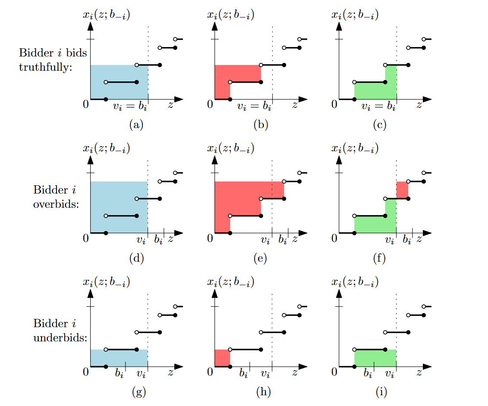

# Zkouška

## Normal-form games

- Definition: Normal-form game
	- hra v normální tvaru je trojice $(P,A,u)$
	- $P$ … konečná množina $n$ hráčů
	- $A=A_1\times\dots\times A_n$ je množina akčních profilů
		- $A_i$ … množina akcí $i$-tého hráče
	- $u=(u_1,\dots,u_n)$, kde $u_i:A\to\mathbb R$ je užitková funkce $i$-tého hráče
- Definition: Strategies
	- čistá (pure) strategie $s_i$ hráče $i$ je akce z $A_i$
		- profil čistých strategií je $n$-tice čistých strategií (akcí) – za každého z $n$ hráčů je tam jedna
	- smíšená (mixed) strategie $s_i$ hráče $i$ je pravděpodobnostní distribuce přes $A_i$
		- tedy $s_i(a_i)\in[0,1]$ a $\sum_{a_i\in A_i}s_i(a_i)=1$
		- profil smíšených strategií je $n$-tice smíšených strategií
	- každá čistá strategie je smíšená
- Definition: Expected payoff
	- ve hře $G=(P,A,u)$ je expected payoff (střední hodnota výplatní funkce) pro hráče $i$ z profilu smíšených strategií $s$ je $$u_i(s)=\sum_{a\in A} u_i(a)\cdot \underbrace{\prod_{j=1}^n s_j(a_j)}_{P(a)}$$
	- platí linearita střední hodnoty výplatní funkce $$u_i(s)=\sum_{a_i\in A_i} s_i(a_i)\cdot u_i(a_i;s_{-i})$$
- Example: Five basic games
	- vězňovo dilema
	- matching pennies
	- battle of sexes
	- game of chicken
	- bitva o duši Gothamu

## Nash equilibrium

- Definition: Best response
	- best response $i$-tého hráče na strategický profil $s_{-i}$ je smíšená strategie $s_i^*$ taková, že $$\forall s_i'\in S_i:u_i(s_i^*;s_{-i})\geq u_i(s_i';s_{-i})$$
	- kdyby hráč $i$ znal strategie ostatních, zvolil by si strategii $s_i^*$, protože maximalizuje jeho očekávanou výplatu, pokud ostatní hrají $s_{-i}$
- Definition: Nash equilibrium
	- mějme hru $G=(P,A,u)$ v normální tvaru s $n$ hráči
	- pak Nashovo ekvilibrium (NE) ve hře $G$ je strategický profil $(s_1,\dots,s_n)$ takový, že $s_i$ je best response hráče $i$ na $s_{-i}$ pro každé $i\in P$
	- tedy žádný hráč by neměnil svou strategii, kdyby znal strategie ostatních
- Theorem: Nash’s Theorem
	- Nashova věta: každá hra v normálním tvaru má Nashovo ekvilibrium
	- pomocné definice a tvrzení
		- $X\subseteq\mathbb R^d$ je kompaktní, pokud je uzavřená a omezená
		- $Y\subseteq\mathbb R^d$ je konvexní, pokud $(\forall x,y\in Y)(\forall\alpha\in [0,1]):\alpha x+(1-\alpha)y\in Y$
		- pro $n$ afinně nezávislých bodů $x_1,\dots,x_n\in\mathbb R^d$ definujeme $(n-1)$-simplex $\Delta_n$ na $x_1,\dots,x_n$ jako množinu konvexních kombinací bodů $x_1,\dots,x_n$
			- každý simplex je kompaktní konvexní množina v $\mathbb R^d$
		- lemma: pokud $K_1,\dots,K_n$ jsou kompaktní množiny a $\forall i:K_i\subseteq\mathbb R^{d_i}$, pak $K_1\times\dots\times K_n$ je kompaktní množina v $\mathbb R^{d_1+\dots+d_n}$
		- Brouwerova věta o pevném bodu: pokud $K\subseteq\mathbb R^d$ je neprázdná kompaktní konvexní množina a $f:K\to K$ je spojité zobrazení, pak existuje pevný bod $x_0\in K$ pro $f$, tedy $f(x_0)=x_0$
	- důkaz Nashovy věty
		- nechť $K=S_1\times\dots\times S_n$ je množina všech smíšených strategií
			- $S_i$ … množina smíšených strategií hráče $i$
			- každá množina $S_i$ je simplex, takže je kompaktní a konvexní
			- proto i $K$ je kompaktní
			- pro libovolné $s,s'\in K$ a $\alpha\in[0,1]$ je $\alpha s+(1-\alpha)s'$ také smíšený strategický profil v $K$, tedy $K$ je konvexní
		- pro hráče $i\in S$ a akci $a_i\in A$ definujeme zobrazení $\varphi_{i,a_i}:K\to\mathbb R$ tak, že $\varphi_{i,a_i}(s)=\max\set{0,u_i(a_i;s_{-i})-u_i(s)}$
			- tato funkce vyjadřuje, o kolik by si hráč polepšil, kdyby místo $s_i$ hrál akci $a_i$ (pokud by si nepolepšil, je nulová)
			- z definice $u_i$ je toto zobrazení spojité
		- pro $s\in K$ definujeme nový „vylepšený“ strategický profil $s'\in K$ tak, že přidáme pravděpodobnost akcím, které jsou lepšími odpověďmi na $s_{-i}$
			- $s'_i(a_i)=\frac{s_i(a_i)+\varphi_{i,a_i}(s)}{\sum_{b_i\in A_i}(s_i(b_i)+\varphi_{i,b_i}(s))}=\frac{s_i(a_i)+\varphi_{i,a_i}(s)}{1+\sum_{b_i\in A_i}\varphi_{i,b_i}(s)}$
			- ve jmenovateli je normalizační konstanta
		- pak definujeme $f:K\to K$ tak, že nastavíme $f(s)=s'$
			- $f$ je spojitá, protože $\varphi$ jsou spojité
			- podle Brouwerovy věty má $f$ pevný bod
		- pokud je $s\in K$ Nashovo ekvilibrium, pak všechny $\varphi$ jsou nulové a $f(s)=s$, tedy $s$ je pevný bod funkce $f$
		- pokud je $s\in K$ pevným bodem funkce $f$…
			- zvolíme libovolného hráče $i\in P$
			- v supportu $s_i$ existuje akce $a_i'\in A_i$ taková, že $u_i(a'_i;s_{-i})\leq u_i(s)$
				- jinak by platilo $u_i(s)\lt\sum_{a_i}s_i(a_i)u_i(a_i;s_{-i})$, což je spor s linearitou střední hodnoty výplatní funkce
				- support $s_i$ … akce $\in A_i$, které $s_i$ nemapuje na nulu
			- pro tuto akci $a_i'$ nutně platí $\varphi_{i,a_i'}=0$ (díky té nerovnosti)
			- tak získáme $s'_i(a'_i)=\frac{s_i(a'_i)}{1+\sum_{b_i\in A_i}\varphi_{i,b_i}(s)}$
			- $s$ je pevný bod, proto $s_i'(a_i')=s_i(a_i')$, tedy ve jmenovateli musí být jednička a suma bude nulová
			- proto $u_i(s)\geq u_i(b_i;s_{-i})$ pro každé $b_i\in A_i$
			- z toho vyplývá, že pro libovolnou smíšenou strategii $s_i''\in S_i$ platí $$u_i(s_i'';s_{-i})=\sum_{b_i\in A_i} s_i''(b_i)u_i(b_i;s_{-i})\leq\sum_{b_i\in A_i} s''_i(b_i)u_i(s)=u_i(s)$$
				- levá rovnost z linearity, nerovnost z nerovnosti výše, pravá rovnost z jednotkového součtu pravděpodobností
			- tedy $s_i$ je best response hráče $i$ na $s_{-i}$ a $s$ je smíšené Nashovo ekvilibrium hry $G$
- Definition: Pareto optimality
	- strategický profil $s$ v $G$ Pareto dominuje $s'$, píšeme $s'\prec s$, pokud…
		- $\forall i\in P:u_i(s)\geq u_i(s')$
		- $\exists j\in P:u_j(s)\gt u_j(s')$
	- $\prec$ je částečná uspořádání množiny $S$ všech strategických profilů hry $G$
	- za nejlepší výsledky $G$ se považují maxima $S$ podle $\prec$
	- strategický profil $s\in S$ je Pareto optimální, pokud neexistuje jiný profil, který ho dominuje
		- ve hrách nulového součtu jsou všechny strategické profily Pareto optimální
		- ne všechna Nashova ekvilibria jsou Pareto optimální (viz vězňovo dilema)

## Zero-sum games

- Definition: Zero-sum game and its representation
	- $G=(P,A=A_1\times A_2,u)$
	- $\forall a\in A:u_1(a)+u_2(a)=0$
	- pokud $|A_1|=m$ a $|A_2|=n$, pak můžeme $G$ reprezentovat pomocí výplatní matice $M\in\mathbb R^{m\times n}$, kde $M_{ij}=u_1(i,j)=-u_2(i,j)$
	- pro strategický profil $(s_1,s_2)$ uvažujeme vektory smíšených strategií $x,y$ takové, že $x_i=s_1(i)$ a podobně $y_i=s_2(j)$
	- pak platí $u_1(s)=x^TMy=-u_2(s)$
- Definition: Worst-case optimal strategies
	- best response druhého hráče je vektor $y\in S_2$, který minimalizuje $x^TMy$
	- best response prvního hráče je vektor $x\in S_1$, který maximalizuje $x^TMy$
	- $\beta(x)=\min_{y\in S_2}x^TMy$ je nejlepší očekávaný payoff druhého hráče proti $x$
	- $\alpha(y)=\max_{x\in S_1} x^TMy$ je nejlepší očekávaný payoff prvního hráče proti $y$
	- strategický profil $(x,y)$ je NE, právě když $\beta(x)=x^TMy=\alpha(y)$
	- pokud první hráč předpokládá, že druhý hráč vždy zvolí best response na každou jeho strategii, a snaží se maximalizovat payoff za tohoto předpokladu, zvolí strategii $\overline x\in S_1$ 
		- pro tuto „worst-case optimal strategy“ platí $\beta(\overline x)=\max_{x\in S_1}\beta(x)$
	- podobně worst-case optimal strategy je taková strategie $\overline y\in S_2$, že $\alpha(\overline y)=\min_{y\in S_2}\alpha(y)$
- Theorem: Worst-case optimal strategies and NE
	- lemma
		1. $(\forall x\in S_1)(\forall y\in S_2):\beta(x)\leq x^TMy\leq\alpha(y)$
		2. pokud je strategický profil $(x^*,y^*)$ Nashovým ekvilibriem, pak jsou obě strategie worst-case optimální
		3. libovolné strategie $x^*\in S_1$ a $y^*\in S_2$ splňující $\beta(x^*)=\alpha(y^*)$ tvoří Nashovo ekvilibrium $(x^*,y^*)$
	- důkaz
		1. přímo z definice $\beta,\alpha$ (jedno definujeme jako minimum, druhé jako maximum)
		2. z (1) vyplývá $\forall x\in S_1:\beta(x)\leq\alpha(y^*)$
			- $(x^*,y^*)$ je NE, proto $\beta(x^*)=\alpha(y^*)$
			- tedy $\forall x\in S_1:\beta(x)\leq \beta(x^*)$
			- proto $x^*$ je worst-case optimální pro prvního hráče, podobně $y^*$ pro druhého hráče
		3. pokud $\beta(x^*)=\alpha(y^*)$, pak (1) implikuje $\beta(x^*)=(x^*)^TMy^*=\alpha(y^*)$
- Theorem: The Duality Theorem
	- lineární program $P$ lze vyjádřit v kanonickém tvaru jako maximalizaci $c^Tx$ při omezujících podmínkách $Ax\leq b$ a $x\geq 0$
	- k primárnímu programu $P$ najdeme duální program $D$, kde minimalizujeme $b^Ty$ při omezujících podmínkách $A^Ty\geq c$ a $y\geq 0$
	- věta
		- pokud oba lineární programy $P,D$ mají přípustná řešení, pak mají oba optimální řešení
		- navíc, pokud $x^*$ a $y^*$ jsou optimální řešení pro $P$ a $D$ po řadě, pak $c^Tx^*=b^Ty^*$, to znamená maximum $P$ se rovná minimu $D$
- Theorem: The Minimax Theorem
	- věta
		- pro každou hru s nulovým součtem, worst-case optimální strategie pro oba hráče existují a mohou být efektivně spočteny
		- existuje číslo $v$ takové, že pro libovolné worst-case optimální strategie $x^*,y^*$ je strategický profil $(x^*,y^*)$ Nashovým ekvilibriem a $\beta(x^*)=(x^*)^TMy^*=\alpha(y^*)=v$
	- důkaz
		- pro pevné $x\in S_1$ určíme best response druhého hráče
			- použijeme lineární program $P$ s proměnnými $y_1,\dots,y_n$
				- minimalizuj $x^TMy$ za podmínek $\sum y_j=1$ a $y\geq 0$
			- jeho duál je $D$ s proměnnou $x_0$
				- maximalizuj $x_0$ za podmínky $1x_0\leq M^Tx$
			- podle věty o dualitě mají oba programy stejné optimum $\beta(x)$
			- z $x$ uděláme vektor proměnných $x_1,\dots,x_m$
			- tak získáme lineární program $D'$ s proměnnými $x_0,x_1,\dots,x_m$
				- maximalizuj $x_0$ za podmínek:
					- $1x_0-M^Tx\leq 0$
					- $\sum_{i=1}^mx_i=1$
					- $x\geq 0$
			- optimum $x^*$ programu $D'$ je worst-case optimální strategie pro prvního hráče
		- podobně lze nalézt worst-case optimální strategii pro druhého hráče
			- minimalizuj $y_0$ za podmínek:
				- $1y_0-My\geq 0$
				- $\sum_{j=1}^ny_j=1$
				- $y\geq 0$
		- nyní zbývá ukázat, že $(x^*,y^*)$ je NE a $\beta(x^*)=(x^*)^TMy^*=\alpha(y^*)=v$
		- z věty o dualitě vidíme, že $P'$ a $D'$ mají stejné optimum $\beta(x^*)=x^*_0=y^*_0=\alpha(y^*)$, což je požadované $v$
		- z části (3) lemmatu o worst-case optimálních strategiích vyplývá, že jsme našli NE a také rovnost $\beta(x^*)=(x^*)^TMy^*=\alpha(y^*)$

## Bimatrix games

- Definition: Bimatrix game, nondegenerate bimatrix game
	- maticová hra (bimatrix game) je hra (v normálním tvaru) dvou hráčů
		- $G=(\set{1,2},A=A_1\times A_2,u)$
		- $|A_1|=m$, $|A_2|=n$
		- výplatní funkce $u_1,u_2$ reprezentujeme maticemi $M,N\in\mathbb R^{m\times n}$
			- $M_{ij}=u_1(i,j)$
			- $N_{ij}=u_2(i,j)$
		- tedy akce prvního hráče odpovídají řádkům, akce druhého sloupcům
		- uvažujeme-li vektory smíšených strategií $x,y$, pak platí $u_1(s)=x^TMy$ a $u_2(s)=x^TNy$
	- maticová hra je nedegenerovaná, pokud ke každé smíšené strategii se supportem velikosti $k$ existuje nejvýše $k$ čistých best responses
- Theorem: Best response condition
	- definice: support (nosič) smíšené strategie $s_i$ je množina $\set{a_i\in A_i:s_i(a_i)\gt 0}$
	- pozorování (best response condition): ve hře $G=(P,A,u)$ pro každého hráče platí, že smíšená strategie $s_i$ je best response na $s_{-i}$, právě když všechny čisté strategie v supportu $s_i$ jsou best responses na $s_{-i}$
	- důkaz $\impliedby$
		- nechť každé $a_i\in\text{Supp}(s_i)$ splňuje $u_i(a_i;s_{-i})\geq u_i(s_i';s_{-i})$ pro každé $s_i' \in S_i$
		- pak pro každé $s_i'\in S_i$ z linearity $u_i$ vyplývá $$u_i(s)=\sum_{a_i\in\text{Supp}(s_i)}s_i(a_i)u_i(a_i;s_{-i})\geq \sum_{a_i\in\text{Supp}(s_i)}s_i(a_i)u_i(s_i';s_{-i})=u_i(s_i';s_{-i})$$
	- důkaz $\implies$ (sporem)
		- nechť $s_i$ je best response hráče $i$ na $s_{-i}$
		- předpokládejme, že existuje $\overline a_i\in\text{Supp}(s_i)$, co není best response
		- pak existuje $s_i'\in S_i$, kde $u_i(\overline a_i;s_{-i})\lt u_i(s_i';s_{-i})$
		- jelikož $s_i$ je best response na $s_{-i}$, nutně $s_i(\overline a_i)\lt 1$
		- z linearity $u_i$ najdeme $\hat a_i\in\text{Supp}(s_i)$, kde $u_i(\hat a_i;s_{-i})\gt u_i(\overline a_i;s_{-i})$
		- definujeme novou smíšenou strategii $s^*_i$
			- $s^*_i(\overline a_i)=0$
			- $s_i^*(\hat a_i)=s_i(\hat a_i)+s_i(\overline a_i)$
			- jinak $s^*_i(a_i)=s_i(a_i)$
		- z linearity $u_i$ dostaneme $$u_i(s_i^*;s_{-i})=\sum_{a_i\in A_i}s^*_i(a_i)u_i(a_i;s_{-i})\gt \sum_{a_i\in A_i}s_i(a_i)u_i(a_i;s_{-i})=u_i(s)$$
			- což je spor
- Algorithm: Support enumeration
	- best response condition (BRC) v maticových hrách
		- $u_1(s)=x^TMy,\;u_2(s)=x^TNy$
		- podle BRC je $x$ best response na $y$, právě když $$\forall i\in A_1:x_i\gt 0\implies M_{i,*}y=\max\set{M_{k,*}y\mid k\in A_1}$$
			- pro každý support platí, že jeho čistá strategie je maximální z čistých strategií
		- podobně $y$ je best response na $x$, právě když $$\forall j\in A_2:y_j\gt 0\implies N^T_{j,*}x=\max\set{N^T_{k,*}x:k\in A_2}$$
	- hledáme NE v nedegenerované maticové hře $G$
	- nechť $I\subseteq A_1$ a $J\subseteq A_2$ jsou supporty v $G$
	- sestavíme soustavu rovnic o $|I|+|J|+2$ neznámých
		- $\sum_{i\in I} x_i=1$
		- $\sum_{j\in J} y_j=1$
		- $\forall j:N^T_{j,*}x=v$
		- $\forall i:M_{i,*}y=u$
	- $u,v$ budou nabývat hodnot maxim plynoucích z BRC (viz výše)
	- také požadujeme nezápornost proměnných
	- pořád je ale nezbytné získat $I,J$, to za nás provede algoritmus
	- u nedegenerovaných her vyplývá přímo z BRC, že supporty strategií v Nashově ekvilibriu budou mít stejnou velikost
	- tedy můžeme projít všechny možné supporty $I,J$ velikosti $k\in\set{1,\dots,\min\set{m,n}}$ a pro každou dvojici řešíme soustavu rovnic (pokud najdeme nezáporné řešení, máme NE)
	- algoritmus běží přibližně v čase $4^n$ pro $m=n$
		- $m=|A_1|,\;n=|A_2|$
- Definition: Best response polyhedra, best response polytope
	- mějme strategický profil $s$ se smíšenými strategiemi $x,y$
	- polyedr nejlepších odpovědí
		- pro prvního hráče: $\overline P=\set{(x,v)\in\mathbb R^m\times \mathbb R:x\geq 0\land 1^Tx=1\land N^Tx\leq 1v}$
		- pro druhého hráče: $\overline Q=\set{(y,u)\in\mathbb R^n\times\mathbb R:y\geq 0\land 1^Ty=1\land My\leq 1u}$
		- poslední nerovnice $My\leq 1u$ říká, že střední hodnota výplatní funkce $u_1(s)$ je nejvýše $u$, jelikož $u_1(s)=x^TMy\leq x^T1u=u\sum x_i=u$ (podobné je to s nerovnicí $N^Tx\leq 1v$)
		- definujeme labels
			- bod $(x,v)\in\overline P$ má label $i\in A_1\cup A_2$, pokud buď $i\in A_1\land x_i=0$, nebo $i\in A_2\land N^T_{i,*}x=v$ (tedy pokud $i\in A_1$ není v supportu nebo pokud $i\in A_2$ je best response na $x$)
			- podobně (opačně) pro $(y,u)\in\overline Q$
			- každý bod může mít více labels
	- (normalizovaný) polytop nejlepších odpovědí
		- předpokládám, že $M,N^T$ jsou nezáporné a nemají nulový sloupec (jednoduše přičteme velkou konstantu k výplatám)
		- každou nerovnost $N^T_{i,*}x\leq v$ vydělíme $v$
		- $x_i/v$ bude naše nová proměnná
		- podobně pro $\overline Q$
		- tak normalizujeme výplaty na jedničku a získáme (normalizované) polytopy nejlepších odpovědí
			- pro prvního hráče: $P=\set{x\in\mathbb R^m:x\geq 0\land N^Tx\leq 1}$
			- pro druhého hráče: $Q=\set{y\in\mathbb R^n:y\geq 0\land My\leq 1}$
		- nerovnosti mají stejné významy (co se týče supportu / best response)
		- z předpokladu na $M,N$ jsou polyedry $P,Q$ omezené (jsou to polytopy) a mají dimenze $m$ a $n$
		- nevýhoda: složky $x$ a $y$ se nesečtou na jedničku, takže je musíme přeškálovat
		- polytop $\overline P$ odpovídá $P\setminus\set{0}$ podle projektivní transformace $(x,v)\mapsto x/v$ (podobně $\overline Q$ odpovídá $P\setminus\set{0}$)
			- projektivní transformace zachovává incidence, tedy labels zůstávají stejné
- Theorem: NE and Best response polyhedra/polytope
	- tvrzení: strategický profil $s$ je NE, právě když je pár $((x,v),(y,u))\in\overline P\times\overline Q$ kompletně označen, tedy každý label $i\in A_1\cup A_2$ se objevuje jako label $(x,v)$ nebo $(y,u)$
	- důkaz
		- podle best response condition je $s_i$ best response na $s_{-i}$, právě když všechny čisté strategie supportu $s_i$ jsou best responses na $s_{-i}$
		- pokud chybí label $i$, znamená to, že $i$ je v supportu, ale čistá strategie $i$ není best response
		- pokud má dvojice bodů dohromady všechny labely, pak $s_1$ a $s_2$ jsou navzájem best responses, jelikož každá čistá strategie je buď best response, nebo není v supportu
		- pak je $s$ Nashovo ekvilibrium
	- důsledek pro polytop
		- strategický profil $s$ je NE, právě když je bod $(x/u_2(s),y/u_1(s))\in P\times Q\setminus\set{(0,0)}$ kompletně označen
- Algorithm: Vertex enumeration
	- z nedegenerovanosti $G$ víme, že každý bod $P$ má nejvýše $m$ labels, podobně každý bod $Q$ má nejvýše $n$ labels (pro $k$ prvků supportu je nejvýše $k$ best responses)
	- labely odpovídají stěnám polytopu, proto pouze vrcholy můžou mít přesně $m$ a $n$ labels (je to jednoduchý polytop, žádné body nemají víc než $m$, respektive $n$ vrcholů)
	- algoritmus
		- vstup: nedegenerovaná maticová hra $G$
		- výstup: všechna Nashova ekvilibria hry $G$
		- pro každou dvojici vrcholů $(x,y)$ z $(P\setminus\set{0})\times(Q\setminus\set{0})$
			- pokud je $(x,y)$ kompletně označen, vrať $(x/(1^Tx),y/(1^Ty))$ jako Nashovo ekvilibrium
	- všechny vrcholy jednoduchého polytopu v $\mathbb R^d$ s $v$ vrcholy a $N$ popisujícími nerovnostmi mohou být nalezeny v čase $O(dNv)$
	- ale pokud $m=n$, polytopy nejlepších odpovědí mohou mít $c^n$ vrcholů pro nějakou konstantu $c\in(1,2.9)$
	- hledání zrychlíme tak, že budeme sledoval labels (viz Lemke–Howson)
- Algorithm: Lemke–Howson algorithm
	- $P$ je jednoduchý polytop dimenze $m$, každému jeho vrcholu přiléhá $m$ hran a $m$ stěn
	- každý vrchol polytopu $P$ má $m$ labels a každá hrana má $m-1$ labels
	- když „upustíme“ label $\ell\in A_1\cup A_2$ z vrcholu $x$ polytopu $P$, znamená to, že se přesouváme po hraně $P$, která je incidentní s vrcholem $x$ a má stejné labely jako $x$ kromě $\ell$
	- druhý konec hrany má stejné labels jako $x$, akorát místo $\ell$ má jiný label, který „sebereme“
	- podobně definujeme upouštění a sbírání labels v $Q$
	- algoritmus
		- začínáme v $(0,0)$ a střídavě prochází po hranách v $P$ a $Q$
		- v prvním kroku vybereme (náhodný) label $k\in A_1\cup A_2$ a upustíme ho
		- pak sebereme nový label $\ell$
		- ten má duplikát ve druhém polytopu
		- v dalším kroku tento duplikát upustíme a sebereme nový label $\ell'$
		- takhle iterujeme pořád dál, zastavíme se v momentě, kdy $\ell'=k$
	- duplikát buď odpovídá nové best response, která má kladnou pravděpodobnost, nebo čisté strategii, jejíž pravděpodobnost jsme vynulovali a přesouváme se směrem od její best response stěny
	- algoritmus vrací jedno Nashovo ekvilibrium v $G$, funguje pro nedegenerované maticové hry
	- správnost
		- věta: algoritmus zastaví po konečném počtu kroků a vrátí vektory smíšených strategií NE
		- nechť $k$ je label vybraný v prvním kroku
		- sestavíme konfigurační graf $\mathcal G$, kde jsou vrcholy tvořeny páry $(x,y)$ vrcholů z $P\times Q$, které jsou $k$-téměř kompletně označené (každý label z $A_1\cup A_2\setminus\set{k}$ je labelem $x$ nebo $y$)
		- mezi vrcholy v $\mathcal G$ vede hrana, právě když se mezi dvojicí párů dá projít v jednom kroku algoritmu (jeden vrchol dvojice se nemění, druhý vrchol změníme průchodem po hraně polytopu)
		- $\mathcal G$ je zjevně konečný
		- $\mathcal G$ má vrcholy stupně 1 nebo 2 (tedy je to disjunktní sjednocení cest a cyklů)
			- pokud má $(x,y)$ všechny labels z $A_1\cup A_2$, pak je připojen k právě jednomu vrcholu, jelikož právě jeden z vrcholů $x,y$ má $k$ a můžeme ho upustit jenom z tohoto vrcholu
			- jinak $x,y$ sdílejí jeden label a $(x,y)$ je incidentní se dvěma hranami, jelikož duplikát můžeme upustit z vrcholu $x$ nebo z vrcholu $y$
		- Lemke–Howson začíná v listu $(0,0)$, prochází po cestě a do žádného vrcholu se nevrací, skončí na konci cesty v listu $(x^*,y^*)$
	- poznámka: v $\mathcal G$ jsou všechna Nashova ekvilibria, z každého z nich můžeme odebrat $k$, takže jsou vždy na konci cest
	- součet vrcholů stupně 1 musí být sudý, jeden z nich je $(0,0)$, ostatní jsou NE, z čehož vyplývá, že *v nedegerované maticové hře je lichý počet NE*
		- Lemke–Howson vždy najde jedno NE
		- degenerované hry můžou mít nekonečně mnoho NE
	- algoritmus lze implementovat pomocí komplementárního pivotování
	- může běžet exponenciálně dlouho ($O(2^n)$ kroků pro $n=m$)
		- v praxi je dostatečně rychlý (polynomiální čas na uniformně náhodných hrách)
- Theorem: Computational complexity of NASH
	- NASH = problém nalezení NE v maticových hrách
	- NASH není NP-úplný, protože víme, že NE vždycky existuje
	- třída FNP
		- vstupem FNP problému je instance problému z NP, algoritmus nám vrátí řešení, pokud existuje, jinak vrátí „ne“
		- NASH patří do FNP, protože ověření NE lze provést pomocí best response condition
		- ale NASH pravděpodobně není FNP-úplný, protože *kdyby byl, NP = coNP*
	- strukturu NASH lze zachytit jako hledání konce cesty v grafu stupně nejvýše 2 (viz důkaz korektnosti Lemke–Howsonova algoritmu)
		- problém END-OF-THE-LINE = pro orientovaný graf $G$, kde má každý vrchol nejvýše jednoho předchůdce a jednoho následníka, a zadaný vrchol $s$ bez předchůdce najdi vrchol $t\neq s$ bez předchůdce nebo následníka
			- $G$ je specifikován tak, že funkce $f(v)$, co běží v polynomiálním čase, vrací předchůdce a následníka $v$, pokud existují
			- tedy $G$ může být exponenciálně velký vůči velikosti vstupu
		- PPAD je složitostní třída, kam spadají problémy, které lze v polynomiálním čase převést na END-OF-THE-LINE
	- *NASH je PPAD-úplný* (dokázáno v roce 2009)
	- pravděpodobně neexistuje polynomiální algoritmus pro NASH
	- hledání aproximace NE ve hrách s aspoň třemi hráči náleží PPAD, ale ten problém se zdá ostře těžší než PPAD
	- když upravíme NASH tak, aby jeho existence nebyla zaručena, výsledný problém se často stane NP-úplný
- Example: Problems from PPAD
	- end-of-the-line
	- NASH (bimatrix, non-degenerate)
	- Sperner's lemma
	- ham sandwich theorem
	- Borsuk–Ulam theorem

## Other notions of equilibria

- Definition: $\varepsilon$-Nash equilibrium
	- pro $\epsilon\gt 0$ je strategický profil $s$ ve hře $G=(P,A,u)$ $\varepsilon$-Nashovým ekvilibriem, pokud pro každého hráče $i\in P$ a každou $s_i'\in S_i$ platí $u_i(s_i;s_{-i})\geq u_i(s_i';s_{-i})-\varepsilon$
		- tedy žádná jiná strategie hráči nezlepší payoff o více než $\varepsilon$
		- pro $\varepsilon=0$ bychom získali klasické NE
	- výhody
		- jednoduchá definice
		- $\varepsilon$-NE vždycky existuje podle Nashovy věty (každé NE je $\varepsilon$-NE)
		- pokud použijeme $\varepsilon$ jako „přesnost počítače“, nemusíme počítat s iracionálními čísly
	- nevýhody
		- existují $\varepsilon$-NE, která nejsou blízko žádným NE
		- pořád je dost těžké najít $\varepsilon$-NE
- Theorem: Algorithmic aspects of $\varepsilon$-Nash equilibria
	- nemáme FPTAS (fully polynomial-time approximation scheme) ani PTAS (polynomial-time approximation scheme)
		- FPTAS ani nemůže existovat, pokud neplatí, že $PPAD\subseteq FP$
	- ale máme kvazi-polynomiální algoritmus
	- věta: nechť $G$ je hra dvou hráčů v normálním tvaru, každý z hráčů má $m$ akcí takových, že výplatní matice obsahují hodnoty v intervalu $[0,1]$, pak pro každé $\varepsilon\gt 0$ existuje algoritmus, který spočítá $\varepsilon$-NE hry $G$ v čase $m^{O(\log m/\varepsilon^2)}$
- Definition: Correlated equilibrium (CE)
	- ve hře $G=(P,A,u)$ nechť $p$ je pravděpodobnostní distribuce na $A$
		- tedy $p(a)\geq 0$ pro každé $a\in A$ a $\sum p(a)=1$
	- distribuce $p$ je korelované ekvilibrium (CE) v $G$, pokud $$(\forall i\in P)(\forall a_i,a_i'\in A_i):\sum_{a_{-i}\in A_{-i}}u_i(a_i;a_{-i})p(a_i;a_{-i})\geq \sum_{a_{-i}\in A_{-i}}u_i(a'_i;a_{-i})p(a_i;a_{-i})$$
	- možný pohled
		- jako by důvěryhodná třetí strana samplovala $a\in A$ podle známého rozdělení $p$ a soukromě by doporučila každému hráči $i$ strategii $a_i$
		- každý hráč se doporučením může, ale nemusí řídit
		- $p$ je CE, pokud každý hráč maximalizuje střední hodnotu užitku tak, že se řídí doporučením
- Theorem: Properties of correlated equilibria
	- každé NE je CE, takže CE vždy existuje
	- každé NE $s$ je CE s distribucí $p=\prod_{i=1}^n s_i$, takže CE může dávat lepší payoffs než NE
	- CE lze spočítat v polynomiálním čase pomocí lineárního programování, jako proměnné použijeme $(p(a))_{a\in A}$

## Regret minimization

- Definition: Regret minimization model
	- máme agenta $A$ v nepřátelském prostředí
	- agent $A$ má $N$ dostupných akcí z množiny $X=\set{1,\dots,N}$
	- v každém kroku $t=1,\dots,T$
		- agent $A$ zvolí pravděpodobnostní rozdělení $p^t=(p_1^t,\dots,p_N^t)$ nad $X$
			- $p_i^t$ … pravděpodobnost, že $A$ zvolí $i$ v kroku $t$
		- pak nepřítel zvolí ztrátový vektor $\ell^t=(\ell_1^t,\dots,\ell_n^t)$
			- $\ell_i^t\in[-1,1]$ … ztráta (loss) akce $i$ v kroku $t$
		- agent $A$ pak prodělá ztrátu $\ell_A^t=\sum_{i=1}^N p_i^t\ell_i^t$
			- to je střední hodnota ztráty agenta $A$ v kroku $t$
	- kumulativní ztráta akce $i$ po $T$ krocích … $L_i^T=\sum_{t=1}^T\ell_i^t$
	- kumulativní ztráta agenta $A$ … $L_A^T=\sum_{t=1}^T\ell^t_A$
	- pro zjednodušení budeme často uvažovat pouze ztrátové vektory $\in\set{0,1}^N$, ale vše lze zobecnit
- Definition: External regret
	- uvažujme třídu agentů $\mathcal A_X=\set{A_i:i\in X}$
		- $A_i$ … agent, který vždy zvolí akci $i$
	- external regret agenta $A$ … $R_A^T=L_A^T-\min\set{L_B^T\mid B\in \mathcal A_X}$
		- tedy $R_A^T=L_A^T-\min\set{L_i^T\mid i\in X}$
- Theorem: External regret as a suitable metric
	- mohlo by se zdát, že $\mathcal A_X$ obsahuje příliš jednoduché agenty, ale lze ukázat, že velké comparison classes vedou k velkému regretu
	- uvažujme $\mathcal A_\text{all}$ třídu agentů, kteří v každém kroku zvolí náhodou akci z $X$ (přiřadí jí pravděpodobnost 1)
	- pozorování: pro libovolného agenta $A$ a každé $T\in\mathbb N$ existují posloupnost $T$ ztrátových vektorů a agent $B\in\mathcal A_\text{all}$ takoví, že $L_A^T-L_B^T\geq T(1-1/N)$
		- horší už to pomalu ani být nemůže
	- důkaz
		- pro každé $t$ ať $i_t$ je akce s nejmenší pravděpodobností $p^t_i$
			- $p_{i_t}^t$ bude nejvýše $1/N$ (kdyby měly všechny akce stejnou pravděpodobnost)
		- nastavíme $\ell_{i_t}^t=0$ a $\ell_i^t=1$ každému $i\neq i_t$
		- $p_{i_t}^t\leq 1/N\implies\ell_A^t\geq 1-1/N\implies L_A^T\geq T(1-1/N)$
		- algoritmus $B\in\mathcal A_\text{all}$, který v kroku $t$ zvolí akci $i_t$ s pravděpodobností 1 bude mít kumulativní ztrátu $L_B^T=0$
- Algorithm: Greedy algorithm
	- budeme vybírat akci s nejmenší kumulativní ztrátou $L_i^{t-1}$ v kroku $t-1$
	- nejprve zvolíme první akci (s pravděpodobností 1), pak vždycky vezmeme první z akcí s minimální kumulativní ztrátou (s pravděpodobností 1)
		  $S^{t-1}$ … množina akcí s minimální kumulativní ztrátou (v kroku $t-1$)
	- tvrzení: pro libovolnou posloupnost ztrátových vektorů z $\set{0,1}^N$ bude kumulativní ztráta hladového (greedy) algoritmu v čase $T\in\mathbb N$ splňovat $L_\text{Greedy}^T\leq N\cdot L_\text{min}^T+(N-1)$
		- přičemž $L^T_\text{min}=\min\set{L_i^T\mid i\in X}$
	- důkaz
		- v každém kroku $t$
			- pokud hladový algoritmus prodělá ztrátu 1 a $L_\text{min}^t$ se nezvýší, pak alespoň jedna akce zmizí z $S^t$ v dalším kroku
			- to se stane nejvýše $N$-krát a pak se $L_\text{min}^t$ zvýší o 1
		- tedy mezi dvěma zvýšeními $L_\text{min}^t$ prodělá algoritmus ztrátu nejvýše $N$
		- z toho vyplývá $L^T_\text{Greedy}\leq N\cdot L^T_\text{min}+N-|S^T|\leq N\cdot L_\text{min}^T+(N-1)$
	- to je docela slabé, protože $A$ tak může být přibližně $N$-krát horší než nejlepší akce
		- ale žádný deterministický algoritmus nemůže být o moc lepší
- Algorithm: Randomized greedy algorithm
	- přidáme „náhodu“ – uniformně náhodně vybereme z těch s minimální kumulativní ztrátou
	- $p^1$ tentokrát nastavíme na $(1/N,\dots,1/N)$
	- v dalších krocích vždy všem prvkům množiny $S^{t-1}$ nastavíme pravděpodobnost na $1/|S^{t-1}|$ (ostatní budou mít nulovou)
		- $S^{t-1}$ … množina akcí s minimální kumulativní ztrátou (v kroku $t-1$)
	- tvrzení: pro libovolnou posloupnost ztrátových vektorů z $\set{0,1}^N$ bude kumulativní ztráta $L_{RG}^T$ randomizovaného hladového algoritmu v čase $T\in\mathbb N$ splňovat $L_{RG}^T\leq (1+\ln N)\cdot L_\text{min}^T+\ln N$
	- důkaz
		- postupujeme jako v důkazu hladového algoritmu
		- jakou ztrátu algoritmus nasbírá mezi zvýšeními $L_\text{min}^t$?
		- pokud se $S^t$ v určitém kroku (který je někde mezi dvěma zvýšeními $L_\text{min}^t$) zmenší o $k$, znamená to, že ztráta algoritmu v tomhle kroku byla $k/n'$ (kde $n'$ je původní velikost $S^t$)
		- zjevně $k/n'=k\cdot\frac 1{n'}\leq\underbrace{\frac1{n'}+\frac1{n'-1}+\dots+\frac1{n'-k+1}}_k$
		- mezi dvěma zvýšeními $L_\text{min}^t$ se $S^t$ může zmenšit z velikosti $N$ na 1, takže za tu dobu může být ztráta nejvýše $\frac1N+\frac1{N-1}+\dots+\frac11\leq 1+\ln N$
		- proto $L_{RG}^T\leq (1+\ln N)\cdot L_\text{min}^T+\frac1N+\frac1{N-1}+\dots+\frac1{|S^T|+1}\leq (1+\ln N)\cdot L_\text{min}^T+\ln N$
- Algorithm: Polynomial weights algorithm
	- vstup: množina akcí $X=\set{1,\dots,N}$, $T\in\mathbb N$ a $\eta\in(0,\frac12]$
	- výstup: pravděpodobnostní distribuce $p^t$ pro každé $t\in\set{1,\dots,T}$
	- algoritmus
		- $\forall i\in X:w_i^1\leftarrow 1$
		- $p^1\leftarrow(1/N,\dots,1/N)$
		- pro $t=2,\dots,T$
			- $\forall i\in X:w_i^t\leftarrow w_i^{t-1}(1-\eta\ell_i^{t-1})$
			- $\forall i\in X:p_i^t\leftarrow w_i^t/W^t$
				- kde $W^t=\sum_j w_j^t$ (normalizační konstanta)
	- věta
		- pro $\eta\in(0,\frac12]$, libovolnou posloupnost ztrátových vektorů z $[-1,1]^N$ a libovolnou akci $k\in X$ platí, že kumulativní ztráta $L_{PW}^T$ algoritmu polynomiálních vah splňuje $L^T_{PW}\leq L_k^T+\eta Q_k^T+\ln N/\eta$
		- přičemž $Q_k^T=\sum_{t=1}^T(\ell_k^t)^2$
		- zejména pokud $T\geq 4\ln N$, pak volbou $\eta=\sqrt{\ln N/T}$ a přihlédnutím k $Q_k^T\leq T$ získáme $L_{PW}^T\leq L_\text{min}^T+2\sqrt{T\ln N}$
	- důkaz
		- pro krok $t$ máme $\ell_{PW}^t=\sum_{i=1}^N w_i^t\ell_i^t/W^t$
		- váha $w_i^t$ každé akce $i$ se násobí $(1-\eta\ell^{t-1}_i)$ v kroku $t$, proto $W^{t+1}=W^t-\sum_{i=1}^N\eta w_i^t\ell_i^t=W^t(1-\eta\ell_{PW}^t)$
		- zjevně $W^1=\sum_i w^1_i=N$
		- použijeme $\forall z\in\mathbb R:1-z\leq e^{-z}$ $$W^{T+1}=W^1\prod_{t=1}^T(1-\eta\ell_{PW}^t)\leq N\prod_{t=1}^Te^{-\eta\ell_{PW}^t}=Ne^{-\eta\sum_{t=1}^T\ell^t_{PW}}$$
		- zlogaritmujeme $$\ln W^{T+1}\leq\ln N-\eta\sum_{t=1}^T\ell_{PW}^t=\ln N-\eta L_{PW}^T$$
		- pro horní odhad máme $W^{T+1}\geq w_k^{T+1}$
		- také platí $w_k^{T+1}=\prod_{t=1}^T(1-\eta\ell_k^t)$
		- použijeme $\forall z\leq\frac12:\ln(1-z)\geq -z-z^2$ $$\ln W^{T+1}\geq \ln w_k^{T+1}=\sum_{t=1}^T\ln(1-\eta\ell_k^t)\geq-\eta L_k^T-\eta^2Q_k^T$$
		- oba odhady zkombinujeme $-\eta L_k^T-\eta^2Q_k^t\leq \ln N-\eta L_{PW}^T$
	- poznámky
		- tenhle algoritmus produkuje velmi dobrý external regret – time-averaged external regret jde k nule
		- odhad $L_{PW}^T\leq L_\text{min}^T+2\sqrt{T\ln N}$ je v podstatě optimální
		- tvrzení: pro $N$ a $T\lt\lfloor\log_2 N\rfloor$ existuje stochastické generování ztrát takové, že pro každý online algoritmus $A$ máme $\mathbb E[L_A^T]\geq T/2$, a přesto $L_\text{min}^T=0$
		- tvrzení: v případě $N=2$ akcí existuje stochastické generování ztrát takové, že pro každý online algoritmus $A$ máme $\mathbb E[L_A^T-L_\text{min}^T]\geq\Omega(\sqrt{T})$
- Algorithm: No-regret dynamics
	- hráči ve hře v normálním tvaru můžou hrát proti sobě tak, že vybírají akce podle algoritmu polynomiálních vah
	- vstup: $G=(P,A,C)$ hra $n$ hráčů, $T\in\mathbb N$ a $\varepsilon\gt 0$
		- místo užitku používáme cost funkci $C$
	- výstup: pravděpodobnostní rozdělení $p_i^t$ na $A_i$ pro každé $i\in P$ a $t\in\set{1,\dots,T}$
	- pro každý krok $t=1,\dots,T$
		- každý hráč $i\in P$ nezávisle vybere smíšenou strategii $p_i^t$ pomocí algoritmu s průměrným regretem nejvýše $\varepsilon$ (kde akce odpovídají čistým strategiím)
		- každý hráč $i\in P$ získá ztrátový vektor $\ell_i^t$, kde $$\ell_i^t(a_i)=\mathop{\mathbb E}_{a_{-i}^t\sim p_{-i}^t}[C_i(a_i;a_{-i}^t)]$$ pro rozdělení $p_{-i}^t=\prod_{j\neq i}p_j^t$

## Applications of regret minimization

- Theorem: Modern proof of the Minimax Theorem
	- mějme hru s nulovým součtem $G=(\set{1,2},A,C)$, kde $A_1=\set{a_1,\dots,a_m}$, $A_2=\set{b_1,\dots,b_n}$
	- hra je reprezentována maticí $M$ s rozměry $m\times n$, kde $M_{ij}=-C_1(a_i,b_j)=C_2(a_i,b_j)\in[-1,1]$
	- střední hodnota ceny $C_2(s)$ pro druhého hráče se rovná $x^TMy$, kde $x,y$ jsou vektory smíšených strategií
	- minimaxová věta říká $$\max_{x\in S_1}\min_{y\in S_2}x^TMy=\min_{y\in S_2}\max_{x\in S_1}x^TMy$$
	- důkaz
		- nerovnost $\max_x\min_y x^TMy\leq \min_y\max_x x^TMy$ je snadná, protože je horší být druhý na tahu
		- nyní dokažme $\max_x\min_y x^TMy\geq \min_y\max_x x^TMy$
		- zvolíme parametr $\varepsilon\in (0,1]$ a spustíme no-regret dynamics pro dostatečný počet kroků $T$, aby oba hráči měli průměrný expected external regret nejvýše $\varepsilon$
		- s algoritmem polynomiálních vah můžeme nastavit $T=4\ln(\max\set{m,n})/\varepsilon^2$
			- jelikož $L_{PW}^T\leq L_\text{min}^T+2\sqrt{T\ln N}$
			- tedy regret za jeden časový krok je $2\sqrt{\ln N/T}=2\sqrt{\ln(\max\set{m,n})/T}$
		- $p^1,\dots,p^T$ jsou strategie prvního hráče, $q^1,\dots,q^T$ druhého
		- jako $\overline x=\frac1T\sum_t p^t$ a $\overline y=\frac1T\sum_tq^t$ označíme time-averaged strategie hráčů
		- time-averaged expected payoff prvního hráče je $v=\frac1T\sum_t (p^t)^TMq^t$
		- jako $e_i$ označíme vektor čisté strategie $a_i$
			- $e_i=(0,\dots,0,1,0,\dots,0)$
		- jelikož external regret prvního hráče je nejvýše $\varepsilon$, získáme $$e_i^TM\overline y=\frac1T\sum_{t=1}^Te_i^TMq^t\leq\frac1T\sum_{t=1}^T(p^t)^TMq^t+\varepsilon=v+\varepsilon$$
		- každá strategie $x\in S_1$ je konvexní kombinace vektorů $e_i$, takže z linearity střední hodnoty získáme $x^TM\overline y\leq v+\varepsilon$, podobně $(\overline x)^TMy\geq v-\varepsilon$ pro každé $y\in S_2$
		- když to všechno poskládáme, získáme $\max_x\min_y x^TMy\geq \min_y(\overline x)^TMy\geq v-\varepsilon\geq\max_x x^TM\overline y-2\varepsilon\geq\min_y\max_xx^TMy-2\varepsilon$
		- pro $T\to\infty$ získáme $\varepsilon\to 0$, čímž dosáhneme požadované nerovnosti
- Definition: Coarse correlated equilibrium (CCE)
	- hrubé korelované ekvilibrium (CCE) $$(\forall i\in P)(\forall a'_i\in A_i):\sum_{a\in A}C_i(a)p(a)\leq\sum_{a\in A}C_i(a'_i;a_{-i})p(a)$$
		- jinak také $$(\forall i\in P)(\forall a_i'\in A_i):\mathop{\mathbb E}_{a\sim p}[C_i(a)]\leq\mathop{\mathbb E}_{a\sim p}[C_i(a_i';a_{-i})]$$
	- pro srovnání: korelované ekvilibrium (CE) $$(\forall i\in P)(\forall a_i,a_i'\in A_i):\sum_{a_{-i}\in A_{-i}}C_i(a_i;a_{-i})p(a_i;a_{-i})\leq \sum_{a_{-i}\in A_{-i}}C_i(a'_i;a_{-i})p(a_i;a_{-i})$$
		- jinak také $$(\forall i\in P)(\forall a_i,a_i'\in A_i):\mathop{\mathbb E}_{a\sim p}[C_i(a)\mid a_i]\leq\mathop{\mathbb E}_{a\sim p}[C_i(a_i';a_{-i})\mid a_i]$$
	- rozdíl mezi CCE a CE
		- u CE řešíme, jestli je pro hráče výhodné řídit se doporučením poté, co se doporučení dozví
		- u CCE se hráč musí rozhodnout už předtím, než se doporučení dozví, jestli bude ochotný hrát podle něj
	- pro $\varepsilon\gt 0$, pravděpodobnostní distribuce $p$ na $A$ je $\varepsilon$-hrubé korelované ekvilibrium ($\varepsilon$-CCE), pokud $\mathbb E_{a\sim p}[C_i(a)]\leq \mathbb E_{a\sim p}[C_i(a_i';a_{-i})]+\varepsilon$
- Theorem: Converging to CCE
	- věta
		- mějme libovolné $G=(P,A,C)$, $\varepsilon\gt 0$ a $T=T(\varepsilon)\in\mathbb N$
		- pokud má po $T$ krocích no-regret dynamics každý hráč $i\in P$ time-averaged expected regret nejvýše $\varepsilon$, pak $p$ je $\varepsilon$-CCE
		- přičemž $p^t=\prod_{i=1}^np_i^t$ (součin přes všechny hráče) a $p=\frac1T\sum_{t=1}^T p^t$
	- důkaz
		- chceme ukázat $\mathbb E_{a\sim p}[C_i(a)]\leq \mathbb E_{a\sim p}[C_i(a_i';a_{-i})]+\varepsilon$
		- z definice $p$ rozepíšeme
			- $\mathbb E_{a\sim p}[C_i(a)]=\frac1T\sum_t \mathbb E_{a\sim p^t}[C_i(a)]$
			- $E_{a\sim p}[C_i(a_i';a_{-i})]=\frac1T\sum_t E_{a\sim p^t}[C_i(a_i';a_{-i})]$
		- pravé strany jsou time-averaged expected costs hráče $i$ (když hraje podle algoritmu nebo když hraje vždycky $a_i'$)
		- každý hráč má regret nejvýše $\varepsilon$, proto $$\frac1T\sum_t \mathbb E_{a\sim p^t}[C_i(a)]\leq\frac1T\sum_t E_{a\sim p^t}[C_i(a_i';a_{-i})]+\varepsilon$$
		- to ověřuje $\varepsilon$-CCE podmínku pro $p=\frac1T\sum_{t=1}^T p_t$
- Definition: Internal and swap regret
	- modifikační pravidlo je funkce $F:X\to X$
		- budeme modifikovat posloupnost $(p^t)_{t=1}^T$ pomocí $F$
			- modifikovaný agent bude hrát $F(i)$, kdykoliv původní agent hrál $i$
			- posloupnost $(p^t)$ nahradíme posloupností $(f^t)$, kde $$f^t_i=\sum_{j:F(j)=i}p_j^t$$
		- kumulativní ztráta $A$ modifikovaná $F$ bude $L_{A,F}^T=\sum_{t=1}^T\sum_{i=1}^N f_i^t\ell_i^t$
		- pro danou množinu modifikačních pravidel $\mathcal F$ můžeme srovnat agenta $A$ s jeho modifikacemi pravidly z $\mathcal F$, tím dostaneme další pohledy na regret
	- external regret
		- $\mathcal F^{ex}=\set{F_i\mid i\in X}$, kde $F_i$ mapuje vše na $i$
		- $R^T_{A,\mathcal F^{ex}}=\max_{F\in\mathcal F^{ex}}\set{L_A^T-L_{A,F}^T}=\max_{j\in X}\set{\sum_t((\sum_{i\in X}p_i^t\ell_i^t)-\ell_j^t)}$
	- internal regret
		- $\mathcal F^{in}=\set{F_{ij}\mid (i,j)\in X^2\land i\neq j}$
			- $F_{ij}(i)=j$
			- $\forall i'\neq i:F_{ij}(i')=i'$
		- $R^T_{A,\mathcal F^{in}}=\max_{i,j\in X}\set{\sum_t p_i^t(\ell_i^t-\ell_j^t)}$
	- swap regret
		- $\mathcal F^{sw}$ … množina všech modifikačních pravidel
		- $R^T_{A,\mathcal F^{sw}}=\sum_{i=1}^N\max_{j\in X}\set{\sum_t p_i^t(\ell_i^t-\ell_j^t)}$
	- jelikož $\mathcal F^{ex}\subseteq\mathcal F^{sw}$ a $\mathcal F^{in}\subseteq\mathcal F^{sw}$, tak external a internal regret budou nutně menší nebo rovny swap regretu
- Theorem: Reduction from external regret to swap regret
	- máme algoritmus polynomiálních vah, který umí zajistit libovolně malý external regret
	- pro swap regret takový algoritmus zkonstruujeme pomocí black-box redukce
	- definice: $R$-external regret algoritmus $A$ garantuje, že pro každou posloupnost ztrátových vektorů $(\ell^t)_{t=1}^t$ a pro každou akci $j\in X$ budeme mít $L_A^T=\sum_t\ell_A^t\leq \sum_t\ell_j^t+R=L_j^T+R$
	- věta
		- pro každý $R$-external regret algoritmus $A$ existuje algoritmus $M=M(A)$ takový, že pro každé $F:X\to X$ a $T\in\mathbb N$ platí $L_M^T\leq L_{M,F}^T+NR$
		- tedy že swap regret algoritmu $M$ je nejvýše $NR$
	- důkaz
		- mějme $N$ kopií algoritmu $A$, označíme je jako $A_1,\dots,A_N$
			- algoritmus $M$ konstruujeme jako jejich kombinaci
		- v každém kroku $k$ každý $A_i$ vrací pravděpodobností rozdělení $q_i^t$
			- přičemž $q^t_{i,j}$ je pravděpodobnost, kterou $A_i$ přiřazuje akci $j\in X$
			- nechť $Q^t$ je matice $N\times N$ taková, že $Q_{ij}^t=q_{i,j}^t$
		- zkonstruujeme pravděpodobnostní rozdělení $p^t$ takové, že $(p^t)^T=(p^t)^TQ^t$
			- tedy $\forall j:p_j^t=\sum_{i=1}^Np_i^tq_{i,j}^t$
			- lze ukázat, že $p^t$ existuje a lze ho efektivně spočítat (je to stacionární distribuce markovského řetězce)
			- díky téhle volbě můžeme volbu akcí uvažovat dvěma způsoby – buď akci zvolíme s pravděpodobností $p^t_j$ nebo nejprve zvolíme algoritmus $A_i$ s pravděpodobností $p_i^t$ a pak použijeme algoritmus $A_i$, aby zvolil $j$ s pravděpodobností $q^t_{i,j}$
		- když získáme ztrátový vektor $\ell^t$, pro každé $i\in X$ přiřadíme algoritmu $A_i$ ztrátový vektor $p_i^t\ell^t$
			- tak $A_i$ prodělá ztrátu $(p_i^t\ell^t)\cdot q_i^t=p_i^t(q_i^t\cdot\ell^t)$
			- jelikož $A_i$ je $R$-external regret algoritmus, platí $\forall j\in X:\sum_{t=1}^T p_i^t(q_i^t\cdot \ell^t)\leq\sum_t p_i^t\ell_j^t+R$
		- když posčítáme ztráty všech algoritmů v kroku $t$, dostaneme celkovou ztrátu $\sum_{i=1}^N p_i^t(q_i^t\cdot\ell^t)=(p^t)^TQ^t\ell^t$
			- díky volbě $p^t$ máme $(p^t)^T=(p^t)^TQ^t$
			- proto se celková ztráta v kroku $t$ rovná $p^t\cdot\ell^t$, což je reálná ztráta algoritmu $M$ v kroku $t$
		- nyní posčítáme za celou dobu běhu (z $R$-external regret) přes všechny algoritmy $$L_M^T=\sum_{i=1}^N\sum_{t=1}^T p_i^t(q_i^t\cdot \ell^t)\leq\sum_{i=1}^N\sum_{t=1}^T p_i^t\ell_{F(i)}^t+NR=L_{M,F}^T+NR$$
			- kde $F$ je libovolná funkce $F:X\to X$ (v definici $R$-external regret je tam libovolné $j$)
		- použijeme-li algoritmus polynomiálních vah jako $A$, získáme algoritmus se swap regret nejvýše $O(N\sqrt{T\log N})$
			- tedy průměrný swap regret jde k nule s $T\to\infty$
- Algorithm: No-swap-regret dynamics
	- jako no-regret, akorát je tam swap regret
	- vstup: $G=(P,A,C)$ hra $n$ hráčů, $T\in\mathbb N$ a $\varepsilon\gt 0$
	- výstup: pravděpodobnostní rozdělení $p_i^t$ na $A_i$ pro každé $i\in P$ a $t\in\set{1,\dots,T}$
	- pro každý krok $t=1,\dots,T$
		- každý hráč $i\in P$ nezávisle vybere smíšenou strategii $p_i^t$ pomocí algoritmu s průměrným swap regretem nejvýše $\varepsilon$ (kde akce odpovídají čistým strategiím)
		- každý hráč $i\in P$ získá ztrátový vektor $\ell_i^t$, kde $$\ell_i^t(a_i)=\mathop{\mathbb E}_{a_{-i}^t\sim p_{-i}^t}[C_i(a_i;a_{-i}^t)]$$ pro rozdělení $p_{-i}^t=\prod_{j\neq i}p_j^t$
- Theorem: Converging to CE
	- věta
		- mějme libovolné $G=(P,A,C)$, $\varepsilon\gt 0$ a $T=T(\varepsilon)\in\mathbb N$
		- pokud má po $T$ krocích no-swap-regret dynamics každý hráč $i\in P$ time-averaged expected regret nejvýše $\varepsilon$, pak $p$ je $\varepsilon$-CE
		- přičemž $p^t=\prod_{i=1}^np_i^t$ (součin přes všechny hráče) a $p=\frac1T\sum_{t=1}^T p^t$
	- důkaz
		- chceme ukázat $\mathbb E_{a\sim p}[C_i(a)]\leq \mathbb E_{a\sim p}[C_i(F(a_i);a_{-i})]+\varepsilon$
		- z definice $p$ rozepíšeme
			- $\mathbb E_{a\sim p}[C_i(a)]=\frac1T\sum_t \mathbb E_{a\sim p^t}[C_i(a)]$
			- $E_{a\sim p}[C_i(F(a_i);a_{-i})]=\frac1T\sum_t E_{a\sim p^t}[C_i(F(a_i);a_{-i})]$
		- pravé strany jsou time-averaged expected costs hráče $i$ (když hraje podle algoritmu nebo když hraje vždycky $F(a_i)$ místo $a_i$)
		- každý hráč má regret nejvýše $\varepsilon$, proto $$\frac1T\sum_t \mathbb E_{a\sim p^t}[C_i(a)]\leq\frac1T\sum_t E_{a\sim p^t}[C_i(F(a_i);a_{-i})]+\varepsilon$$
		- to ověřuje $\varepsilon$-CE podmínku pro $p=\frac1T\sum_{t=1}^T p_t$

## Games in extensive form

- Definition: Extensive game, (im)perfect-information game
	- hra v rozšířené (explicitní) formě
		- odpovídá orientovanému stromu, jehož vrcholy představují stavy hry
		- strom kóduje celou historii hry
		- hra začíná v kořeni stromu a končí v listu, kde každý hráč získá výplatu
		- hrana stromu odpovídá tomu, že se jeden hráč přesouvá z jednoho stavu hry do druhého
		- vrcholy, které nejsou listy, se označují jako rozhodovací uzly
		- tahy, které hráč v daném stavu může provést, odpovídají výstupním hranám daného rozhodovacího uzlu
	- hra s dokonalou informací – všichni hráči vědí, v jakém jsou stavu
	- hra s nedokonalou informací – hráči mají jenom částečnou znalost stavu hry
		- rozdělíme rozhodovací uzly na informační množiny
			- uzly v jedné informační množině patří stejnému hráči a mají stejné tahy
			- hráč ví, v jaké informační množině se nachází, ale nedokáže určit, v jakém je uzlu
		- množina informačních množin hráče $i$ se označuje jako $H_i$
		- pro $h\in H_i$ nechť $C_h$ je množina možných tahů z $h$
- Definition: Strategies in extensive games
	- čistá (pure) strategie hráče $i$
		- přesný popis, jakou akci zvolit v každé informační množině hráče $i$
		- pomocí čistých strategií můžeme hru $G$ v rozšířené formě převést na hru $G'$ v normálním tvaru – prostě uděláme tabulku všech čistých strategií
	- smíšená (mixed) strategie
		- smíšené strategie $G$ odpovídají smíšeným strategiím $G'$
		- je to pravděpodobnostní distribuce nad vektory
	- behaviorální strategie hráče $i$
		- je to pravděpodobnostní distribuce na $C_h$ pro každé $h\in H_i$
		- je to vektor pravděpodobnostních distribucí
		- hráč se v každé informační množině rozhoduje nezávisle
		- na rozdíl od smíšené strategie se hráč může rozhodnout různě, když do $h$ přijde vícekrát
			- ve hře s dokonalou pamětí hráč nemůže do jedné $h$ přijít vícekrát, proto tam pojmy smíšené a behaviorální strategie splývají (viz Kuhnova věta)
- Definition: Games of perfect recall, Kuhn’s theorem
	- posloupnost $\sigma_i(t)$ tahů hráče $i$ do uzlu $t$ je posloupnost jeho tahů (nehledě na tahy ostatních hráčů) po jedinečné cestě z kořene stromu do $t$
		- prázdná posloupnost se značí $\emptyset$
	- hráč $i$ má *dokonalou paměť* (perfect recall), právě když pro každé $h\in H_i$ a libovolné $t,t'\in h$ platí $\sigma_i(t)=\sigma_i(t')$
		- v takovém případě používáme $\sigma_h$ k označení jedinečné posloupnosti vedoucí do libovolného uzlu $t\in h$
		- kdyby rovnost neplatila a hráč by si pamatoval historii, byl by schopen rozhodnout, zda se nachází v $t$ nebo v $t'$
			- podle definice dané hry jsou ale $t,t'$ ve stejné informační množině, tedy je hráč nedovede rozlišit
			- proto zjevně nemá dokonalou paměť – je to ale vlastnost designu hry, ne hráče
	- $G$ je hra s dokonalou pamětí, pokud má každý hráč dokonalou paměť
		- žádný hráč nezapomíná informace, které znal o svých dosavadních tazích
		- každá hra s dokonalou informací je hra s dokonalou pamětí
	- Kuhnova věta
		- ve hře s dokonalou pamětí může být každá smíšená strategie daného hráče nahrazena ekvivalentní behaviorální strategií a libovolná behaviorální strategie může být nahrazena ekvivalentní smíšenou strategií
- Definition: Sequence form
	- sekvenční forma (reprezentace posloupnostmi) je čtveřice $(P,S,u,\mathcal C)$
	- $P$ … množina $n$ hráčů
	- $S=(S_1,\dots,S_n)$, kde $S_i$ je množina posloupností $i$-tého hráče
	- $u=(u_1,\dots,u_n)$, kde $u_i:S\to \mathbb R$ je výplatní funkce $i$-tého hráče
	- $\mathcal C=(\mathcal C_1,\dots,\mathcal C_n)$, kde $\mathcal C_i$ je množina lineárních omezujících podmínek nad realizačními parvděpodobnostmi $i$-tého hráče
	- posloupnosti $S_i$
		- libovolná posloupnost z $S_i$ je buď prázdná $\emptyset$, nebo je jednoznačně určena posledním tahem $c$ v informační množině $h$
		- $S_i=\set\emptyset\cup\set{\sigma_hc\mid h\in H_i,\,c\in C_h}$
		- $|S_i|=1+\sum_{h\in H_i}|C_h|$, což je lineární vzhledem k velikosti stromu
	- výplatní funkce $u_i$
		- mějme hráče $i$ a posloupnosti $\sigma=(\sigma_1,\dots,\sigma_n)\in S$
		- pokud se po tom, co každý hráč $j$ zahraje svou sekvenci $\sigma_j$, hra dostane do listu $\ell$, rovná se výplatní funkce $u_i(\sigma)$ hodnotě $u_i(\ell)$
		- jinak $u_i(\sigma)=0$
		- výplatní funkce lze popisovat (řídkými) maticemi – pokud jsou hráči dva, používají se matice $A,B$
	- realizační plán behaviorální strategie $\beta_i$ pro hráče $i$ je zobrazení $x:S_i\to [0,1]$, definované jako $x(\sigma_i)=\prod_{c\in\sigma_i}\beta_i(c)$
		- realizační plán je pravděpodobnost, že hráč zahraje určitou posloupnost, pokud hraje danou behaviorální strategii
		- ekvivalentně můžeme použít lineární rovnice
			- realizační plán hráče $i$ je zobrazení $x: S_i\to[0,1]$ splňující $x(\emptyset)=1$ a $\sum_{c\in C_h}x(\sigma_hc)=x(\sigma_h)$ pro každé $h\in H_i$
			- $\mathcal C_i$ je množina těchto rovnic
	- omezující podmínky $\mathcal C_i$
		- lze je zapsat jako $Ex=e,\;x\geq 0$
		- $E$ má $1+|H_i|$ řádků
		- první řádek rovnice $Ex=e$ odpovídá $x(\emptyset)=1$
		- další řádky odpovídají $-x(\sigma_h)+\sum_{c\in C_h}x(\sigma_hc)=0$ pro každé $h\in H_i$
	- realizační plán lze převést na behaviorální strategii tak, že $\beta_i(h,c)=\frac{x(\sigma_hc)}{x(\sigma_h)}$
- Theorem: Using the sequence form to find NE
	- mohli bychom $G$ převést na $G'$ v normálním tvaru a použít Lemke–Howsonův algoritmus, ale počet akcí v $G'$ je exponenciální vůči velikosti $G$, takže by byl počet kroků algoritmu dvojitě exponenciální → proto jsme si definovali sekvenční formu
	- best responses
		- pro pevný realizační plán $y$ druhého hráče spočítáme best response $x$ prvního hráče
		- $x$ je řešení lineárního programu $P$
			- $\max x^TAy$ za podmínek $Ex=e,\;x\geq 0$
		- duál $D$ má tvar
			- $\min e^Tu$ za podmínky $E^Tu\geq Ay$
	- hry s nulovým součtem
		- použijeme větu o dualitě na $P$ a $D$, tím dostaneme lineární program pro nalezení NE
		- druhý hráč chce minimalizovat $x^TAy$, což se z duality rovná $e^Tu$, pokud první hráč maximalizuje svůj payoff $x^TAy$
		- věta: Nashova ekvilibria hry dvou hráčů v rozšířené formě s nulovým součtem s dokonalou pamětí jsou řešení lineárního programu
			- $\min_{u,y}e^Tu$ za podmínek $Fy=f,\;E^Tu-Ay\geq 0,\;y\geq 0$
		- duál k tomuto programu najde realizační plán $x$ pro prvního hráče
		- počet nenulových položek v maticích $E,F,A$ je lineární vůči velikosti stromu, takže lineární programy lze vyřešit v polynomiálním čase vůči velikosti hry → to je exponenciální zlepšení
	- hry dvou hráčů
		- věta: dvojice $(x,y)$ realizačních plánů ve hře dvou hráčů v extenzivní formě s dokonalou pamětí je Nashovo ekvilibrium, právě když existují vektory $u,v$ takové, že $$\begin{aligned}x^T(E^Tu-Ay)=0,\quad& y^T(F^Tv-B^Tx)=0 \\ Ex=e,\;x\geq 0,\quad& Fy=f,\;y\geq 0 \\ E^Tu-Ay\geq 0,\quad& F^Tv-B^Tx\geq 0\end{aligned}$$
		- to není lineární program, ale problém lineární komplementarity (linear complementarity problem, LCP)
		- lze ho řešit pomocí Lemkeho algoritmu, který má exponenciálně mnoho kroků, ale je exponenciálně rychlejší, než kdybychom použili Lemke–Howsonův algoritmus na indukované hře v normálním tvaru

## Mechanism design

- Definition: Single item auction
	- v jednopoložkové aukci nabízí prodejce jeden kus zboží $n$ zájemcům
	- každý zájemce $i$ má svou tajnou valuaci $v_i$, kterou je ochoten zaplatit za zboží
	- každý zájemce prodejci tajně sdělí svou nabídku (bid) $b_i$
	- prodejce se rozhodne, který zájemce (jestli nějaký) obdrží zboží a jakou bude muset zaplatit prodejní cenu $p$
	- pokud zájemce (bidder) prohraje aukci, jeho užitek $u_i$ je nulový, pokud vyhraje aukci, jeho užitek se rovná $u_i=v_i-p$
	- chceme navrhnout mechanismus, který zajistí, že přidělení položky zájemci nemůže být strategicky manipulováno
- Definition: Dominant strategy, social surplus, awesome auction
	- dominantní strategie zájemce $i$ je strategie, která maximalizuje jeho užitek nehledě na to, co dělají ostatní zájemci
	- sociální zisk (social surplus) je $\sum_{i=1}^nv_ix_i$, kde $x_i$ je indikátor toho, zda zájemce $i$ vyhrál
	- chceme, aby naše aukce byla **úžasná**, tedy aby garantovala:
		- DSIC (dominant-strategy incentive compatible)
			1. dominantní strategie každého zájemce je bidovat pravdivě (zvolit $b_i=v_i$)
			2. užitek každého pravdivě bidujícího zájemce bude vždy nezáporný
		- maximalizaci sociálního zisku – pokud zájemci bidují pravdivě
		- výpočetní efektivitu – aukce by měla jít „spočítat“ v polynomiálním čase
	- proč to chceme?
		- DSIC – aby mohli zájemci snadno určit bid a aby mohl prodejce při práci s výsledkem aukce předpokládat, že zájemci bidovali pravdivě
		- sociální zisk – jenom DSIC by nám nestačilo, chceme identifikovat zájemce s největší valuací
		- výpočetní efektivita je prostě praktická
- Theorem: Vickrey’s auction is awesome
	- DSIC
		- uvažujme hráče $i$
		- dokážeme, že jeho užitek je maximalizován pro $b_i=v_i$
		- nechť $B=\max_{j\in\set{1,\dots,n}\setminus\set{i}} b_j$
		- pokud $b_i\lt B$, pak $i$ prohrává a jeho užitek je 0
		- pokud $b_i\geq B$, pak $i$ vyhrává a získá užitek $v_i-B$
		- pokud $v_i\lt B$, pak může získat nejvýše $\max\set{0,v_i-B}=0$
		- pokud $v_i\geq B$, pak může získat nejvýše $\max\set{0,v_i-B}=v_i-B\geq 0$
		- těchto užitků dosáhne, pokud biduje pravdivě
	- sociální zisk – pokud všichni bidují pravdivě, vyhraje hráč s největší valuací
	- efektivita – aukce běží v lineárním čase
- Definition: Single parameter environment
	- $n$ zájemců, každý má soukromou valuaci $v_i$, což je hodnota „za jednotku zboží“
	- $X\subseteq\mathbb R^n$ … přípustná množina (množina přípustných výsledků)
		- prvky $X$ jsou vektory $x=(x_1,\dots,x_n)$, kde $x_i$ označuje část výsledku, která se týká $i$-tého zájemce
	- sealed-bid aukce v jednoparametrovém prostředí probíhá ve třech krocích
		- vybereme nabídky $b=(b_1,\dots,b_n)$
		- alokační pravidlo
			- zvolíme přípustnou alokaci výsledku $x=x(b)$ z $X$ jako funkci nabídek $b$
		- platební pravidlo
			- zvolíme platby $p(b)=(p_1(b),\dots,p_n(b))\in\mathbb R^n$ jako funkci nabídek $b$
	- dvojice $(x,p)$ tvoří *mechanismus*
	- užitek $u_i(b)$ zájemce $i$ je $u_i(b)=v_i\cdot x_i(b)-p_i(b)$
	- budeme uvažovat jenom platby $p_i(b)\in[0,b_i\cdot x_i(b)]$
		- nikdy nebudeme platit zájemcům
		- zájemce nikdy nebude platit vyšší jednotkovou cenu, než byla jeho nabídka (tedy pravdivě bidující bude mít nezáporný užitek)
	- budeme maximalizovat sociální zisk $\sum_{i=1}^n v_i\cdot x_i(b)$
- Example: Some single parameter environments
	- jednopoložkové aukce
		- $X=\set{(x_1,\dots,x_n)\in\set{0,1}^n:\sum_i x_i\leq 1}$
	- sponzorované hledání
		- pro $n$ zájemců máme $k$ dostupných pozic
		- každá pozice $j$ má click-through-rate $\alpha_j$, přičemž $\alpha_1\gt\dots\gt\alpha_k\gt 0$
		- $X$ se skládá z vektorů $(x_1,\dots,x_n)$, přičemž $x_i\in\set{\alpha_1,\dots,\alpha_k,0}$ a pokud $x_i=x_j$, pak jsou obě nulová
		- takže hodnota slotu $j$ pro zájemce $i$ je $v_i\alpha_j$
- Definition: Implementable allocation rule, monotone allocation rule
	- alokační pravidlo $x$ pro jednoparametrové prostředí je implementovatelné, pokud existuje platební pravidlo $p$ takové, že $(x,p)$ je DSIC
		- alokační pravidlo „dej položku zájemci s nejvyšší nabídkou“ je v jednopoložkových aukcích implementovatelné, protože platební pravidlo „ať zaplatí druhou nejvyšší cenu“ zajišťuje DSIC
	- alokační pravidlo $x$ je monotónní, pokud pro každého zájemce $i$ a všechny nabídky ostatních zájemců $b_{-i}$ je alokace $x_i(z;b_{-i})$ hráči $i$ neklesající vzhledem k jeho nabídce $z$
		- alokační pravidlo „dej položku zájemci s nejvyšší nabídkou“ je monotónní, alokační pravidlo „dej položku zájemci s druhou nejvyšší nabídkou“ už není
- Theorem: Myerson’s lemma
	- Myersonovo lemma: v jednoparametrovém prostředí platí následující tři výroky
		1. alokační pravidlo je implementovatelné, právě když je monotónní
		2. pokud je alokační pravidlo $x$ monotónní, pak existuje unikátní platební pravidlo $p$ takové, že mechanismus $(x,p)$ je DSIC
			- za předpokladu, že $b_i=0\implies p_i(b)=0$
		3. platební pravidlo $p$ je $$\forall i:p_i(b_i;b_{-i})=\int_{0}^{b_i}z\cdot\frac {\text d}{\text dz} x_i(z;b_{-i})\text{ d}z$$
	- důkaz
		- nechť $x$ je alokační pravidlo a $p$ je platební pravidlo takové, že $(x,p)$ je DSIC
		- dokážeme všechny tři výroky naráz pomocí chytrého prohození
		- DSIC vlastnost říká, že $\forall z:u_i(z;b_{-i})=v_i\cdot x_i(z;b_{-i})-p_i(z;b_{-i})\leq v_i\cdot x_i(v_i;b_{-i})-p_i(v_i;b_{-i})$
		- mějme dvě nabídky $y,z$ takové, že $0\leq y\lt z$
			- zájemce $i$ může mít soukromou valuaci $z$ a nepravdivě bidovat $y$
			- dosadíme do DSIC: $u_i(y;b_{-i})=z\cdot x_i(y;b_{-i})-p_i(y;b_{-i})\leq z\cdot x_i(z;b_{-i})-p_i(z;b_{-i})=u_i(z;b_{-i})$
			- taky by to mohlo být naopak, že by zájemce přestřelil svou valuaci
				- tedy $v_i=y$ a $b_i=z$
			- $u_i(z;b_{-i})=y\cdot x_i(z;b_{-i})-p_i(z;b_{-i})\leq y\cdot x_i(y;b_{-i})-p_i(y;b_{-i})=u_i(y;b_{-i})$
		- když dáme tyhle nerovnosti dohromady, získáme payment difference sandwich
			- $z\cdot (x_i(y;b_{-i})-x_i(z;b_{-i}))$
				- $\leq p_i(y;b_{-i})-p_i(z;b_{-i})$
				- $\leq y\cdot (x_i(y;b_{-i})-x_i(z;b_{-i}))$
			- takže $z\cdot\alpha\leq y\cdot\alpha$, přičemž $y\lt z$
			- proto $\alpha=x_i(y;b_{-i})-x_i(z;b_{-i})$ musí být menší nebo rovno nule
			- tudíž $x_i(y;b_{-i})\leq x_i(z;b_{-i})$
			- proto pokud je $(x,p)$ DSIC, pak je $x$ monotónní
		- dále budeme předpokládat, že je $x$ monotónní
		- zafixujeme $i,b_{-i}$, takže $x_i,p_i$ budou funkce $z$
		- budeme předpokládat, že $x_i$ je piecewise konstantní
			- takže se skládá z konečného počtu intervalů se „skoky“ mezi nimi
			- velikost skoku funkce $x_i$ v bodě $t$ označíme jako $\text{jump}(f,t)$
		- zafixujeme $z$ v payment difference sendviči a budeme $y$ přibližovat k $z$ (zespodu)
			- pokud $x_i$ nemá skok v $z$, obě strany se vynulují
			- pokud $\text{jump}(x_i,z)=h\gt 0$, obě strany půjdou k $z\cdot h$
		- tedy má-li $(x,p)$ být DISC, musí pro každé $z$ platit následující omezující podmínka funkce $p$
			- $\text{jump}(p_i,z)=z\cdot\text{jump}(x_i,z)$
		- zkombinujeme-li tuhle podmínku s původní podmínkou $p_i(0;b_{-i})=0$, získáme vzorec $$p_i(b_i;b_{-i})=\sum_{j=1}^\ell z_j\cdot\text{jump}(x_i(\bullet;b_{-i}),z_j)$$
			- kde $z_1,\dots,z_\ell$ jsou zlomy alokační funkce $x_i(\bullet;b_{-i})$ v intervalu $[0,b_i]$
			- tenhle argument by se dal zobecnit pro obecné monotónní funkce $x_i$, ale k tomu bychom potřebovali matematickou analýzu
		- je potřeba ukázat, že pokud je $x$ monotónní, pak je $(x,p)$ opravdu DSIC
			- ukážeme to pro piecewise konstantní funkce, ale fungovalo by to i obecně
			- platba $p_i(b_i;b_{-i})$ se zjevně rovná ploše nalevo od křivky $x_i(\bullet;b_{-i})$ v intervalu $[0,b_i]$
			- připomeňme, že užitek $u_i(b_i;b_{-i})=v_i\cdot x_i(b_i;b_{-i})-p_i(b_i;b_{-i})$
				- tedy užitek odpovídá rozdílu obdélníku „valuace × alokováno“ a platby (tedy plochy nalevo od křivky)
			- DSIC nahlédneme rozborem případů (viz obrázek, jeho autorem je Martin Balko)

## Applications of mechanism design

- Definition: Bayesian model
	- součástí bayesovského modelu jsou
		- jednoparametrové prostředí $(x,p)$
		- pravděpodobnostní distribuce $F_1,\dots,F_n$
			- $F_i$ … distribuce určující soukromou valuaci $i$ tého hráče
			- support $F_i$ je obsažen v $[0,v_\text{max}]$
			- $F_i$ má hustotní funkci $f_i$
			- jednotlivé $F_i$ jsou nezávislé, ale ne nutně stejné
	- distribuce $F_1,\dots,F_n$ jsou známy návrháři mechanismu, zájemci je neznají, ale ani je znát nepotřebují, neboť uvažujeme pouze DSIC aukce a oni mají dominantní strategie
	- cílem je maximalizovat střední hodnotu zisku (revenue) $\sum_{i=1}^n p_i(v)$
		- přičemž středí hodnotu počítáme podle distribucí valuací hráčů
	- to se obvykle dělá tak, že zvolíme minimální cenu
		- té se říká monopoly price
- Theorem: Maximizing expected revenue
	- věta
		- nechť $(x,p)$ je DSIC mechanismus v jednoparametrovém prostředí tvořící bayesovský model s $n$ zájemci a distribucemi $F_1,\dots,F_n$, nechť $F=F_1\times\dots\times F_n$
		- pak $$\mathop{\mathbb E}_{v\sim F}\left[\sum_{i=1}^np_i(v)\right]=\mathop{\mathbb E}_{v\sim F}\left[\sum_{i=1}^n \varphi_i(v_i)\cdot x_i(v) \right]$$
		- kde $\varphi_i(v_i)=v_i-\frac{1-F_i(v_i)}{f_i(v_i)}$ je virtuální valuace zájemce $i$
			- $f_i$ … hustota rozdělení $F_i$
			- $F_i$ … distribuční funkce (CDF) rozdělení $F_i$
	- poznámky
		- tedy bychom místo maximalizace (našeho) zisku mohli maximalizovat virtuální sociální zisk
		- virtuální valuace může být i záporná, závisí jenom na $v_i$ a $F_i$, ne na parametrech ostatních hráčů
		- jakási intuice pro virtuální valuaci
			- $v_i$ … maximální zisk, který můžeme získat od zájemce
			- $\frac{1-F_i(v_i)}{f_i(v_i)}$ … ztráta způsobená tím, že $v_i$ neznáme
	- důkaz
		- $(x,p)$ je DSIC, takže budeme předpokládat $b_i=v_i$ pro každého zájemce $i$
		- podle Myersonova lemmatu $p_i(b_i;b_{-i})=\int_{0}^{b_i}z\cdot\frac {\text d}{\text dz} x_i(z;b_{-i})\text{ d}z$
		- zafixujeme zájemce $i$ a nabídky ostatních $v_{-i}$
			- $\mathbb E[p_i(v)]=\int_0^{v_\text{max}}p_i(v)f_i(v_i)\text{ d}v_i$
		- dosadíme $p_i$, dostaneme $$\mathbb E[p_i(v)]=\int_0^{v_\text{max}}\left(\int_{0}^{v_i}z\cdot\frac {\text d}{\text dz} x_i(z;v_{-i})\text{ d}z\right) f_i(v_i)\text{ d}v_i$$
		- použijeme Fubiniovu větu a obrátíme pořadí integrování $$\mathbb E[p_i(v)]=\int_0^{v_\text{max}}\left(\int_{z}^{v_\text{max}}f_i(v_i)\text{ d}v_i\right) z\cdot\frac {\text d}{\text dz} x_i(z;v_{-i})\text{ d}z$$
			- změnili jsme meze integrálu (?), u toho jsme použili, že $z\leq v_i$
		- $f_i$ je hustota, takže to zjednodušíme na $$\mathbb E[p_i(v)]=\int_0^{v_\text{max}}(1-F_i(z))\cdot z\cdot\frac {\text d}{\text dz} x_i(z;v_{-i})\text{ d}z$$
		- provedeme integraci per partes
			- $\int fg'=fg-\int f'g$
			- $f(z)=(Q-F_i(z))\cdot z$
			- $g'(z)=\frac d{dz} x_i(z;v_{-i})$
		- dostaneme $[(1-F_i(z))\cdot z\cdot x_i(z;v_{-i})]_0^{v_\text{max}}-\int_0^{v_\text{max}} x_i(z;v_{-i})\cdot(1-F_i(z)-zf_i(z))\text{ d}z$
			- první člen je nulový (pro obě meze)
		- druhý člen přepíšeme na $\int_0^{v_\text{max}} (z-\frac{1-F_i(z)}{f_i(z)})x_i(z;v_{-i})f_i(z)\text{ d}z$
		- což se rovná $\int_0^{v_\text{max}} \varphi_i(z)x_i(z;v_{-i})f_i(z)\text{ d}z$
		- takže $\mathbb E[p_i(v_i;v_{-i})]=\mathbb E[\varphi_i(v_i)\cdot x_i(v_i;v_{-i})]$
		- z linearity střední hodnoty dostaneme požadovanou rovnost
- Theorem: Vickrey with reserve price is optimal
	- tvrzení
		- nechť $F$ je regulární pravděpodobnostní rozdělení s hustotou $f$ a valuací $\varphi$ a nechť $F_1,\dots,F_n$ jsou nezávislé pravděpodobnostní rozdělení na valuacích $n$ zájemců taková, že $F=F_1=\dots=F_n$ (a tedy $\varphi=\varphi_1=\dots=\varphi_n$)
		- pak Vickreyho aukce s rezervní cenou $\varphi^{-1}(0)$ maximalizuje střední hodnotu zisku
	- poznámky
		- $F$ je regulární, pokud $\varphi(v)$ je ostře rostoucí podle $v$
		- Vickreyho aukce s rezervní cenou $r$
			- položka se přidělí zájemci s nejvyšší nabídkou, pokud tato nabídka je větší nebo rovna $r$
			- pokud jsou všechny nabídky menší než $r$, nikdo položku nezíská
			- vítěz musí zaplatit druhou nejvyšší nabídku nebo $r$
	- důkaz
		- podle předchozí věty budeme maximalizovat střední hodnotu virtuálního sociálního zisku
		- položku dáme zájemci s nejvyšší virtuální valuací
		- pokud mají všichni zápornou virtuální valuaci, nedáme ji nikomu
		- z regularity $F$ je $\varphi$ ostře rostoucí → alokační pravidlo je monotónní → z Myersonova lemmatu máme DSIC aukci $(x,p)$
- Theorem: The Bulow–Klemperer theorem
	- věta
		- nechť $F$ je regulární pravděpodobnostní rozdělení
		- pak $\mathbb E_{v_1,\dots,v_{n+1}\sim F}[\text{Rev}(VA_{n+1})]\geq \mathbb E_{v_1,\dots,v_n\sim F}[\text{Rev}(OPT_{F,n})]$
		- kde $\text{Rev}(VA_{n+1})$ je zisk z Vickreyho aukce s $n+1$ zájemci *bez rezervy*
			- tedy nezávisí na $F$
		- a $\text{Rev}(OPT_{F,n})$ je zisk z optimální aukce pro $F$ s $n$ zájemci
			- tedy Vickreyho aukce s rezervou $\varphi^{-1}(0)$
			- závisí na $F$
	- důkaz
		- budeme uvažovat aukci $A$ s $n+1$ zájemci
			- bude simulovat $OPT_{F,n}$ na zájemcích $1,\dots,n$
			- pokud položka nebyla nikomu přidělena, dáme ji zdarma zájemci $n+1$
		- takže $A$ z definice vždy přidělí položku a střední hodnota zisku se rovná optimální aukci na $n$ zájemcích
		- budeme chtít ukázat, že Vickreyho aukce maximalizuje střední hodnotu zisku přes všechny aukce, které přidělí položku
		- uvažujme optimální aukci (maximalizující zisk), která vždy přidělí položku
			- taková aukce ji vždy dá zájemci s nejvyšší virtuální valuací
			- z regularity a rovnosti distribucí plyne, že to bude rovněž zájemce s nejvyšší valuací
			- takovému zájemci ji dá právě Vickreyho aukce $VA_{n+1}$
		- tedy Vickreyho aukce má střední hodnotu zisku aspoň takovou jako libovolná aukce, která vždycky přidělí položku (což je třeba $A$)
			- $\mathbb E[\text{Rev}(VA_{n+1})]\geq \mathbb E[\text{Rev}(A)]= \mathbb E[\text{Rev}(OPT_{F,n})]$
	- důsledek
		- střední hodnota zisku z $VA_n$ je aspoň $\frac{n-1}{n}$násobek střední hodnoty zisku z $OPT_{F,n}$
		- lze to dokázat podobně jako BK větu, zkonstruujeme aukci, kde budeme jednoho hráče ignorovat (pravděpodobnost, že by ji vyhrál je $\frac1n=\frac{n-1}n$ → zisk bude přibližně tolikrát menší)
- Definition: Knapsack auction
	- každý z $n$ zájemců má veřejně známou velikost $w_i\geq 0$ a soukromou valuaci $v_i\geq 0$
	- prodejce má kapacitu $W\geq 0$
	- přípustná množina $X$ se skládá z vektorů $(x_1,\dots,x_n)\in\set{0,1}^n$ takových, že $\sum_{i=1}^n x_iw_i\leq W$
		- $x_i$ je indikátor toho, že zájemce $i$ vyhrál
	- jak zkonstruovat úžasný mechanismus?
		- zvolíme alokaci $x(b)$ tak, abychom maximalizovali $\sum_i b_ix_i$, tak by se při pravdivém bidování maximalizoval sociální zisk
		- alokační pravidlo je monotónní, proto nám Myersonovo lemma dá $p$ takové, že $(x,p)$ je DSIC
		- třetí podmínku úžasných aukcí ale nesplníme, protože $x$ řeší NP-těžký problém batohu
	- co s tím?
		- kolidují nám druhá a třetí podmínka
		- to vyřešíme tak, že tu druhou trochu uvolníme, čímž získáme polynomiální algoritmus
		- použijeme FPTAS
- Theorem: 2-approximation for knapsack auctions
	- hladové alokační pravidlo
		- předpokládáme, že $\forall i: w_i\leq W$
		- nechť jsou zájemci seřazeni tak, že $\frac{b_1}{w_1}\geq\dots\geq\frac{b_n}{w_n}$
		- nejprve se budeme snažit v tomto pořadí „batoh“ naplnit co nejvíce – dokud se tam zájemci vejdou → tak získáme možné řešení
		- vrátíme buď nalezené řešení nebo zájemce s největší nabídkou – podle toho, z čeho bude větší sociální zisk
	- věta: pokud jsou nabídky pravdivé (podle valuace), sociální zisk hladového alokačního pravidla je aspoň polovina maximálního možného sociálního zisku
	- důkaz
		- uvažujme relaxaci problému, kde můžeme použít zlomek zájemce
		- hladové pravidlo upravíme tak, že použijeme kousek zájemce, který už by se nám nevešel
		- tak určitě najdeme optimální řešení, protože jsme si zájemce seřadili podle „hustoty“ – libovolné jiné řešení by bylo horší (formálnější důkaz ve skriptech)
		- vybrané zájemce si označíme $1,\dots,k$, přičemž z $k$-tého jsme použili jenom kousek
		- několik pozorování
			- sociální zisk z prvního kroku hladového pravidla (nezlomkového) je $\sum_{i=1}^{k-1}v_i$
			- sociální zisk z druhého kroku je aspoň $v_k$ (vybíráme ze maximální $v_i$ ze zájemců, které jsme nepoužili, $v_k$ patří do této množiny)
			- $(\sum_{i=1}^{k-1}v_i)+v_k\gt$ optimum
		- výsledný sociální zisk bude $\max\set{v_k,\sum_{i=1}^{k-1}v_i}$
		- to bude nutně aspoň polovina optima (to vyplývá z pozorování – celek se nedá rozdělit na dvě části menší než polovina)
- Definition: Multi-parameter mechanism design
	- $n$ zájemců
	- konečná množina $\Omega$ výsledků
	- každý zájemce $i$ má soukromou valuaci $v_i(\omega)\geq 0$ pro každý výsledek $\omega\in \Omega$
	- každý zájemce $i$ odevzdá své nabídky $b_i(\omega)\geq 0$ pro každou $\omega\in\Omega$
	- našim cílem je navrhnout algoritmus, který vybere výsledek $\omega\in\Omega$, aby maximalizoval sociální zisk $\sum_i v_i(\omega)$
- Theorem: VCG mechanism
	- věta: v každém prostředí multi-parameter mechanism designu existuje DSIC mechanismus maximalizující sociální zisk
	- idea důkazu
		- jakou ztrátu sociálního zisku způsobuje $i$-tý zájemce ostatním?
			- třeba v jednopoložkových aukcích způsobuje vítěz ostatním ztrátu rovnou druhé nejvyšší nabídce
		- definujeme platby tak, aby se zájemci museli zajímat o ostatní
		- alokační pravidlo bude $x(b)=\text{argmax}_{\omega\in\Omega}\sum_{i=1}^n b_i(\omega)$
		- platební vzorec bude $$p_i(b)=\max_{\omega\in\Omega}\left\lbrace\sum_{\substack{j=1 \\ j\neq i}}^n b_j(\omega)\right\rbrace-\sum_{\substack{j=1 \\ j\neq i}}^n b_j(\omega^*)$$
			- přičemž $\omega^*=x(b)$, tedy výsledek vybraný naším alokačním pravidlem
	- důkaz
		- předpokládejme, že zájemci budou bidovat pravdivě → jaký výsledek zvolit?
		- maximalizujeme sociální zisk, takže definujeme alokační pravidlo jako $x(b)=\text{argmax}_{\omega\in\Omega}\sum_{i=1}^n b_i(\omega)$
		- teď zajistíme, aby měli zájemci motivaci bidovat pravdivě (DSIC) – zvolíme vhodné platební pravidlo
		- nechť $p_i(b)=\max_{\omega\in\Omega}\left\lbrace\sum_{\substack{j=1 \\ j\neq i}}^n b_j(\omega)\right\rbrace-\sum_{\substack{j=1 \\ j\neq i}}^n b_j(\omega^*)$
			- „social surplus ostatních v aukci bez $i$“ $-$ „social surplus ostatních v této aukci“
			- tedy vlastně „o kolik si ostatní pohoršili účastí $i$“
		- lze ukázat, že $0\leq p_i(b)\leq b_i(\omega^*)$, takže pravdiví zájemci mají garantovaný nezáporný užitek
		- zafixujeme $i$ a nabídky ostatních zájemců $b_{-i}$
		- pokud $x(b)=\omega^*$ pak se užitek $i$-tého zájemce rovná $v_i(\omega^*)-p_i(b)$
		- což se rovná $$\left(v_i(\omega^*)+\sum_{j\neq i} b_j(\omega^*)\right)-\left(\max_{\omega\in\Omega}\left\lbrace\sum_{j\neq i}b_j(\omega)\right\rbrace\right)$$
		- pravý člen je nezávislý na $b_i$, takže zájemce $i$ musí maximalizovat levý člen, pokud chce maximalizovat svůj užitek
		- zájemce $i$ ale nemůže přímo ovlivnit $\omega^*$, jelikož ho volí mechanismus tak, aby byl součet nabídek maximální
		- zájemce $i$ chce, aby mechanismus vybral $\text{argmax}_\omega\set{v_i(\omega)+\sum_{j\neq i} b_j(\omega)}$
		- pokud $i$ biduje pravdivě, tak to přesně odpovídá naší volbě $x$, takže pravdivé bidování maximalizuje utilitu $i$
- Theorem: Revelation principle
	- DSIC můžeme rozdělit na dvě části
		- každý hráč má dominantní strategii
		- dominantní strategie je přímé odhalení valuace $v_i$
	- dává smysl zbavit se druhé části?
		- ne, důležitá je ta první
		- druhou část dostaneme zdarma
	- věta: pro každý multi-parameter mechanismus $M$, v němž má každý zájemce dominantní strategii nehledě na jeho soukromou valuaci, existuje ekvivalentní mechanismus $M'$, kde má každý zájemce dominantní strategii, která přímo odhaluje jeho valuaci
	- důkaz
		- použijeme simulační argument
		- pro každého zájemce $i$ mějme jeho valuace $v_i(\omega)_{\omega\in\Omega}$
		- pro každého zájemce $i$ ať $s_i(v_i(\omega)_\omega)$ je jeho dominantní strategie v mechanismu $M$
		- zkonstruujeme $M'$
			- $M'$ přijme zapečetěné nabídky $b_1(\omega)_{\omega\in\Omega},\dots,b_n(\omega)_{\omega\in\Omega}$ od všech zájemců
			- $M'$ odešle nabídky $s_1(b_1(\omega)_{\omega\in\Omega}),\dots,s_n(b_n(\omega)_{\omega\in\Omega})$ do mechanismu $M$
			- $M'$ vrátí stejný výsledek jako $M$
		- kdyby zájemce $i$ do $M'$ odevzdal jiné nabídky než $v_i(\omega)_\omega$, hrozilo by, že bude hrát jinou strategii než $s_i(v_i(\omega)_\omega)$, což by mu mohlo jedině snížit užitek
		- proto je přímé odhalení valuací dominantní strategie v $M'$
	- příklad
		- uvažujme jednopoložkovou aukci, kde prodávající přijme nabídky $(b_1,\dots,b_n)$ a následně provede Vickreyho aukci na nabídkách $(2b_1,\dots,2b_n)$
		- dominantní strategie je zde nabídnout polovinu své hodnoty
		- z důkazu věty vyplývá, že bychom mohli zkonstruovat $M'$, který bude nabídky hráčů půlit → pro tento $M'$ už by bylo dominantní strategií bidovat pravdivě
