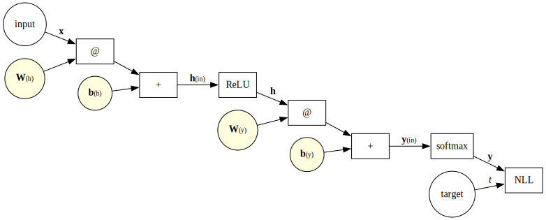

# Zkouška

tento dokument je zveřejněn pod licencí [CC BY-SA]([https://creativecommons.org/licenses/by-sa/4.0/](https://creativecommons.org/licenses/by-sa/4.0/)), vychází z materiálů, jejichž autory jsou Jindřich Libovický a Milan Straka

## 1. Introduction to Machine Learning

- Easy: Explain how reinforcement learning differs from supervised and unsupervised learning in terms of the type of input the learning algorithms use to improve model performance.
	- supervised, unsupervised
		- máme vstupní data (v případě supervised také cílové hodnoty)
	- reinforcement
		- nemáme vstupní data, ale spíše prostředí
		- např. necháme program, aby donekonečna hrál šachy proti jiným programům
	- výkon (performance) vždy měříme pomocí vhodné metriky
- Medium: Explain why we need separate training and test data. What is generalization, and how does the concept relate to underfitting and overfitting?
	- testovací data slouží k ověření toho, jak dobře náš model generalizuje – snažíme se zjistit, jak dobré výsledky model vrací pro data, která dosud neviděl
	- underfitting – model je příliš slabý (příliš jednoduchý), plně jsme nevyužili jeho potenciál
	- overfitting – model špatně generalizuje, příliš se přizpůsobil trénovacím datům
- Medium: Define the prediction function of a linear regression model and write down $L^2$-regularized mean squared error loss.
	- predikce … $y(x;w,b)=x^Tw+b$
		- někdy je vhodné přidat na konec $x$ jedničku, pak je bias uložen v poslední hodnotě váhového vektoru, tedy $y(x;w)=x^Tw$
	- MSE
		- původní vzorec: $\text{MSE}(w)=\frac1N\sum_{i=1}^N(y(x_i;w)-t_i)^2$
		- místo $\frac1N$ se používá $\frac12$ (při minimalizaci MSE se počet dat nemění) → není to MSE, ale „sum of squares error“
		- používaný vzorec s $L^2$ regularizací
			- $\frac12\sum_{i=1}^N(y(x_i;w)-t_i)^2+\frac{\lambda}2 \lVert w\rVert^2$
			- to odpovídá $\frac12\lVert Xw-t\rVert^2+\frac{\lambda}2 \lVert w\rVert^2$
		- poznámka: obvykle se $L^2$ regularizace nepoužívá na bias, jelikož ten nezpůsobuje overfitting
- Medium: Starting from the unregularized sum of squares error of a linear regression model, show how the explicit solution can be obtained, assuming $\boldsymbol X^T \boldsymbol X$ is invertible.
	- sum of squares error: $\frac12\sum_{i}(x_i^Tw-t_i)^2$
		- lze ho zapsat jako $\frac12\lVert Xw-t\rVert^2$
	- snažíme se ho minimalizovat → hledáme hodnoty, kde je derivace chybové funkce podle každé z vah nulová
		- $\frac{\partial}{\partial w_j}\frac12\sum_{i}(x_i^Tw-t_i)^2=\sum_i x_{ij}(x_i^Tw-t_i)$
		- chceme, aby $\forall j:\sum_i x_{ij}(x_i^Tw-t_i)=0$
			- $X^T(Xw-t)=0$
			- $X^TXw=X^Tt$
	- je-li $X^TX$ invertibilní, pak lze určit explicitní řešení jako $w=(X^TX)^{-1}X^Tt$

## 2. Linear Regression, SGD

- Medium: Describe standard gradient descent and compare it to stochastic (i.e., online) gradient descent and minibatch stochastic gradient descent. Explain what it is used for in machine learning.
	- snažíme se minimalizovat hodnotu chybové funkce $E(w)$ pro dané váhy $w$ volbou lepších vah
		- spočítáme $\nabla_wE(w)$ → tak zjistíme, jak váhy upravit
		- nastavíme $w\leftarrow w-\alpha\nabla_wE(w)$
			- $\alpha$ … learning rate (hyperparametr), „délka kroku“
		- tomu se říká gradient descent
	- standard gradient descent – používáme všechna trénovací data k výpočtu $\nabla_wE(w)$
	- stochastic (online) gradient descent – používáme jeden náhodný řádek
	- minibatch stochastic gradient descent – používáme $B$ náhodných nezávislých řádků
- Easy: Explain possible intuitions behind $L^2$ regularization.
	- penalizujeme modely s většími váhami
	- preferujeme menší změny modelu
	- omezujeme efektivní kapacitu modelu
	- čím je model složitější, tím větší má váhy
- Easy: Explain the difference between hyperparameters and parameters.
	- parametry
		- jsou předmětem učení
		- na základě trénovacích dat se model naučí nějaké parametry, podle nichž pak predikuje
		- příklady: váhový vektor $w$ u lineární regrese, váhová matice $W$ a vektor biases $b$ u MLP, středy clusterů u clusteringu
	- hyperparametry
		- ovlivňují učení
		- učicí algoritmus je nijak neupravuje
		- k posuzování kvality zvolených hyperparametrů slouží validační/vývojová data
		- příklady: síla regularizace $\lambda$, maximální stupeň polynomu $M$ (u polynomiálních features), rychlost učení $\alpha$ (u SGD)
- Medium: Write an $L^2$-regularized minibatch SGD algorithm for training a *linear regression* model, including the explicit formulas (i.e., formulas you would need to code it with `numpy`) of the loss function and its gradient.
	- náhodně inicializujeme $w$ (nebo nastavíme na nulu)
	- opakujeme, dokud to nezkonverguje nebo nám nedojde trpělivost
		- samplujeme minibatch řádků s indexy $\mathbb B$
			- buď uniformně náhodně, nebo budeme chtít postupně zpracovat všechna trénovací data (to se obvykle dělá, jednomu takovému průchodu se říká epocha), tedy je nasekáme na náhodné minibatche a procházíme postupně
		- $w\leftarrow w-\alpha\frac1{|\mathbb B|}\sum_{i\in \mathbb B}((x_i^Tw-t_i)x_i)-\alpha\lambda w$
			- jako $E$ se používá polovina MSE (s $L^2$ regularizací) – stačí to zderivovat
- Medium: Does the SGD algorithm for *linear regression* always find the best solution on the training data? If yes, explain under what conditions it happens; if not, explain why it is not guaranteed to converge. What properties of the error function does this depend on?
	- loss function je $(y(x;w)-t)^2$ (nebo polovina), což je spojitá konvexní funkce, tedy SGD téměř jistě konverguje k optimu, pokud posloupnost $(\alpha_n)$ splňuje podmínky
		- $\forall n:\alpha_n\gt 0$
		- $\sum_n \alpha_n=\infty$
		- $\sum_n \alpha_n^2\lt\infty$
	- z třetí podmínky vyplývá, že $\alpha_n$ jde k nule
- Medium: After training a model with SGD, you ended up with a low training error and a high test error. Using the learning curves, explain what might have happened and what steps you might take to prevent this from happening.
	- pokud se testovací křivka přibližovala a v určitý moment se začala vzdalovat, došlo k přetrénování (overfitting) modelu
		- je potřeba zesílit regularizaci nebo včas zastavit trénování
	- pokud se testovací křivka ani nezačala přibližovat, je potřeba trénovat déle
- Medium: You were given a fixed training set and a fixed test set, and you are supposed to report model performance on that test set. You need to decide what hyperparameters to use. How will you proceed and why?
	- v procesu trénování modelu a ladění hyperparametrů nesmím použít testovací data
	- z trénovacích dat vyčlením vývojová data, která se nebudou účastnit trénování, ale budou sloužit k porovnávání výkonu modelu při různých hodnotách hyperparametrů
	- alternativou by bylo použití cross-validation
		- trénovací data rozdělím na $n$ dílů
		- model natrénuju na datech z $n-1$ dílů
		- na zbylých datech model vyhodnotím
		- proces opakuju pro $n$ možných voleb
		- jako výsledné skóre modelu použiju průměr průběžných hodnocení
- Easy: What methods can be used to normalize feature values? Explain why it is useful.
	- obvyklé metody
		- normalizace
			- přeškálování na rozsah $[0,1]$
			- $x_\text{norm}=\frac{x-\text{min}}{\text{max}-\text{min}}$
		- standardizace
			- vystředění na nulu a přeškálování, aby měla data jednotkový rozptyl
			- $x_\text{standard}=\frac{x-\hat\mu}{\hat\sigma}$
		- logaritmizace
	- pokud bychom měli features s různými rozsahy, potřebovali bychom různé learning rates

## 3. Perceptron, Logistic Regression

- Medium: Define binary classification, write down the perceptron algorithm, and show how a prediction is made for a given data instance $\boldsymbol x$.
	- binární klasifikace je klasifikace do dvou tříd
		- $t_i\in\set{-1,+1}$
	- algoritmus
		- začneme s nulovými váhami $w$
		- dokud nejsou všechna trénovací data klasifikována správně, postupně bereme řádky po jednom
			- pro $i$-tý řádek spočítáme predikci $y=x_i^Tw$
			- pokud $t_iy\leq 0$, je řádek klasifikován špatně
				- provedeme korekci $w\leftarrow w+t_ix_i$
	- predikce pro $x_i$ … $\text{sign}(x_i^Tw)$
- Hard: For discrete random variables, define entropy, cross-entropy, and Kullback-Leibler divergence, and prove the Gibbs inequality (i.e., that KL divergence is non-negative).
	- self information … $I(x)=-\log P(X)$ 
	- entropie pravděpodobnostního rozdělení $P$
		- $H(P)=-\mathbb E[\log P(x)]=-\sum_xP(x)\log P(x)$
	- cross entropie rozdělení $P,Q$
		- $H(P,Q)=-\mathbb E_{x\sim P}[\log Q(x)]=-\sum_xP(x)\log Q(x)$
	- Gibbsova nerovnost
		- $H(P,Q)\geq H(P)$
		- $H(P)=H(P,Q)\iff P=Q$
	- důkaz
		- chceme $H(P)-H(P,Q)\leq 0$ (s rovností právě když $P=Q$)
		- $H(P)-H(P,Q)=\sum_xP(x)\log\frac{Q(x)}{P(x)}$
		- použijeme faktu, že $\log x\leq x-1$ s rovností pouze pro $x=1$
		- $\sum P(x)\log\frac{Q(x)}{P(x)}\leq\sum P(x)(\frac{Q(x)}{P(x)}-1)=\sum Q(x)-\sum P(x)=1-1=0$
		- aby platila rovnost, musí být $\frac{Q(x)}{P(x)}$ pro všechny $x$ rovno 1, tedy $P=Q$
	- Kullback-Leibler divergence
		- $D_{KL}(P\| Q)=H(P,Q)-H(P)=\mathbb E_{x\sim P}[\log P(x)-\log Q(x)]$
- Easy: Explain the notion of likelihood in maximum likelihood estimation. What likelihood are we estimating in machine learning, and why do we do it?
	- máme-li fixní trénovací data, pak likelihood $L(w)$ (kde $w$ jsou váhy modelu) se rovná součinu pravděpodobností targetů trénovacích dat
	- odhadujeme váhy modelu tak, aby byl likelihood (věrohodnost) trénovacích dat co největší
	- přesněji
		- pro model s fixními vahami $w$ máme pravděpodobnostní distribuci $p_\text{model}(x;w)$, že model vygeneruje $x$
		- pro model s fixními vahami $w$ a konkrétní řádek $x$ máme pravděpodobnostní distribuci $p_\text{model}(t\mid x;w)$, jak model klasifikuje $x$
		- místo toho zafixujeme trénovací data a budeme měnit váhy → dostaneme $L(w)=p_\text{model}(X;w)=\prod_i p_\text{model}(x_i;w)$
		- $w_\text{MLE}=\text{arg max}_w\,p_\text{model}(X;w)$
- Hard: Describe maximum likelihood estimation as minimizing NLL, cross-entropy, and KL divergence and explain whether they differ or are the same and why.
	- z distribuce $p_\text{data}$ samplujeme trénovací data $X$
	- tak získáme empirickou distribuci dat $\hat p_\text{data}(x)$
	- pro model s fixními vahami $w$ máme pravděpodobnostní distribuci $p_\text{model}(x;w)$, že model vygeneruje $x$
	- místo $x$ můžeme všude uvažovat $t\mid x$ (protože negenerujeme $x$, ale snažíme se predikovat $t$ pro dané $x$), dopadne to stejně
	- místo $p_\text{model}$ píšu $p$, místo $\hat p_\text{data}$ píšu $\hat p$
	- $w_\text{MLE}=\text{arg max}_w\,p(X;w)=\text{arg max}_w\prod_ip(x_i;w)$
	- $=\text{arg min}_w\sum_i-\log p(x_i;w)$
		- negative log-likelihood
	- $=\text{arg min}_w\,\mathbb E_{x\sim\hat p}[-\log p(x;w)]$
	- $=\text{arg min}_w\,H(\hat p(x),p(x;w))$
	- $=\text{arg min}_w(D_{KL}(\hat p(x)\|p(x;w))+H(\hat p))$
	- $=\text{arg min}_w\,D_{KL}(\hat p(x)\|p(x;w))$
		- protože $H(\hat p)$ není parametrizováno $w$ → neovlivňuje polohu minima
- Easy: Provide an intuitive justification for why cross-entropy is a good optimization objective in machine learning. What distributions do we compare in cross-entropy? Why is it good when the cross-entropy is low?
	- pomocí cross-entropy porovnáváme distribuci opravdových targetů a distribuci predikcí modelu
	- čím víc se distribuce liší (cross-entropy je větší), tím hůř model predikuje
	- cross-entropy odpovídá našemu překvapení – pokud jsou dvě distribuce hodně odlišné, jsme hodně překvapení
	- cross-entropy taky podporuje confidence – nestačí, aby model dal správnému výsledku největší pravděpodobnost (třeba 51 %), měla by co nejvíc odpovídat rozdělení, které je v datech
		- ale naopak pokud si na základě features nemůže být jistý klasifikací (šance je třeba 2 : 3), chceme, aby si klasifikací opravdu nebyl jistý a vrátil 60 %
- Medium: Considering the binary logistic regression model, write down its parameters (including their size) and explain how we decide what classes the input data belong to (including the explicit formula for the sigmoid function).
	- $y(x;w)=\sigma(\bar y(x;w))=\sigma(x^Tw)$
		- správnou třídu získáme zaokrouhlením
		- přesná hodnota se rovná pravděpodobnosti, že je $x$ klasifikováno jako 1 (uvažujeme třídy 0 a 1)
	- $\bar y$ … „lineární složka“ logistické regrese
	- velikost vektoru vah $w$ odpovídá počtu features
		- nesmíme zapomenout také na bias, ten opět může být reprezentován jako další váha
	- $\sigma(x)=\frac1{1+e^{-x}}$
- Hard: Write down an $L^2$-regularized minibatch SGD algorithm for training a binary *logistic regression* model, including the explicit formulas (i.e., formulas you would need to code it in `numpy`) of the loss function and its gradient (saying just $\nabla$ is not enough).
	- klasifikujeme do tříd $\set{0,1}$, na vstupu máme dataset $X$ a learning rate $\alpha\in\mathbb R^+$
	- náhodně inicializujeme $w$ (nebo nastavíme na nulu)
	- opakujeme, dokud to nezkonverguje nebo nám nedojde trpělivost
		- samplujeme minibatch řádků s indexy $\mathbb B$
		- $w\leftarrow w-\alpha\frac1{|\mathbb B|}\sum_{i\in \mathbb B}(\sigma(x^Tw)-t)x-\alpha\lambda w$
			- jako $E$ se používá NLL (s $L^2$ regularizací)
			- výsledek se překvapivě podobá lineární regresi
				- gradient je také $(y(x)-t)x$
	- ztrátová funkce (loss ~~:.|:;~~)
		- $E(w)=\frac1N\sum_i-\log(p(C_{t_i}\mid x_i;w))$
		- kde $p(C_{t_i}\mid x_i;w)=\sigma(x^Tw)^t(1-\sigma(x^Tw))^{1-t}$

## 4. Multiclass Logistic Regression, Multilayer Perceptron

- Medium: Define mean squared error and show how it can be derived using MLE. What assumptions do we make during such derivation?
	- $\text{MSE}(w)=\frac1N\sum_{i=1}^N(y(x_i;w)-t_i)^2$
	- předpokládáme, že náš model generuje distribuci $p(t\mid x;w)=\mathcal N(t;y(x;w),\sigma^2)$
		- tedy že jde o normální distribuci se střední hodnotou v predikované hodnotě $y(x;w)$ a s fixním rozptylem $\sigma^2$
		- poznámka ke značení: pokud $X\sim\mathcal N(\mu,\sigma^2)$, pak $f_X(x)=\mathcal N(x;\mu,\sigma^2)$
	- použijeme maximum likelihood estimation (odhad maximální věrohodnosti)
	- $\text{arg max}_w\,p(t\mid X;w)=\text{arg min}_w\sum_i-\log p(t_i\mid x_i;w)$
	- $$=\text{arg min}_w-\sum_{i=1}^N\log\sqrt{\frac1{2\pi\sigma^2}}e^{-\frac{(t_i-y(x_i;w))^2}{2\sigma^2}}$$
	- $=\text{arg min}_w-\sum_{i=1}^N(\log\sqrt{\frac1{2\pi\sigma^2}}{-\frac{(t_i-y(x_i;w))^2}{2\sigma^2}})$
	- $=\text{arg min}_w-N\log\sqrt{\frac1{2\pi\sigma^2}}+\sum_{i=1}^N{\frac{(t_i-y(x_i;w))^2}{2\sigma^2}}$
		- první člen neobsahuje $w$, tak se ho zbavíme
	- $=\text{arg min}_w\sum_{i=1}^N{\frac{(t_i-y(x_i;w))^2}{2\sigma^2}}$
		- na konkrétní hodnotě $\sigma$ nezáleží, můžeme tam doplnit $\frac1N$ (na tom taky nezáleží)
	- $=\text{arg min}_w\,\frac1N\sum_{i=1}^N{{(y(x_i;w)-t_i)^2}}$
- Medium: Considering $K$-class logistic regression model, write down its parameters (including their size) and explain how we decide what classes the input data belong to (including the formula for the softmax function).
	- parametry: váhová matice $W$ (sloupce odpovídají třídám, řádky featurám), vektor biasů (jeden bias za každou třídu)
	- klasifikace: $p(C_i\mid x;W)=y(x;W)_i=\text{softmax}(\bar y(x;W))_i=\text{softmax}(x^TW)_i$
	- $\text{softmax}(z)_i=\frac{e^{z_i}}{\sum_je^{z_j}}$
	- poznámka: softmax je invariantní k přičtení konstanty $\text{softmax}(z+c)_i=\text{softmax}(z)_i$
- Easy: Explain the relationship between the sigmoid function and softmax.
	- $\sigma(x)=\text{softmax}([x,0])_0=\frac{e^x}{e^x+e^0}=\frac1{1+e^{-x}}$
- Easy: Show that the softmax function is invariant towards constant shift.
	- $\text{softmax}(z+c)_i=\frac{e^{z_i+c}}{\sum_je^{z_j+c}}=\frac{e^{z_i}}{\sum_j e^{z_j}}\cdot\frac{e^c}{e^c}=\text{softmax}(z)_i$
- Hard: Write down an $L^2$-regularized minibatch SGD algorithm for training a $K$-class logistic regression model, including the explicit formulas (i.e., formulas you would use to code it in `numpy`) of the loss function and its gradient.
	- klasifikujeme do tříd $\set{0,\dots,K-1}$, na vstupu máme dataset $X$ a learning rate $\alpha\in\mathbb R^+$
	- náhodně inicializujeme $w$ (nebo nastavíme na nulu)
	- opakujeme, dokud to nezkonverguje nebo nám nedojde trpělivost
		- samplujeme minibatch řádků s indexy $\mathbb B$
		- $w\leftarrow w-\alpha\frac1{|\mathbb B|}\sum_{i\in \mathbb B}\left((\text{softmax}(x^TW)-1_t)x^T\right)^T-\alpha\lambda w$
			- jako $E$ se používá NLL (s $L^2$ regularizací)
			- srovnání gradientu logistické regrese
				- binary: $(y(x)-t)x$
				- multiclass: $((y(x)-1_t)x^T)^T$
			- přičemž $1_t$ je one-hot reprezentace targetu $t$ (tedy vektor s jedničkou na $t$-té pozici a nulami všude jinde)
- Medium: Prove that decision regions of a multiclass logistic regression are convex.
	- uvažujme dvojici dat $x_A$ a $x_B$, které jsou klasifikovány jako $k$ (jsou ve stejném regionu)
	- libovolný bod $x$ ležící na jejich spojnici je jejich konvexní kombinace $x=\lambda x_a+(1-\lambda)x_B$ a z linearity $\bar y(x)=x^TW$ vyplývá
		- $\bar y(x)=\lambda\bar y(x_A)+(1-\lambda)\bar y(x_B)$
	- jelikož ve vektoru $\bar y(x_A)$ byla největší $k$-tá složka a ve vektoru $\bar y(x_B)$ rovněž, bude i ve vektoru $\bar y(x)$ největší $k$-tá složka
- Medium: Considering a single-layer MLP with $D$ input neurons, $H$ hidden neurons, $K$ output neurons, hidden activation $f$, and output activation $a$, list its parameters (including their size) and write down how the output is computed.
	- vstupní data mají $D$ features
	- parametry
		- první váhová matice $W^{(h)}$ bude mít tvar $D\times H$
		- první vektor biasů bude mít $H$ složek
		- druhá váhová matice $W^{(y)}$ bude mít tvar $H\times K$
		- druhý vektor biasů bude mít $K$ složek
	- výsledný vektor bude mít $K$ složek
	- pro řádek vstupních dat $x$ spočítáme
		- aktivaci skryté vrstvy $h=f(x^TW^{(h)}+b^{(h)})$
		- výsledný vektor $y=a(h^TW^{(y)}+b^{(y)})$
- Medium: List the definitions of frequently used MLP output layer activations (the ones producing parameters of a Bernoulli distribution and a categorical distribution). Then, write down three commonly used hidden layer activations (sigmoid, tanh, ReLU). Explain why identity is not a suitable activation for hidden layers.
	- aktivační funkce výstupní vrstvy
		- binární klasifikace (Bernoulliho distribuce) → sigmoid
		- klasifikace do více tříd (kategorická distribuce) → softmax
		- lineární regrese → identita
	- aktivační funkce skryté vrstvy
		- $\sigma(x)=\frac1{1+e^{-x}}$
		- $\tanh(x)=2\sigma(2x)-1$
		- $\text{ReLU}=\max(0,x)$
	- proč není u skryté vrstvy vhodná identita?
		- na výstupní vrstvě (před aktivací) by nám vyšlo toto:
		- $(x^TW^{(h)}+b^{(h)})^TW^{(y)}+b^{(y)}=x^T\underbrace{W^{(h)}W^{(y)}}_{W}+\underbrace{b^{(h)T}W^{(y)}+b^{(y)}}_b$
		- vyjde to, jako by tam ta skrytá vrstva vůbec nebyla – místo $W^{(h)},W^{(y)},b^{(h)},b^{(y)}$ by nám stačilo $W,b$ a mělo by to stejný efekt

## 5. MLP, Softmax as MaxEnt classifier, F1 score

- Hard: Considering a single-layer MLP with $D$ input neurons, a ReLU hidden layer with $H$ units, and a softmax output layer with $K$ units, write down the explicit formulas (i.e., formulas you would use to code it in `numpy`) of the gradient of all the MLP parameters (two weight matrices and two bias vectors), assuming input $\boldsymbol x$, target $t$, and negative log likelihood loss.
	- algoritmus trénování
		- náhodně inicializujeme váhy a biasy
		- opakujeme, dokud to nezkonverguje nebo nám nedojde trpělivost
			- samplujeme minibatch řádků s indexy $\mathbb B$
			- gradienty vah a biasů nastavíme na nulu
			- $\forall i\in\mathbb B:$
				- nejprve dopředný běh
					- $h \leftarrow \max(0,x_i W^{(h)} + b^{(h)})$
					- $y \leftarrow \text{softmax}(h W^{(y)} + b^{(y)})$
				- pak zpětná propagace
					- výstupní vrstva
						- $\nabla y \leftarrow y - 1_{t_i}$
						- $\nabla W^{(y)} \mathrel{+}= h\nabla y^T$
						- $\nabla b^{(y)} \mathrel{+}= \nabla y$
					- skrytá vrstva
						- $\nabla h \leftarrow (W^{(y)} \nabla y) \cdot 1_{h > 0}$
						- $\nabla W^{(h)} \mathrel{+}= x_i\nabla h^T$
						- $\nabla b^{(h)} \mathrel{+}= \nabla h$
			- od vah a biasů odečteme $\alpha\over |\mathbb B|$-násobek odpovídajícího gradientu
	- gradienty
		- $\nabla W^{(y)}=\frac{1}{N}\sum_i h\nabla y_i^T$
		- $\nabla b^{(y)}=\frac{1}{N}\sum_i \nabla y_i$
		- $\nabla W^{(h)}=\frac{1}{N}\sum_i x_i\nabla h_i^T$
		- $\nabla b^{(h)}=\frac{1}{N}\sum_i \nabla h_i$
		- přičemž
			- $h_i= \max(0,x_i W^{(h)} + b^{(h)})$
			- $y_i= \text{softmax}(h W^{(y)} + b^{(y)})$
			- $\nabla y_i = y_i - 1_{t_i}$
			- $\nabla h_i = (W^{(y)} \nabla y_i) \cdot 1_{h_i > 0}$
- Medium: Formulate the computation of MLP as a computation graph. Explain how such a graph can be used to compute the gradients of the parameters in the back-propagation algorithm.
	- trénování MLP můžeme popsat jako graf operací a datových zdrojů
	- 
	- gradienty
		- $\nabla W^{(y)}=\frac{1}{N}\sum_i h\nabla y_i^T$
		- $\nabla b^{(y)}=\frac{1}{N}\sum_i \nabla y_i$
		- $\nabla W^{(h)}=\frac{1}{N}\sum_i x_i\nabla h_i^T$
		- $\nabla b^{(h)}=\frac{1}{N}\sum_i \nabla h_i$
		- přičemž
			- $h_i= \max(0,x_i W^{(h)} + b^{(h)})$
			- $y_i= \text{softmax}(h W^{(y)} + b^{(y)})$
			- $\nabla y_i = y_i - 1_{t_i}$
			- $\nabla h_i = (W^{(y)} \nabla y_i) \cdot 1_{h_i > 0}$
	- tedy při výpočtu gradientů můžeme postupovat grafem proti směru hran
- Medium: Formulate the Universal approximation theorem and explain in words what it says about multi-layer perceptron.
	- mějme $\varphi(x):\mathbb R\to\mathbb R$ nekonstantní omezenou neklesající spojitou funkci (ale lze to ukázat i pro ReLU)
	- pak $\forall\varepsilon\gt 0$ a pro libovolnou spojitou $f:[0,1]^D\to\mathbb R$ existují $H\in\mathbb N$, $v\in\mathbb R^H$, $b\in\mathbb R^H$ a $W\in\mathbb R^{D\times H}$ takové, že…
		- označíme-li $F(x)=v^T\varphi(x^TW+b)$
		- přičemž $\varphi$ se aplikuje po prvcích
		- pak $\forall x\in[0,1]^D:|F(x)-f(x)|\lt\varepsilon$
	- $v$ … vektor vah výstupní vrstvy
	- co to znamená?
		- MLP s jednou skrytou vrstvou dokáže modelovat libovolnou spojitou funkci $f$
		- ale možná k tomu budeme potřebovat hodně neuronů ve skryté vrstvě
- Medium: How do we search for a minimum of a function $f(\boldsymbol x): \mathbb{R}^D \rightarrow \mathbb{R}$ subject to equality constraints $g_1(\boldsymbol x)=0, \ldots, g_m(\boldsymbol x)=0$?
	- použijeme metodu Lagrangeových multiplikátorů
	- předpokládáme, že $f,g1,\dots,g_m$ mají spojité parciální derivace a že gradienty $\nabla g_1,\dots,\nabla g_m$ jsou lineárně nezávislé
	- pak existují $\lambda_1\in\mathbb R,\dots,\lambda_m\in\mathbb R$ takové, že Lagrangeova funkce $\mathcal L(x,\lambda)=f(x)-\sum_{i=1}^m\lambda_ig_i(x)$ má nulový gradient podle $x$ a $\lambda$
		- jinými slovy $\nabla f(x)=\sum\lambda_i\nabla g_i(x)$ a $\forall i:g_i(x)=0$
	- vyřešíme soustavu rovnic a dostaneme hledané $x$
	- poznámka
		- proč by mělo „minimum pod podmínkou“ být zrovna v bodě, kde $\nabla f(x)=\lambda\nabla g(x)$?
		- funkce, jejíž minimum hledáme je $f(x)$
			- uvažujme její vrstevnice, tedy množiny bodů, kde $f(x)=\alpha$ pro nějakou konstantu $\alpha$
			- gradient $\nabla f(x)$ je vždy kolmý na vrstevnici, „ukazuje“ směrem, kam funkce roste
			- chceme najít takový bod, kde bude gradient $\nabla f(x)$ kolmý na podmínku – jinak bychom se po křivce podmínky mohli vydat směrem, kterým gradient ukazuje a funkce by rostla (respektive na opačnou stranu, když hledáme minimum)
		- podmínka je popsána jako $g(x)=0$
			- gradient $\nabla g(x)$ je kolmý na každou vrstevnici $g(x)=\alpha$
			- podmínka $g(x)=0$ je jednou z vrstevnic, tedy je na ni gradient kolmý
		- takže hledáme bod, kde je gradient $\nabla f(x)$ kolmý na $g(x)=0$ a kde je gradient $\nabla g(x)$ kolmý na $g(x)=0$, což znamená, že gradienty mají být kolineární
			- $\nabla f(x)=\lambda\nabla g(x)$
- Medium: Prove which categorical distribution with $N$ classes has maximum entropy.
	- hledáme kategorickou distribuci $p=(p_1,\dots,p_n)$ s maximální entropií
	- tedy minimalizujeme $-H(p)$ s podmínkami $\forall i:p_i\geq 0$ a $\sum_i p_i=1$
		- první z nich zatím ignorujeme
	- $\mathcal L(x,\lambda)=(\sum_i p_i\log p_i)-\lambda(\sum_i p_i-1)$
	- $0=\frac{\partial\mathcal L}{\partial p_i}=1\cdot\log p_i+p_i\cdot\frac1{p_i}-\lambda=\log p_i+1-\lambda$
	- $\log p_i=\lambda-1$
	- $p_i=e^{\lambda-1}$
	- tedy všechny pravděpodobnosti musejí být stejné
	- z podmínky $\sum p_i=1$ vyplývá, že $p_i=\frac1n$
- Hard: Consider derivation of softmax using maximum entropy principle, assuming we have a dataset of $N$ examples $(x_i, t_i), x_i \in \mathbb{R}^D, t_i \in \{1, 2, \ldots, K\}$. Formulate the three conditions we impose on the searched $\pi: \mathbb{R}^D \rightarrow \mathbb{R}^K$, and write down the Lagrangian to be minimized. Explain in words what is the interpretation of the conditions.
	- podmínky
		- $\forall k\in[K]:\pi(x)_k\geq 0$
		- $\sum_{k=1}^K \pi(x)_k=1$
		- $\forall k\in[K]:\sum_{i=1}^N\pi(x_i)_kx_i=\sum_{i=1}^N[t_i=k]x_i$
	- první dvě podmínky: chceme generovat pravděpodobnost
	- třetí podmínka
		- chceme, aby součty hodnot jednotlivých features v každé z tříd byly správné
		- např. klasifikujeme lidi, psy a kočky, chceme, aby se pro feature „počet nohou“ součet ve třídě lidí rovnal dvojnásobku počtu lidí v trénovacích datech (podobně pro třídu psů čtyřnásobku počtu psů)
		- poznámka: mohli bychom nastavit podmínku $\pi(x_i)=1_{t_i}$, ale ta by byla moc přísná, proto jsme se rozhodli pro tuto alternativu
	- první podmínku ignorujme
	- Lagrangián bude vypadat takto: $$\begin{aligned}\mathcal L=&\sum_{i=1}^N\sum_{k=1}^K\pi(x_i)_k\log(\pi(x_i)_k)\\ &-\sum_{j=1}^D\sum_{k=1}^K\lambda_{j,k}(\sum_{i=1}^N\pi(x_i)_kx_{i,j} -[t_i=k]x_{i,j}) \\ &-\sum_{i=1}^N\beta_i(\sum_{k=1}^K\pi(x_i)_k-1)\end{aligned}$$
- Medium: Define precision (including true positives and others), recall, $F_1$ score, and $F_\beta$ score (we stated several formulations for $F_1$ and $F_\beta$ scores; any one of them will do).
	- základní dělení výsledků klasifikace
		- predikce je pozitivní, realita (target) rovněž → true positive (TP)
		- predikce je pozitivní, realita je negativní → false positive (FP)
		- predikce je negativní, realita je pozitivní → false negative (FN)
		- predikce je negativní, realita také → true negative (TN)
	- $\text{precision}=\frac{TP}{TP+FP}$
	- $\text{recall}=\frac{TP}{TP+FN}$
	- $F_1=\frac{TP + TP}{TP+FP+TP+FN}$
	- $F_\beta=\frac{TP+\beta^2\cdot TP}{TP+FP+\beta^2(TP+FN)}$
- Medium: Explain the difference between micro-averaged and macro-averaged $F_1$ scores. List a few examples of when you would use them.
	- děláme multiclass clasifikaci
	- obvykle nějakou třídu považujeme za negativní, tu budeme ignorovat
	- postupně se díváme na každou z pozitivních tříd jako na binární klasifikaci
		- např. pokud konkrétní řádek dat patří do dané třídy, ale predikovali jsme, že tam nepatří, je to false negative
		- takhle pro každou třídu můžeme získat $TP,FP,FN$
	- micro-averaged $F_1$
		- nejdřív všechny $TP$, $FP$ a $FN$ sečteme dohromady
		- pak spočítáme $F_1$
		- takže velikost (frekvence) tříd hraje roli
	- macro-averaged $F_1$
		- spočítáme $F_1$ skóre jednotlivých binárních klasifikací
		- pak je zprůměrujeme
		- tím zajistíme, že na velikosti tříd moc nezáleží
	- příklady
		- rozpoznávání vlastních jmen v textu (jména osob, organizací a míst)
			- přesnost (accuracy) by byla vysoká, protože je tam hodně true negatives (většina slov nejsou vlastní jména)
			- micro-averaged $F_1$ nám řekne, jak dobří jsme obecně v určování vlastních jmen (ve všech kategoriích dohromady)
				- jsme celkově úspěšní?
			- macro-averaged $F_1$ nám řekne, jak dobře určujeme konkrétní typy vlastních jmen
				- daří se nám ve všech typech? (i v těch s menší frekvencí?)
		- podobně kdybychom klasifikovali slovní druhy
			- kdybychom špatně klasifikovali citoslovce, na micro-averaged bychom to nepoznali, ale na macro-averaged už ano
- Easy: Explain (using examples) why accuracy is not a suitable metric for unbalanced target classes, e.g., for a diagnostic test for a contagious disease.
	- $\text{accuracy}=\frac{TP+TN}{TP+TN+FP+FN}$
	- uvažujme nemoc, kterou má 1 % obyvatel
	- test, který je vždy negativní nebo pozná jen velmi málo nemocných, bude mít vysokou přesnost/accuracy (cca 99 %)

## 6. Representing Text (TF-IDF, Word2Vec)

- Easy: Explain how the TF-IDF weight of a given document-term pair is computed.
	- term frequency … $TF(t;d)$ = počet výskytů slova $t$ v dokumentu $d$ / počet slov v dokumentu $d$
	- inverse document frequency $IDF(t)$ = log(počet dokumentů / počet dokumentů obsahujících slovo $t$)
		- někdy se k počtu dokumentů obsahujících $t$ přičítá jednička, aby se to nerozbilo pro slova, která v dokumentech nejsou vůbec
	- empiricky, součin $TF\cdot IDF$ docela dobře odráží, jak je slovo důležité pro daný dokument z korpusu
- Easy: What is Zipf's law? Explain how it can be used to provide intuitive justification for using the logarithm when computing IDF.
	- Zipfův zákon: frekvence slov je přibližně nepřímo úměrná jejich ranku (pořadí podle četnosti)
	- proto by byl podíl „počet dokumentů / počet dokumentů obsahujících slovo $t$“ extrémně malý pro častá slova a extrémně malý pro málo častá slova
	- logaritmus to normalizuje, proto $IDF(t)$ = log(počet dokumentů / počet dokumentů obsahujících slovo $t$)
- Medium: Define conditional entropy and mutual information, write down the relation between them, and finally prove that mutual information is zero if and only if the two random variables are independent (you do not need to prove statements about $D_\textrm{KL}$).
	- podmíněná entropie: $H(Y\mid X)=\mathbb E_{x,y}[I(y\mid x)]=-\sum_{x,y}P(x,y)\log P(y\mid x)$
	- vzájemná informace: $I(X;Y)=\mathbb E_{x,y}[\log\frac{P(x,y)}{P(x)P(y)}]$
	- $H(Y)-H(Y\mid X)=\mathbb E_{x,y}[-\log P(y)]-\mathbb E_{x,y}[-\log P(y\mid x)]=\mathbb E_{x,y}[\log\frac{P(x,y)}{P(x)P(y)}]$
	- připomenutí: $D_{KL}(P\|Q)=H(P,Q)-H(P)=\mathbb E_{x\sim P}[\log\frac{P(x)}{Q(x)}]$
		- proto zjevně $I(X;Y)=D_{KL}(P(X,Y)\|P(X)P(Y))$
		- z Gibbsovy nerovnosti vyplývá, že $H(P,Q)-H(P)=0\iff P=Q$
		- tedy $I(X;Y)=0\iff P(X,Y)=P(X)P(Y)\iff$ $P,Q$ jsou nezávislé
- Medium: Show that TF-IDF terms can be considered portions of suitable mutual information.
	- mějme $\mathcal D$ kolekci dokumentů a $\mathcal T$ kolekci slov
	- uniformně náhodně vybereme dokument, $P(d)=1/|\mathcal D|$
	- $I(d)=H(\mathcal D)=\log|\mathcal D|$
	- $P(d\mid t\in d)=1/|\set{d\in\mathcal D:t\in d}|$
	- $I(d\mid t\in d)=H(\mathcal D\mid t)=\log|\set{d\in\mathcal D:t\in d}|$
	- $I(d)-I(d\mid t\in d)=H(\mathcal D)-H(\mathcal D\mid t)=\log\frac{|\mathcal D|}{|\set{d\in\mathcal D:t\in d}|}=IDF(t)$
	- $I(\mathcal D;\mathcal T)=\sum_{d,t\in d}P(d)\cdot P(t\mid d)\cdot (I(d)-I(d\mid t))=\frac1{|\mathcal D|}\sum_{d,t\in d}TF(t;d)\cdot IDF(t)$
- Easy: Explain the concept of word embedding in the context of MLP and how it relates to representation learning.
	- MLP lze interpretovat jako automatickou extrakci features pro zobecněný lineární model
	- reprezentační učení: model se ze vstupních dat naučí, jak je reprezentovat, aby se tato reprezentace dala použít k dalším specifickým úkolům (klasifikaci apod.)
	- vstupní slovo budeme reprezentovat jako one-hot vektor
	- po vynásobení s maticí vah ze skryté vrstvy dostaneme konkrétní řádek ze skryté vrstvy, tomu se říká word embedding
- Medium: Describe the skip-gram model trained using negative sampling. What is it used for? What are the input and output of the algorithm?
	- pro každé slovo ze slovníku se chceme naučit embedding
	- natrénujeme model, který bude predikovat pravděpodobnost jiných slov, že se objeví v kontextu daného slova
	- model bude mít dvě vrstvy
		- matici embeddingů
		- výstupní matici (se softmaxem)
	- po trénování můžeme první vrstvu použít jako embeddingy (druhá vrstva se obvykle zahazuje)
	- pro každé slovo samplujeme slova, která se v textu objevují v jeho okolí (obvykle 2 slova doleva a 2 slova doprava)
	- ale musíme samplovat i slova, která se v jeho kontextu nikdy neobjevují (obvykle 5 slov)
	- to zohledníme v loss funkci
- Easy: How would you train a part-of-speech tagger (i.e., you want to assign each word to its part of speech) if you could only use pre-trained word embeddings and MLP classifier?
	- chceme zohlednit kontext, v jakém se slovo v textu objevuje
	- použijeme „posuvné okýnko“ nad embeddingy, budeme klasifikovat prostřední slovo

## 7. K Nearest Neighbors, Naive Bayes

- Medium: Describe the prediction of $k$ for the nearest neighbors, both for regression and classification. Define $L_p$ norm and describe uniform, inverse, and softmax weighting.
	- regrese: $t=\sum_i\frac{w_i}{\sum_j w_j}\cdot t_i$
	- klasifikace
		- pro uniformní váhy můžeme hlasovat (nejčastější třída vyhrává, remízy rozhodujeme náhodně)
		- jinak uvažujeme one-hot kódování $t_i$ opět můžeme použít predikci $t=\sum_i\frac{w_i}{\sum_j w_j}\cdot t_i$ (zvolíme třídu s největší predikovanou pravděpodobností)
	- $L^p$ norma: $\|x\|_p=\sqrt[p]{\sum_i|x_i|^p}$
		- obvykle se používá $p\in\set{1,2,3,\infty}$
		- vzdálenost $x$ a $y$ lze určit jako $\|x-y\|_p$
	- weighting
		- uniform: všech $k$ nejbližších sousedů má stejné váhy
		- inverse: váhy jsou nepřímo úměrné vzdálenosti
		- softmax: váhy jsou přímo úměrné softmaxu záporných vzdáleností
- Medium: Show that $L^2$-regularization can be obtained from a suitable prior by Bayesian inference (from the MAP estimate).
	- budeme předpokládat, že váhy mají distribuci $\mathcal N(0,\sigma^2)$
		- používáme princip maximální entropie
		- $p(w)=\prod_{j=1}^D\mathcal N(w_j;0,\sigma^2)$
	- $w_{\text{MAP}}=\text{arg max}_w\,p(X\mid w)p(w)=\text{arg max}_w\prod_i p(x_i\mid w)p(w)$
		- $=\text{arg min}_w\sum_i(-\log p(x_i\mid w)-\log p(w))$
	- dosadíme normálně rozdělený prior vah
		- $w_\text{MAP}=\text{arg min}_w\sum_i(-\log p(x_i\mid w)-\log\prod_j \sqrt{\frac1{2\pi\sigma^2}}e^{-\frac{w_j^2}{2\sigma^2}})$
		- $=\text{arg min}_w\sum_i(-\log p(x_i\mid w)+\frac D2\log (2\pi\sigma^2)+\frac{\|w\|^2}{2\sigma^2})$
			- prostřední člen nás nezajímá, protože neobsahuje $w$
		- $=\text{arg min}_w\sum_i(-\log p(x_i\mid w)+\frac{\|w\|^2}{2\sigma^2})$
			- tak jsme dostali NLL s $L^2$ regularizací
- Medium: Write down how $p(C_k | \boldsymbol x)$ is approximated in a Naive Bayes classifier, explicitly state the Naive Bayes assumption, and show how the prediction is performed.
	- hledáme $\text{arg max}_k\,p(C_k\mid x)=\text{arg max}_k\frac{p(x\mid C_k)p(C_k)}{p(x)}=\text{arg max}_k\,{p(x\mid C_k)p(C_k)}$
	- $p(C_k)$ lze vyčíst snadno z dat, ale jak určíme $p(x\mid C_k)$?
	- jednotlivé features $x_1,\dots,x_n$ nemusí být nezávislé, tedy $p(x_1,x_2\mid C_k)$ by se měl počítat jako $p(x_1\mid C_k)p(x_2\mid C_k,x_1)$
	- použijeme naivní bayesovský předpoklad, že všechny $x_d$ jsou nezávislé pro dané $C_k$
	- tedy $p(x\mid C_k)=\prod_d p(x_d\mid C_k)$
	- predikce: $\text{arg max}_k\,p(C_k)\prod_d p(x_d\mid C_k)$
		- přičemž pravděpodobnostní funkce se model naučil z trénovacích dat
- Medium: Considering a Gaussian Naive Bayes, describe how probabilities $p(x_d | C_k)$ are modeled (what distribution and which parameters it has) and how we estimate it during fitting.
	- podmíněnou distribuci každé featury budeme modelovat jako $\mathcal N(\mu_{d,k},\sigma^2_{d,k})$
	- výpočet $\mu$ a $\sigma^2$ odpovídá očekávání
		- $\mu_{d,k}=\frac1{N_k}\sum_{i=1}^{N_k}x_{i,d}$
		- $\sigma^2_{d,k}=\frac1{N_k}\sum_{i=1}^{N_k}(x_{i,d}-\mu_{d,k})^2$
	- k rozptylu se obvykle přičítá konstanta $\alpha$, aby distribuce nebyla moc ostrá
- Medium: Considering a Bernoulli Naive Bayes, describe how probabilities $p(x_d | C_k)$ are modeled (what distribution and which parameters it has) and how we estimate it during fitting.
	- podmíněnou distribuci každé featury budeme modelovat jako $\text{Ber}(p)$
	- pokud jsou features binární, pak $p_{d,k}=\frac1{N_k}\sum_{i=1}^{N_k} x_{i,d}$
		- tedy $p_{d,k}$ = (počet řádků ve třídě $k$ s nenulovou featurou $d$) / (počet řádků ve třídě $k$)
	- akorát obvykle nechceme nulovou pravděpodobnost pro features, které jsou pro danou třídu v trénovacích datech vždy nulové
		- proto budeme uvažovat $p_{d,k}$ = (počet řádků ve třídě $k$ s nenulovou featurou $d$ + $\alpha$) / (počet řádků ve třídě $k$ + $2\alpha$)
		- tedy k čitateli zlomku přičteme konstantu $\alpha$ a ke jmenovateli $2\alpha$
			- přičemž $\alpha\gt 0$
		- tomu se říká Laplace/additive smoothing
- Medium: What measures can we take to prevent numeric instabilities in the Naive Bayes classifier, particularly if the probability density is too high in Gaussian Naive Bayes and there are zero probabilities in Bernoulli Naive Bayes?
	- gaussovský NB: k rozptylu přičteme $\alpha$
		- v Scikit-learn se používá $10^{-9}$-násobek největšího rozptylu ze všech features
	- bayesovský NB: k čitateli přičteme $\alpha\gt 0$, ke jmenovateli přičteme $2\alpha$
			- tedy $p_{d,k}$ = (počet řádků ve třídě $k$ s nenulovou featurou $d$ + $\alpha$) / (počet řádků ve třídě $k$ + $2\alpha$)
- Easy: What is the difference between discriminative and (classical) generative models?
	- diskriminativní modely modelují podmíněnou pravděpodobnost nějakého targetu, pokud máme data
		- $p(t\mid x)$
		- model se naučí decision boundary
	- generativní modely generují sdruženou pravděpodobnost
		- $p(t,x)=p(x\mid t)p(t)$
		- model se naučí pravděpodobnostní distribuci dat
		- tedy jsou teoreticky silnější než ty diskriminativní
	- teoretický příklad
		- máme dva clustery trénovacích dat, jeden cluster odpovídá jedné třídě, druhý druhé
		- co nám o řádku testovacích dat, který je úplně mimo clustery řekly modely?
		- diskriminativní model nám trénovací data lineárně separuje – tedy i pro tento řádek umí určit třídu, kam patří (pokud není přímo na rozhraní)
		- generativní model by nám řekl, že je ten řádek úplně mimo a nepatří ani do jedné třídy
	- ale když je dost dat, tak se v praxi ukazuje, že diskriminativní modely jsou vždycky lepší než generativní
	- pozor, i „generativní AI“ dneska obvykle používá diskriminativní modely

## 8. Correlation, Model Combination

- Medium: Prove that independent discrete random variables are uncorrelated.
	- kovariance: $\text{cov}(X,Y)=\mathbb E[(X-\mathbb EX)(Y-\mathbb EY)]$
	- $X,Y$ jsou nekorelované, pokud $\text{cov}(X,Y)=0$
	- mějme $X,Y$ nezávislé náhodné veličiny
	- pak $\text{cov}(X,Y)=\mathbb E((X-\mathbb EX)(Y-\mathbb EY))=\sum_{x,y} P(x,y)(x-\mathbb EX)(y-\mathbb EY)$
	- $=\sum_{x,y} P(x)(x-\mathbb EX)P(y)(y-\mathbb EY)=(\sum_xP(x)(x-\mathbb EX))(\sum_y P(y)(y-\mathbb EY))$
	- $=\mathbb E[X-\mathbb EX]\cdot\mathbb E[Y-\mathbb EY]=0$
- Medium: Write down the definition of covariance and Pearson correlation coefficient $\rho$, including its range.
	- $\text{cov}(X,Y)=\mathbb E[(X-\mathbb EX)(Y-\mathbb EY)]$
	- $\rho(X,Y)=\frac{\text{cov}(X,Y)}{\sqrt{\text{var}(X)}\sqrt{\text{var}(Y)}}=\frac{\text{cov}(X,Y)}{\sigma_X\cdot\sigma_Y}$
	- $\forall X,Y:\rho(X,Y)\in[-1,1]$
- Medium: Explain how Spearman's rank correlation coefficient and Kendall's rank correlation coefficient are computed (there is no need to describe the Pearson correlation coefficient).
	- $\rho$ nefunguje dobře, pokud chceme počítat nelineární korelaci
	- Spearmanův koeficient pořadové korelace
		- počítá se jako $\rho$ na pořadí dat
		- pořadí (rank) určíme tak, že hodnoty (dvojice $(x,y)$) seřadíme vzestupně (podle dané souřadnice) a vezmeme jejich indexy
		- značí se také $\rho$
	- Kendallův koeficient pořadové korelace
		- data jsou tvořena dvojicemi $(x,y)$
		- libovolné dvě dvojice vybrané z dat můžou být buď konkordantní (ve správném pořadí, např. pokud je $x_1\gt x_2$, pak i $y_1\gt y_2$) nebo diskordantní (ve špatném pořadí, např. $x_1\gt x_2$, ale $y_1\lt y_2$)
		- Kendallův koeficient $\tau$ získáme jako rozdíl mezi pravděpodobností, že jsou vybrané dvojice konkordantní, a pravděpodobností, že jsou vybrané dvojice diskordantní
		- tedy platí $$\begin{aligned}\tau&=\frac{|\{\mathrm{pairs}~i ≠ j: x_j > x_i, y_j > y_i\}| - |\{\mathrm{pairs}~i ≠ j: x_j > x_i, y_j < y_i\}|}{\binom{n}{2}} \\&= \frac{∑_{i < j} \text{sign}(x_j - x_i)\cdot\text{sign}(y_j - y_i)}{\binom{n}{2}}\end{aligned}$$
- Easy: Describe setups where a correlation coefficient might be a good evaluation metric.
	- chceme model používat k seřazení (rankování) dokumentů
		- uživatel zadá dotaz, my mu vrátíme výsledky v nějakém pořadí
		- pro daný dotaz víme, jaké by pořadí mělo být
	- chceme vyhodnotit kvalitu embeddingů
		- z psycholingvistických experimentů máme nějaká skóre pro dvojice slov/vět
		- model se naučil embeddingy, pro dvojice embeddingů můžeme spočítat jejich vzdálenost
- Easy: Describe under what circumstance correlation can be used to assess the validity of evaluation metrics.
	- někdy není jasné, jak vyhodnocovat výkon modelu
	- typicky u úloh, kde hraje roli subjektivní hodnocení daného člověka, např. u strojového překladu nebo korekce gramatických chyb
	- snažíme se, aby uměle nastavená metrika korelovala s lidským hodnocením
- Medium: Define Cohen's $\kappa$ and explain what it is used for when preparing data for machine learning.
	- mezianotátorská shoda u klasifikačních úloh
	- $\kappa=\frac{p_O-p_E}{1-p_E}$
		- $p_O$ … pozorovaná shoda
		- $p_E$ … shoda, kdyby byla anotace náhodná
- Easy: Assuming you have collected data for classification by letting people annotate data instances. How do you estimate a reasonable range for classifier performance?
	- chtěli bychom, aby byl natrénovaný model lepší než triviální klasifikátor, který přiřadí všem datům největší třídu nebo bude používat nějaká jednoduchá pravidla
	- očekáváme, že výkon modelu nebude lepší než mezianotátorská shoda
		- pokud se něco takového stane, asi overfitujeme
- Hard: Considering an averaging ensemble of $M$ models, prove the relation between the average mean squared error of the ensemble and the average error of the individual models, assuming the model errors have zero means and are uncorrelated. Use a formula to explain what uncorrelated errors mean in this context.
	- chybu $i$-tého modelu v ansámblu pro konkrétní řádek $x$ označíme $\varepsilon_i(x)$
		- tedy model pro dvojici $(x,t)$ predikuje $y_i(x)=t+\varepsilon_i(x)$
	- pak MSE $i$-tého modelu bude $\mathbb E[\varepsilon^2_i(x)]$
	- když používáme „averaging ensemble“, tak celková chyba pro $x$ bude $\frac1M\sum_i\varepsilon_i(x)$
	- MSE ansámblu tedy bude $\mathbb E[(\frac1M\sum_i\varepsilon_i(x))^2]$
	- $\mathbb E[(\frac1M\sum_i\varepsilon_i(x))^2]=\mathbb E[\frac1{M^2}\sum_{i,j}\varepsilon_i(x)\varepsilon_j(x)]=\frac1{M^2}\sum_{i,j}\mathbb E[\varepsilon_i(x)\varepsilon_j(x)]$
		- první rovnost je přímočará, druhou mocninu součtu přepíšeme na roznásobení jednotlivých členů „každý s každým“
		- druhá rovnost podle linearity střední hodnoty
	- pro $i\neq j$ platí $\mathbb E[\varepsilon_i(x)\varepsilon_j(x)]=0$
		- předpokládáme totiž, že jsou chyby nekorelované, tak se střední hodnota jejich součinu rovná součinu středních hodnot
		- také předpokládáme, že střední hodnota chyb je nulová
	- proto $\frac1{M^2}\sum_{i,j}\mathbb E[\varepsilon_i(x)\varepsilon_j(x)]=\frac1{M^2}\sum_{i}\mathbb E[\varepsilon_i^2(x)]$
	- tedy se MSE ansámblu rovná $1\over M$-násobku průměru MSE jednotlivých modelů
- Medium: Explain knowledge distillation: what it is used for, describe how it is done. What is the loss function? How does it differ from standard training?
	- ansámbl modelů může být příliš pomalý nebo velký
	- proto na základě tohoto ansámblu (učitelského modelu) natrénujeme menší/rychlejší studentský model, který ho bude napodobovat
	- studentský model budeme trénovat tak, že mu místo dvojic $(x,t)$ budeme předhazovat dvojice $(x,p)$, kde $p$ je pravděpodobnostní rozdělení tříd, které pro hodnotu $x$ vrací učitelský model
		- dokonce můžeme použít data, k nimž nejsou dostupné anotace (targety)
		- jako loss funkci používáme $H(p_\text{student}(y\mid x;w),p_\text{teacher}(y\mid x;w))$

## 9. Decision Trees, Random Forests

- Medium: In a regression decision tree, state what values are kept in internal nodes, define the squared error criterion, and describe how a leaf is split during training (without discussing splitting constraints).
	- v každém vnitřním vrcholu je uložena feature, podle které dělíme, a konkrétní hodnota, která určuje rozhraní
	- každému vrcholu náleží podmnožina trénovacích dat
	- pro dělení dat ve vrcholu $\mathcal T$ při regresi používáme squared error criterion (při klasifikaci se obvykle používá Gini index nebo entropy criterion)
		- squared error criterion říká, jak homogenní je podmnožina trénovacích dat, která náleží vrcholu $\mathcal T$
		- $c_\text{SE}(\mathcal T)=\sum_{i\in I_\mathcal T}(t_i-\hat t_{\mathcal T})^2$
		- $I_\mathcal T$ jsou indexy řádků trénovacích dat, které náleží danému vrcholu
		- $\hat t_\mathcal T$ je průměr targetů v daném vrcholu
	- při dělení vrcholu (listu) chceme najít takovou dvojici (feature, dělicí hodnota), která nejvíc sníží celkovou hodnotu „kritéria“, tedy takovou, aby rozdíl $c_{\mathcal T_L}+c_{\mathcal T_R}-c_{\mathcal T}$ byl co nejmenší
		- $c_\mathcal T$ … criterion současného vrcholu
		- $c_{\mathcal T_L}$ … criterion nového levého syna
		- $c_{\mathcal T_R}$ … criterion nového pravého syna
- Medium: Explain the CART algorithm for constructing a decision tree. Explain the relationship between the loss function that is optimized during the decision tree construction and the splitting criterion that is during the node splitting.
	- algoritmus CART (Classification and Regression Trees)
		- trénovací data jsou uložena v listech (predikce listu odpovídá tomu, jaká data v něm jsou)
		- začneme s jedním listem
		- list můžeme rozdělit (stane se z něj vnitřní vrchol a pod něj připojíme dva nové listy)
		- list dělíme tak, aby rozdíl $c_{\mathcal T_L}+c_{\mathcal T_R}-c_{\mathcal T}$ byl co nejmenší
		- někdy stanovujeme omezení: maximální hloubku stromu, minimální počet dat v děleném listu (abychom nedělili zbytečně listy, co mají málo dat), maximální počet listů
			- obvykle se listy dělí prohledáváním do hloubky
			- pokud je stanoven maximální počet listů, je vhodnější je dělit ty s nejmenším rozdílem $c_{\mathcal T_L}+c_{\mathcal T_R}-c_{\mathcal T}$
	- ztrátová funkce (loss ~~:.|:;~~)
		- dosud nás vždycky zajímaly parametry, které minimalizují ztrátovou funkci
		- tím, že minimalizujeme dělicí kritérium, minimalizujeme minimální dosažitelnou hodnotu ztrátové funkce pro daný strom
- Medium: In a $K$-class classification decision tree, state what values are kept in internal nodes, define the Gini index, and describe how a node is split during training (without discussing splitting constraints).
	- ve vnitřním vrcholu je uložena dvojice (feature, hodnota), která určuje dělicí rozhraní
	- Gini index / Gini impurity
		- $c_\text{Gini}(\mathcal T)=|I_\mathcal T|\sum_kp_\mathcal T(k)(1-p_\mathcal T(k))$
		- jak často by byl náhodně vybraný prvek špatně klasifikován, kdyby byl klasifikován náhodně podle rozdělení $p_\mathcal T$
			- $p_\mathcal T(k)$ … pravděpodobnost, že vybereme prvek ze třídy $k$
			- $(1-p_\mathcal T(k))$ … pravděpodobnost, že mu přiřadíme jinou třídu než $k$
	- při dělení vrcholu chceme najít takovou dvojici (feature, dělicí hodnota), aby rozdíl $c_{\mathcal T_L}+c_{\mathcal T_R}-c_{\mathcal T}$ byl co nejmenší
- Medium: In a $K$-class classification decision tree, state what values are kept in internal nodes, define the entropy criterion, and describe how a node is split during training (without discussing splitting constraints).
	- ve vnitřním vrcholu je uložena dvojice (feature, hodnota), která určuje dělicí rozhraní
	- entropy criterion
		- $c_\text{entropy}(\mathcal T)=|I_\mathcal T|\cdot H(p_\mathcal T)=-|I_\mathcal T|\sum_k p_\mathcal T(k)\log p_\mathcal T(k)$
		- ze součtu vynecháme třídy s nulovou pravděpodobností, aby nám nerozbily logaritmus
	- při dělení vrcholu chceme najít takovou dvojici (feature, dělicí hodnota), aby rozdíl $c_{\mathcal T_L}+c_{\mathcal T_R}-c_{\mathcal T}$ byl co nejmenší
- Hard: For binary classification using decision trees, derive the Gini index from a squared error loss.
	- označme $n(k)$ počet dat s targetem $k$ v daném listu
	- nechť $p_\mathcal T=\frac1{|I_\mathcal T|}\sum_{i\in I_\mathcal T} t_i=\frac{n(1)}{n(0)+n(1)}$
	- uvažujme ztrátovou funkci součtu čtverců: $L(p)=\sum_{i\in I_\mathcal T}(p-t_i)^2$
		- $L'(p)=\sum_i 2(p-t_i)$
		- nastavme $L'(p)=0$, abychom našli minimum
		- $\sum_{i\in\mathcal T} 2(p-t_i)=0$
		- $|I_\mathcal T|p=\sum_{i\in I_\mathcal T}t_i$
		- tedy $p=p_\mathcal T$
	- proto $L(p_\mathcal T)=\sum_{i\in I_\mathcal T}(p_\mathcal T-t_i)^2=n(0)(p_\mathcal T-0)^2+n(1)(p_\mathcal T-1)^2=$
	- $=n(0)p_\mathcal T^2+n(1)(1-p_\mathcal T)^2=n(0)\frac{n(1)^2}{(n(0)+n(1))^2}+n(1)\frac{n(0)^2}{(n(0)+n(1))^2}=$
	- $=\frac{(n(1)+n(0))n(0)n(1)}{(n(0)+n(1))^2}=(n(0)+n(1))\cdot\frac{n(1)}{n(0)+n(1)}\cdot \frac{n(0)}{n(0)+n(1)}=$
	- $=|I_\mathcal T|\cdot p_\mathcal T(1-p_\mathcal T)$
- Hard: For $K$-class classification using decision trees, derive the entropy criterion from a non-averaged NLL loss.
	- označme $n(k)$ počet dat s targetem $k$ v daném listu
	- označme $K$ množinu tříd přítomných v datech daného listu (pomůže nám nerozbít logaritmy nulovou pravděpodobností)
	- $p_\mathcal T(k)=\frac{n(k)}{|I_\mathcal T|}$
	- uvažujme non-averaged NLL loss
		- $L(p)=\sum_{i\in I_\mathcal T}-\log p_{t_i}$
		- pomocí metody Lagrangeových multiplikátorů zjistíme, že $p$ minimalizující loss splňuje $p_k=p_\mathcal T(k)$
	- proto $L(p_\mathcal T)=\sum_{i\in I_\mathcal T}-\log p_{t_i}=-\sum_{k\in K} n(k)\log p_\mathcal T(k)=-\sum_{k\in K} {|I_\mathcal T|\over |I_\mathcal T|} n(k)\log p_\mathcal T(k)=$
	- $=-|I_\mathcal T|\sum_k p_\mathcal T(k)\log p_\mathcal T(k)=|I_\mathcal T|\cdot H(p_\mathcal T)$
- Medium: Describe how a random forest is trained (including bagging and a random subset of features) and how prediction is performed for regression and classification.
	- trénování
		- pro každý strom náhodně (s opakováním) vybereme sample trénovacích dat, tomu se říká bagging
		- pro každý vrchol náhodně vybereme podmnožinu features, které při dělení bereme v úvahu
	- predikce
		- u regrese průměrujeme hodnoty jednotlivých stromů
		- u klasifikace hlasujeme

## 10. Gradient Boosted Decision Trees

- Easy: Explain the main differences between random forests and gradient-boosted decision trees.
	- random forest trénuje stromy nezávisle
	- v GBDT se stromy trénují sekvenčně, snažíme se postupně opravovat chyby předchozích stromů
- Medium: Explain the intuition for second-order optimization using Newton's root-finding method or Taylor expansions.
	- v algoritmech typu SGD se postupně posouváme směrem k místu, kde bude derivace chybové funkce nulová
		- počítáme první derivaci (respektive vektor/matici prvních derivací, pro každou váhu jednu), proto se tomu říká metoda prvního řádu
	- vlastně hledáme kořen derivace chybové funkce
		- Newtonova metoda spočívá v tom, že hledáme-li kořen funkce $f$, můžeme ji pro konkrétní bod aproximovat její tečnou (pomocí $f'$) a najít, kde leží kořen tečny
		- jsme-li v bodě $x$, pak bod $x'$, který bude blíže hledanému kořenu spočítáme jako $x'=x-\frac{f(x)}{f'(x)}$
		- protože ale ve strojovém učení hledáme kořen derivace, budeme používat druhou derivaci
			- $x'\leftarrow x-\frac{f'(x)}{f''(x)}$
	- alternativně můžeme použít Taylorův rozvoj
		- chybovou funkci aproximujeme pomocí Taylorova rozvoje
		- $f(x+\varepsilon)\approx f(x)+\varepsilon f'(x)+\frac12\varepsilon^2 f''(x)+O(\varepsilon^3)$
		- budeme hledat minimum této aproximace
		- $0=\frac{\partial f(x+\varepsilon)}{\partial\varepsilon}\approx f'(x)+\varepsilon f''(x)$
		- z toho nám vyjde $\varepsilon=\frac{f'(x)}{f''(x)}$
		- tedy $x+\varepsilon=x-\frac{f'(x)}{f''(x)}$
	- tyhle postupy používají druhou derivaci, proto se jim říká metody druhého řádu
		- s druhou derivací bychom ale měli problém třeba u MLP, jelikož bychom museli počítat druhou derivaci pro každou **dvojici** vah
- Hard: Write down the loss function that we optimize in gradient-boosted decision trees while constructing $t^\mathrm{}$ tree. Then, define $g_i$ and $h_i$ and show the value $w_\mathcal{T}$ of optimal prediction in node $\mathcal{T}$ and the criterion used during node splitting.
	- loss pro strom $t$: $E^{(t)}(w_t;w_{1..{t-1}})=\sum_i[\ell(t_i,y^{(t-1)}(x_i;w_{1..t-1})+y_t(x_i;w_t))]+\frac12\lambda\|w_t\|^2$
		- kde $\ell$ je loss pro jeden řádek dat, tedy $\ell(t_i,y(x_i;w))=(t_i-y(x_i;w))^2$ pro regresi
		- $w=(w_1,\dots,w_T)$, kde $w_t$ jsou parametry stromu $t$
		- $\lambda$ je síla $L^2$ regularizace
	- zjednodušeně zapíšeme loss jako $E^{(t)}(w_t;w_{1..{t-1}})=\sum_i[\ell(t_i,y^{(t-1)}(x_i)+y_t(x_i))]+\frac12\lambda\|w_t\|^2$
	- definujme
		- $g_i=\frac{\partial\ell(t_i,y^{(t-1)}(x_i))}{\partial y^{(t-1)}(x_i)}$
		- $h_i=\frac{\partial^2\ell(t_i,y^{(t-1)}(x_i))}{\partial y^{(t-1)}(x_i)^2}$
	- pak můžeme loss aproximovat jako $E^{(t)}(w_t;w_{1..{t-1}})\approx\sum_i[\ell(t_i,y^{(t-1)}(x_i))+g_iy_t(x_i)+\frac12h_iy_t^2(x_i)]+\frac12\lambda\|w_t\|^2$
	- optimální váha pro vrchol $\mathcal T$ bude $w_\mathcal T^*=-\frac{\sum_{i\in I_\mathcal T} g_i}{\lambda + \sum_{i\in I_{\mathcal T}}h_i}$
	- dosazením $w^*$ do $E$ dostaneme $E^{(t)}(w^*)\approx-\frac12\sum_{\mathcal T}\frac{(\sum_{i\in I_\mathcal T} g_i)^2}{\lambda + \sum_{i\in I_\mathcal T} h_i}+\text{const}$
		- to lze použít jako kritérium
- Medium: For a $K$-class classification, describe how to perform prediction with a gradient boosted decision tree trained for $T$ time steps (how the individual trees perform prediction and how are the $K \cdot T$ trees combined to produce the predicted categorical distribution).
	- v každém kroku $t$ trénujeme $K$ stromů $w_{t,k}$, každý predikuje jednu hodnotu lineární části zobecněného lineárního modelu
		- každý strom predikuje logit pro konkrétní třídu (binární predikci)
	- pak provedeme predikci pomocí softmaxu
		- $\text{softmax}(y(x_i))=\text{softmax}(\sum_{t=1}^T y_{t,1}(x_i;w_{t,1}),\dots,\sum_{t=1}^T y_{t,K}(x_i;w_{t,K}))$
- Easy: What type of data are gradient boosted decision trees suitable for as opposed to multilayer perceptron? Explain the intuition why it is the case.
	- MLP
		- s jednou/dvěma skrytými vrstvami
		- hodí se pro data s mnoha dimenzemi (obrázky, řeč, text)
		- jedna dimenze (feature) v takových datech nenese moc významu
		- pokud je to možné, je vhodné použít předtrénovanou reprezentaci (např. embedding)
	- gradient boosted decision trees
		- fungují nejlépe pro data s méně dimenzemi
		- tam, kde každá feature má svoji interpretaci

## 11. SVD, PCA, k-means

- Medium: Formulate SVD decomposition of matrix $\boldsymbol X$, describe properties of individual parts of the decomposition. Explain what the reduced version of SVD is.
	- mějme matici $X\in\mathbb R^{m\times n}$ s hodností $r$
	- $X=U\Sigma V^T$
		- $U\in\mathbb R^{m\times m}$ ortonormální
		- $\Sigma\in\mathbb R^{m\times n}$ diagonální matice s nezápornými hodnotami (tzv. singulárními hodnotami) zvolenými tak, aby byly uspořádány sestupně
		- $V\in\mathbb R^{n\times n}$ ortonormální
	- možný pohled na dekompozici
		- $X=\sigma_1u_1v_1^T+\sigma_2u_2v_2^T+\dots+\sigma_ru_rv_r^T$
		- $\sigma_i$ … $i$-té singulární číslo
		- $u_i$ … $i$-tý sloupec matice $U$
		- $v_i^T$ … $i$-tý řádek matice $V^T$
	- redukovaná verze SVD
		- $\sigma$ označme vektor singulárních hodnot
		- pro matici $X$ s hodností $r$ bude v tom vektoru nejvýše $r$ nenulových hodnot
		- tedy matici $\Sigma$ můžeme redukovat na rozměry $r\times r$, podobně $U$ můžeme redukovat na $m\times r$ a $V^T$ na $r\times n$, touto kompresí nepřijdeme o žádné informace
	- dokonce můžeme $\Sigma$ zmenšit ještě víc
		- zvolíme $k\lt r$
		- necháme jenom $k$ největších singulárních hodnot, všechny ostatní zahodíme
		- tím už se nějaké informace ztratí
		- budeme mít aproximaci původní matice $X$, ta aproximace bude mít rank $k$
- Medium: Formulate the Eckart-Young theorem. Provide an interpretation of what the theorem says and why it is useful.
	- věta
		- mějme matici $X$ a její SVD aproximaci $X_k$ (pomocí $k$ největších singulárních čísel)
		- pak $X_k$ je nejlepší aproximace s hodností $k$ vzhledem k Frobeniově normě (neexistuje žádná jiná matice s hodností $k$, která by byla „blíže“ $X$)
	- formálně
		- mějme $X\in\mathbb R^{m\times n}$ a její SVD aproximaci $X_k\in\mathbb R^{m\times n}$ s rankem $k$
		- pro každou $B\in\mathbb R^{m\times n}$ s rankem $k$ platí: $\|X-X_k\|_F\leq\|X-B\|_F$
		- přičemž $\|X\|_F=\sqrt{\sum_i\sum_j x_{ij}^2}$
			- v podstatě $L^2$ norma, když z matice uděláme jeden dlouhý vektor hodnot
	- proč to funguje?
		- násobením ortonormální maticí se norma nemění, tedy Frobeniova norma $X$ je prostě $L^2$ norma diagonály $\Sigma$
		- když odebíráme nejmenší hodnoty, norma se moc nemění
	- k čemu se to hodí?
		- aproximaci pomocí SVD můžeme použít k tomu, abychom data s velkým množstvím dimenzí reprezentovali pomocí méně dimenzí
		- právě jsme ukázali, že tahle aproximace bude dost blízko realitě
		- typický use-case je u doporučovacího systému
			- pokud budeme mít matici, která bude zachycovat, kteří uživatelé viděli který obsah, bude hodně velká a hodně řídká
			- pomocí SVD ji můžeme vhodně aproximovat jako součin menších matic
				- jednak se sníží šum (tím, že zahodíme malé singulární hodnoty)
				- jednak získáme uživatelské vlastní vektory a obsahové vlastní vektory, což lze použít k hledání podobností
- Medium: Explain how to compute the PCA of dimension $M$ using the SVD decomposition of a data matrix $\boldsymbol X$, and why it works.
	- jak na to?
		- spočteme SVD matice $(X-\bar x)$
			- kde $\bar x$ je průměr řádků matice (vektor průměrných hodnot jednotlivých features)
		- necháme prvních $M$ řádků $V^T$, ostatní zahodíme (takže $V$ bude mít $M$ sloupců)
		- pokud chceme získat hodnoty nových $M$ komponent, tak stačí vynásobit $XV$, tak dostaneme matici $N\times M$
	- proč to funguje?
		- mějme kovarianční matici $\text{cov}(X)=\frac 1N(X-\bar x)^T(X-\bar x)$
			- poznámka: v obvyklé definici kovarianční matice se transponuje druhý činitel, protože tam každé náhodné proměnné náleží jeden řádek (my máme features ve sloupcích)
		- $\|X\|_F=\sqrt{\sum_i\sum_j x_{ij}^2}=\sqrt{\text{trace}(X^TX)}$ (stopa je součet diagonály)
		- $\|X-\bar x\|_F^2=\text{trace}(\underbrace{(X-\bar x)^T(X-\bar x)}_{N\cdot\text{cov}(X)})$, což se rovná $N$-násobku součtu rozptylů jednotlivých features, jelikož na diagonále kovarianční matice jsou rozptyly
			- tedy SVD aproximace $(X-\bar x)$ zachovává většinu rozptylu v datech
		- hlavní komponenty (principal components) matice $X$ odpovídají vlastním vektorům kovarianční matice, ty lze získat pomocí SVD matice $(X-\bar x)$, konkrétně jde o matici $V$
			- poznámka: kovarianční matice má navíc koeficient $\frac1N$, ten sice škáluje vlastní hodnoty, ale vlastní vektory nemění
- Hard: Given a data matrix $\boldsymbol X$, write down the algorithm for computing the PCA of dimension $M$ using the power iteration algorithm.
	- na vstupu máme matici $X$ a požadovaný počet dimenzí (komponent) $M$
		- budeme hledat vlastní vektory kovarianční matice
	- spočítáme $\bar x$
	- spočítáme kovarianční matici $S\leftarrow\frac1N(X-\bar x)^T(X-\bar x)$
	- pro každou komponentu $i\in[M]$ opakujeme:
		- náhodně inicializujeme $v_i$
		- několikrát opakujeme (dokud to nezkonverguje nebo pro fixní počet iterací):
			- $v_i\leftarrow Sv_i$
			- $\lambda_i\leftarrow\|v_i\|$
			- $v_i\leftarrow v_i/\lambda_i$
		- $S\leftarrow S-\lambda_iv_iv_i^T$
	- vrátíme $XV$, kde sloupce $V$ odpovídají $v_1,\dots,v_M$
- Easy: List at least two applications of SVD or PCA.
	- aproximace matic
	- snížení šumu v datech
	- redukce dimenzí dat, extrakce features
	- vizualizace dat
	- praktické použití: doporučovací systémy
- Hard: Describe the $K$-means algorithm, including the `kmeans++` initialization. What is it used for? What is the loss function that the algorithm optimizes? What can you say about the algorithm convergence?
	- algoritmus
		- na vstupu máme body $x_1,\dots,x_N$, počet clusterů $K$
		- inicializujeme středy clusterů $\mu_1,\dots,\mu_K$
			- buď náhodně (ze vstupních bodů)
			- nebo pomocí `kmeans++`
				- první střed se vybere náhodně (ze vstupních bodů)
				- každý další střed vybereme z nepoužitých bodů tak, že pravděpodobnost výběru každého bodu úměrně roste s druhou mocninou vzdálenosti jeho nejbližšího středu (clusteru)
		- opakujeme, dokud to nezkonverguje nebo nám nedojde trpělivost
			- body přiřadíme clusterům (každý bod přiřadíme tomu clusteru, k jehož středu má nejblíž)
			- aktualizujeme středy clusterů (vždy zprůměrujeme body, které jsme danému clusteru přiřadili)
	- použití
		- $K$-means se používá ke clusteringu, tedy k dělení dat do skupin, clusterů
		- je to technika učení bez učitele (unsupervised), neznáme targety
		- konkrétní příklady: seskupení pixelů podobné barvy, určení skupin zákazníků
	- ztrátová funkce (loss ~~:.|:;~~)
		- $J=\sum_{i=1}^N\sum_{k=1}^Kz_{i,k}\|x_i-\mu_k\|^2$
		- kde $z_{i,k}$ je indikátor přiřazení bodu $x_i$ do clusteru $k$
	- konvergence
		- aktualizace přiřazení bodů ke clusterům nezvyšuje loss
		- aktualizace středů clusterů nezvyšuje loss
		- takže $K$-means konverguje k lokálnímu optimu
- Medium: Name at least two clustering algorithms. What is their main principle? How do they differ?
	- $K$-means
		- hledání nejbližších bodů pomocí $L^2$ normy
		- průměrování
	- Gaussian mixture
		- clustery modelujeme jako Gaussova rozdělení
		- hledáme parametry rozdělení, které vygenerovaly clustery
	- hierarchický clustering
		- na začátku je každý cluster singleton (patří tam jeden bod)
		- slučujeme nejpodobnější clustery, dokud nezískáme cílový počet clusterů
		- dají se používat různé metriky podobnosti clusterů
	- hustotní clustering
		- najdeme oblasti, kde je hodně bodů u sebe (je tam vysoká hustota bodů)
		- tyhle body sloučíme do jednoho clusteru

## 12. Statistical Hypothesis Testing, Model Comparison

- Medium: Considering statistical hypothesis testing, define type I errors and type II errors (in terms of the null hypothesis). Finally, define what a significance level is.
	- nulová hypotéza $H_0$ … defaultní, konzervativní model
	- alternativní hypotéza $H_1$ … alternativní model, „zajímavost“
	- nulovou hypotézu buď zamítneme, nebo nezamítneme
	- chyba 1. druhu – chybné zamítnutí, „trapas“
		- zamítli jsme $H_0$, ale platí
	- chyba 2. druhu – chybné přijetí, „promarněná příležitost“
		- nezamítli jsme $H_0$, ale neplatí
	- hladina významnosti $\alpha$ … pravděpodobnost chyby 1. druhu
		- typicky se volí $\alpha=0.05$
- Medium: Explain what a test statistic and a p-value are.
	- testová statistika (testovací kritérium) je funkce naměřených dat – typicky je to jedna hodnota, třeba průměr
		- s její pomocí formulujeme $H_0$ a $H_1$
		- musíme být schopni určit distribuci statistiky, aby bylo jasné, zda můžeme $H_0$ zamítnout nebo ne
	- $p$-hodnota … pravděpodobnost, že za předpokladu platnosti $H_0$ získáme hodnotu statistiky, která bude aspoň tak extrémní jako ta, kterou jsme naměřili
		- pokud $p\leq\alpha$, pak zamítáme $H_0$ a výsledek je statisticky významný
- Medium: Write down the steps of a statistical hypothesis test, including a definition of a p-value.
	1. formulujeme nulovou hypotézu $H_0$ a případně alternativní hypotézu $H_1$
	2. vybereme testovou statistiku (testovací kritérium)
	3. spočítáme pozorovanou hodnotu testové statistiky (pro naměřená data)
	4. spočítáme $p$-hodnotu, což je pravděpodobnost, že hodnota statistiky bude aspoň tak extrémní jako pozorovaná hodnota, pokud platí $H_0$
	5. zamítneme $H_0$ (ve prospěch $H_1$), pokud je $p$-hodnota menší než zvolená hladina významnosti $\alpha$ (obvykle se používá $\alpha=5\,\%$)
- Medium: Explain the differences between a one-sample test, a two-sample test, and a paired test.
	- jednovýběrový test – samplujeme z jedné distribuce
		- klasický intervalový odhad, např. $H_0$ … $\mu=5$
		- nebo můžeme zkoumat, zda data pocházejí z určité distribuce
	- dvouvýběrový test – samplujeme nezávisle ze dvou distribucí
		- máme dvě sady dat, porovnáváme parametry
		- např. $H_0$ … $\mu_X=\mu_Y$
	- párový test – samplujeme ze dvou distribucí, ale samply jsou spárované
		- data jsou ve dvojicích, dvojice dat spolu nějak souvisí
		- např. $H_0$ … $\mu_X=\mu_Y$
		- uvažuju $R_i=Y_i-X_i$ (rozdíl dvojice), použiju jednovýběrový test
- Medium: When considering the multiple comparison problem, define the family-wise error rate and prove the Bonferroni correction, which allows limiting the family-wise error rate by a given $\alpha$.
	- family-wise error rate je pravděpodobnost alespoň jedné chyby 1. druhu při několikanásobném testování
		- $\text{FWER}=P(\bigcup_i(p_i\leq\alpha))$
	- Bonferroniho korekce zamítá nulovou hypotézu testu v rodině velikosti $m$, pokud $p_i\leq\frac\alpha m$
		- předpokládejme použití korekce
		- pak $\text{FWER}=P(\bigcup_i(p_i\leq\frac\alpha m))\leq\sum_i P(p_i\leq\frac\alpha m)=m\cdot\frac\alpha m=\alpha$
			- využili jsme Booleovu nerovnost $P(\bigcup_i A_i)\leq\sum_i P(A_i)$
- Medium: For a trained model and a given test set with $N$ examples and metric $E$, write how to estimate 95\% confidence intervals using bootstrap resampling.
	- na vstupu máme metriku $E$, počet resamplingů $R$, testovací data, targety a predikce modelu
	- $R$-krát opakujeme
		- náhodně nasamplujeme $N$ řádků z testovacích dat – s opakováním
		- určíme výkon modelu pro tento sample (pomocí metriky $E$)
	- tak jsme získali $R$ hodnot metriky
		- pomocí těchto hodnot najdeme 2,5-tý precentil a 97,5-tý percentil (takže $Q_{0.025}$ a $Q_{0.975}$)
		- tak můžeme určit 95\% konfidenční interval – metrika bude s 95\% pravděpodobností v intervalu $[Q_{0.025},Q_{0.975}]$
- Medium: For two trained models and a given test set with $N$ examples and metric $E$, explain how to perform a paired bootstrap test that the first model is better than the other.
	- na vstupu máme metriku $E$, počet resamplingů $R$, testovací data, targety a predikce obou modelů
	- $R$-krát opakujeme
		- náhodně nasamplujeme $N$ řádků z testovacích dat – s opakováním
		- pomocí metriky $E$ určíme výkon obou modelů, uložíme si jejich rozdíl
	- tak jsme získali $R$ rozdílů výkonů modelů
		- vrátíme poměr, kolik rozdílů je menších nebo rovno nule
		- pozor, tohle není $p$-hodnota, protože jsme neuvažovali distribuci statistiky za předpokladu platnosti $H_0$
- Medium: For two trained models and a given test set with $N$ examples and metric $E$, explain how to perform a random permutation test that the first model is better than the other with a significance level $\alpha$.
	- na vstupu máme metriku $E$, počet resamplingů $R$, testovací data, targety a predikce obou modelů
	- pomocí metriky $E$ spočteme výkon prvního modelu
	- $R$-krát opakujeme
		- pro každý řádek uniformně náhodně vybereme model, jehož predikci použijeme
		- pomocí metriky $E$ určíme výkon pro tyto predikce
	- tak jsme získali $R$ hodnot metriky (výkonů)
		- $p$-hodnota odpovídá poměru hodnot, které jsou větší nebo stejné jako výkon prvního modelu
		- pokud je $p\leq\alpha$, tak zamítáme $H_0$ (první model je nejvýše tak dobrý jako ten druhý) ve prospěch $H_1$ (první model je lepší než ten druhý)
	- poznámka: nenašli jsme přesně $p$, to bychom museli uvažovat všechny způsoby volby modelu (je jich $2^N$, my jsme ale výkon počítali jenom pro $R$, tedy se jedná o aproximaci)

## 13. Machine Learning Ethics, Final Summary

- Medium: Explain the difference between deontological and utilitarian ethics. List examples of how these theoretical frameworks can be applied in machine learning ethics.
	- deontologická etika
		- máme nějaká pravidla/principy, těch se držíme
		- zaměřuje se na povahu akcí spíš než na jejich důsledky
		- řídíme se definovanými pravidly a principy (např. Všeobecná deklarace lidských práv, Desatero přikázání, Kantův kategorický imperativ)
		- zásady v AI: prospěšnost, neškodlivost, soukromí, nediskriminace, autonomie + informovaný souhlas
		- výhody: jasná pravidla, stabilita, respekt práv
		- nevýhody: rigidita, možný konflikt dvou pravidel, zanedbání důsledků
		- kritika: když jsi zlý, vždycky můžeš tvrdit, že vycházíš z dobrých principů, nehledě na důsledky
	- konsekvencialistická etika / utilitarianismus
		- dobré chování maximalizuje dobré následky (ale může být problém měřit, co jsou dobré následky)
		- maximalizujeme celkové štěstí / well-being, minimalizujeme újmu
		- zaměřuje se na důsledky akcí
		- dobrá rozhodnutí = rozhodnutí, která maximalizují celkový dopad
		- výhody: flexibilita, kvantifikovatelnost
		- nevýhody: hrozí, že budeme ignorovat práva jednotlivců, je těžké definovat účelovou funkci
- Easy: List at least two potential ethical problems related to data collection.
	- reprezentační bias – data nejsou reprezentativní, chybí tam menšiny apod.
		- rozpoznávání obličejů
	- data z internetu nepopisují svět takový, jaký je
	- historický bias – nerovnosti z minulosti jsou v datasetech zachovány
	- problémy s autorským právem – u generativních modelů
	- problematické způsoby kolekce dat
		- crowdsourcing
			- lidé jsou najati, aby dělali práci, kterou má dělat model
			- špatně placená monotónní práce, může způsobovat psychologickou újmu (typicky v případě posuzování obrázků ze sociálních sítí)
			- gig economy – přivýdělek se stane hlavním úvazkem bez pracovněprávní ochrany
		- sběr uživatelských dat
			- trénovací data jsou sbírána od uživatelů, kteří nemají jinou možnost než data poskytovat, aby mohli službu používat
			- netransparentní transakce – uživatel získá službu, platí daty, není jasné, jakou hodnotu data mají
- Easy: List at least two potential ethical problems that can originate in model evaluation.
	- metriky nezohledňují všechno, co bychom potřebovali (třeba bychom chtěli minimalizovat gender bias)
	- v HR nás zajímá jenom accuracy – může se stát, že model systematicky znevýhodňuje nějaké uchazeče
	- používáme proxy metriky, abychom optimalizovali něco jiného
		- musíme metriky vhodně zvolit
		- čas sledování videa nemusí být dobrou metrikou pro jeho kvalitu – favorizuje videa s extrémními názory
- Easy: List at least one example of an ethical problem that can originate in model design or model development.
	- diskretizace výstupů zesiluje bias (stereotypy) – pokud se rozhodujeme mezi dvěma možnostmi a jedna je pravděpodobnější, vždycky použijeme tu pravděpodobnější
	- větší modely snadno overfittujou, dají se z nich vytáhnout soukromé údaje, které byly obsaženy v trénovacích datech
	- destilace modelů také zesiluje biasy (stereotypy)
	- modely se můžou naučit smazané features (etnická příslušnost, gender, …) z jiných features (jméno, škola, …)
- Easy: Under what circumstances could train-test mismatch be an ethical problem?
	- nesoulad mezi trénovacími/testovacími daty a reálným světem je typicky problematický ze dvou důvodů
		1. pokud jsou menšiny v datech nedostatečně reprezentovány, hrozí jejich diskriminace při reálném použití
		2. pokud predikcím modelu dáváme velkou váhu, používáme je v kritických situacích apod. (jinak by nám tolik nevadilo, že model nefunguje dobře)
	- příklad: jazyk minorit je častěji klasifikován jako hate speech / NSFW
