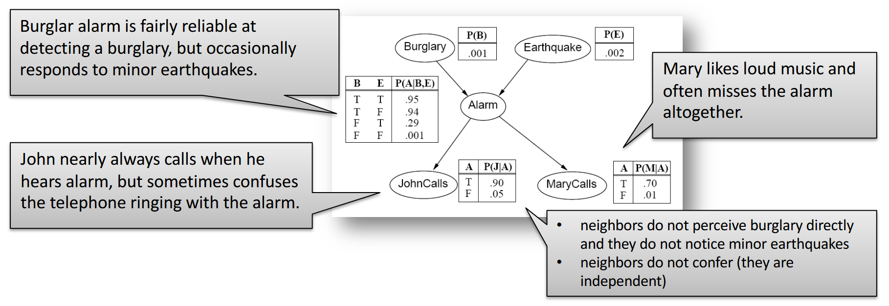

# Základy umělé inteligence

## Řešení úloh prohledáváním

- formulace úlohy
	- agent – vnímá prostředí pomocí senzorů, aktuátory mu umožňují jednat
		- racionální agent
			- zvolí akci, která maximalizuje jeho výkon
		- simple reflex agent
			- observation → action
		- model-based reflex agent
			- past state + past action + observation → state
			- state → action
		- goal-based agent
			- state + goal → action
	- reprezentace stavů agenta
		- atomic – stav je blackbox
			- dá se použít prohledávání
		- factored – stav je vektor
			- dá se použít constraint satisfaction, výroková logika, plánování
		- structured – stav je sada objektů, ty jsou propojeny
			- dá se použít (predikátová) logika prvního řádu
	- problem solving agent – typ goal-based agenta
		- atomická reprezentace stavů
		- cíl = množina cílových stavů
		- akce = přechody mezi stavy
		- hledáme posloupnost akcí, kterými se dostaneme z výchozího do nějakého cílového stavu
		- očekáváme, že prostředí je plně pozorovatelné, diskrétní, statické a deterministické
		- příklad – Lloydova patnáctka
			- ne všechny stavy jsou dosažitelné – zachovává se parita permutace
	- formulace problému
		- budeme potřebovat abstrakci prostředí (odstraníme detaily z prostředí)
			- validní abstrakce = abstraktní řešení můžeme expandovat do reálného řešení
			- užitečná abstrakce = vykonávání akcí v řešení je jednodušší než v původním problému
		- dobře definovaný problém
			- výchozí stav
			- přechodový model `(state, action) -> state`
			- goal test (funkce, která odpoví true/false podle toho, zda je daný stav cílový)
- stromové vs. grafové prohledávání
	- udržujeme si hranici (frontier) prozkoumané oblasti
	- graph search si navíc ukládá „uzavřenost“ vrcholu (jestli už jsme vrchol viděli)
		- takže nenastávají problémy s cykly
		- kvůli tomu, že stavový prostor může být nekonečný, neinicializujeme všechny vrcholy, ale místo toho použijeme hešovací tabulku
	- i tree search lze použít k prohledávání grafů s cykly, ale může se chovat divně
	- u prohledávání DAGů tree search nezaručuje, že se prohledané stavy nebudou opakovat (opakovat se můžou, pokud do stejného vrcholu vedou dvě orientované cesty)
- neinformované prohledávání (DFS, BFS, uniform-cost search)
	- BFS (fronta)
		- nejmělčí neexpandovaný vrchol je zvolen k expanzi
		- úplný pro konečně větvící grafy
		- optimální – pokud je cena cesty nerostoucí funkce hloubky
		- časová a prostorová složitost $O(b^{d+1})$, kde $b$ je stupeň větvení (branching factor, maximální výstupní stupeň) a $d$ je hloubka nejbližšího cíle
		- problém je s prostorovou složitostí
	- DFS (zásobník)
		- nejhlubší neexpandovaný vrchol je zvolen k expanzi
		- úplný pro graph search
			- úplný = nalezne řešení vždy, když existuje (a v opačném případě hlásí, že řešení neexistuje)
		- neúplný pro tree search (pokud algoritmus pustíme na grafu, který není strom)
		- suboptimální – nesměřuje k cíli
		- časová složitost $O(b^m)$, kde $m$ je maximální hloubka libovolného vrcholu
		- prostorová složitost $O(bm)$
		- pokud použijeme backtracking (generujeme jenom jednoho následníka místo všech), tak nám stačí dokonce jenom $O(m)$ paměti
			- DFS využívá to, že nám stav může vrátit všechny následníky (pak je držíme v paměti)
			- backtracking v daném vrcholu generuje jednoho následníka (takže všechny ostatní nemusíme držet v paměti)
				- ale někdy se nedá generovat jenom jeden následník
	- rozšíření BFS o funkci určující cenu kroku (tedy cenu hrany)
		- Dijkstrův algoritmus
		- taky se tomu říká uniform-cost search
		- $g(n)$ označuje cenu nejlevnější cesty ze startu do $n$
		- místo fronty použijeme prioritní frontu
- informované prohledávání (algoritmus A*, přípustné a konzistentní heuristiky)
	- best-first search
		- pro vrchol máme ohodnocovací funkci $f(n)$
		- $f(n)$ použijeme v Dijkstrově algoritmu místo $g(n)$
		- máme heuristickou funkci $h(n)$, která pro daný vrchol označuje odhadovanou cenu nejlevnější cesty do cílového stavu
		- best-first je třída algoritmů, kde máme uzly ohodnoceny nějakou funkcí a vybíráme nejmenší z nich
		- greedy best-first search
			- $f(n)=h(n)$
			- není optimální ani úplný
		- A\* algoritmus
			- $f(n)=g(n)+h(n)$, kde $h(n)$ je heuristika
			- optimální a úplný
			- typicky mu dojde paměť dřív než čas
	- co chceme od heuristiky $h(n)$ u algoritmu A*
		- přípustnost – $h(n)$ musí být menší rovna nejkratší cestě z daného vrcholu do cíle, musí být nezáporná
		- monotónnost (= konzistence)
			- mějme vrchol $n$ a jeho souseda $n'$
			- $c(n,a,n')$ je cena přechodu z $n$ do $n'$ (akcí $a$)
			- heuristika je monotónní, když $h(n)\leq c(n,a,n')+h(n')$
		- tvrzení: monotonie implikuje přípustnost, opačná implikace neplatí
		- tvrzení: pro monotónní heuristiku jsou hodnoty $f(n)$ neklesající po libovolné cestě
		- tvrzení: pokud je $h(n)$ přípustná, pak je A* u tree search optimální
			- do cíle nevedou žádné suboptimální cesty, takže si vystačíme s důkazem optimality Dijkstrova algoritmu
		- tvrzení: pokud je $h(n)$ monotónní, pak je A* u graph search optimální
			- s nemonotónní heuristikou jsme mohli najít suboptimální cestu do cíle
	- když heuristika $h_2$ dává větší hodnoty než $h_1$, tak se říká, že $h_2$ dominuje $h_1$
		- pokud je $h_2$ přípustná a pokud se $h_2$ nepočítá výrazně déle než $h_1$, tak je $h_2$ zjevně lepší než $h_1$

## Splňování omezujících podmínek

- problém splňování podmínek
	- = constraint satisfaction problem (CSP)
	- konečná množina proměnných
	- domény – konečné množiny možných hodnot pro každou proměnnou
	- konečná množina podmínek (constraints)
		- constraint je relace na podmnožině proměnných (je to podmnožina kartézského součinu domén)
		- constraint arity = počet proměnných, které podmínka omezuje
	- chceme přípustné řešení (feasible solution)
		- úplné konzistentní přiřazení hodnot proměnným
		- konzistentní … všechny podmínky jsou splněny
	- CSP můžeme řešit tree-search backtrackingem
		- úpravou proměnných v určitém pořadí můžeme získat větší efektivitu
		- můžeme pročistit hodnoty, které zjevně nesplňují podmínky
			- příklad
				- $a\in\set{3,4,5,6,7}$
				- $b\in\set{1,2,3,4,5}$
				- constraint: $a\lt b$
				- ale např. $a=6$ vůbec nedává smysl
				- odstraněním nekonzistentních hodnot dostaneme $a\in \set{3,4}$, $b\in\set{4,5}$
			- můžeme použít metodu hranové konzistence
- hranová konzistence (algoritmus AC-3)
	- = arc consistency (arc … orientovaná hrana)
	- uvažujme binární podmínky
		- libovolnou n-ární podmínku lze převést na balík binárních podmínek
	- každá binární podmínka odpovídá dvojici orientovaných hran v síti podmínek (vrcholy odpovídají proměnným)
		- pokud je mezi dvěma proměnnými více podmínek, můžeme je sloučit do jedné (abychom neměli multigraf)
	- orientovaná hrana $(V_i,V_j)$ je hranově konzistentní $\equiv$ pro každé $x\in D_i$ existuje $y\in D_j$ takové, že přiřazení $V_i=x$ a $V_j=y$ splní všechny binární podmínky pro $V_i,V_j$
		- může platit, že $(V_i,V_j)$ je hranově konzistentní, ale $(V_j,V_i)$ není
	- CSP je hranově konzistentní $\equiv$ každá hrana je hranově konzistentní (v obou směrech)
	- algoritmus AC-3
		- začínám se všemi hranami (podmínkami) ve frontě
		- postupně beru hrany z fronty a pro každou odstraním nekonzistentní prvky z domény
		- pokud jsem odstranil nějaké prvky z domény, musím zopakovat kontrolu pro hrany směřující do dané proměnné (kromě hrany opačné k té aktuálně zpracované)
		- složitost $O(cd^3)$, kde $c$ je počet podmínek, $d$ je velikost domény
			- $O(d^2)$ … kontrola konzistence
			- každá podmínka se ve frontě může objevit nejvýše $d$-krát, protože se z dané domény dá odstranit nejvýše $d$ prvků
		- optimální algoritmus má složitost $O(cd^2)$
	- hranová konzistence je typ lokální konzistence, negarantuje globální konzistenci
	- arc consistency (AC) vs. forward checking (FC)
		- FC je jednodušší (a rychlejší) než AC, slouží ke stejnému účelu – zrychlení prohledávání
		- FC na základě přiřazení do proměnné (v daném kroku prohledávání) pročistí domény dosud nepřiřazených proměnných
		- AC k tomu navíc zajišťuje vzájemnou kompatibilitu domén nepřiřazených proměnných
- algoritmus hledání řešení (MAC)
	- chceme zkombinovat AC a backtracking
	- problém uděláme hranově konzistentní
	- po každém přiřazení obnovíme hranovou konzistenci
	- této technice se říká *look ahead* nebo *constraint propagation* nebo *udržování hranové konzistence* (MAC, maintaining arc consistency)
	- kontroly FC/AC jsou v polynomiálním čase, kdežto strom stavů se větví exponenciálně

## Logické uvažování

- základy výrokové logiky (konjunktivní a disjunktivní normální forma)
	- viz [Společná matematika](spolecna-matematika.md)
	- výrokovou logiku lze použít k logickému odvozování znalostí na základě znalostní báze
- algoritmus DPLL
	- literál $\ell$ má čistý výskyt ve $\varphi$, pokud se $\ell$ vyskytuje ve $\varphi$ a opačný literál $\overline\ell$ se ve $\varphi$ nevyskytuje
		- takový literál můžu nastavit na 1
		- to neovlivní splnitelnost výroku, ale zmenší to množinu modelů, které jsem schopen nalézt
	- algoritmus
		- dokud $\varphi$ obsahuje jednotkovou klauzuli $\ell$, ohodnoť $\ell=1$ a proveď jednotkovou propagaci
			- každou klauzuli obsahující $\ell$ odstraníme (protože je takto splněna)
			- $\overline\ell$ odstraníme ze všech klauzulí, které ho obsahují (protože $\overline\ell$ nemůže zajistit splnění dané klauzule)
		- dokud existuje literál $\ell$, který má ve $\varphi$ čistý výskyt, ohodnoť $\ell=1$ a odstraň klauzule obsahující $\ell$
		- pokud $\varphi$ neobsahuje žádnou klauzuli, je splnitelný
		- pokud $\varphi$ obsahuje prázdnou klauzuli, není splnitelný
		- jinak zvol dosud neohodnocenou výrokovou proměnnou $p$ a zavolej algoritmus rekurzivně na $\varphi\land p$ a na $\varphi\land\neg p$
	- algoritmus běží v exponenciálním čase
	- praktické poznámky
		- čistý výskyt se zas tak moc nepoužívá
		- jednotková propagace
			- hledám klauzule o jedné proměnné
			- je v zásadě ekvivalentní hranové konzistenci
		- ke zkoušení hodnot proměnných se používá tree search
- dopředné a zpětné řetězení (Hornovské klauzule)
	- mám dotaz $\alpha$, ten vyjádřím jako výrokovou formuli
		- znalostní bázi $KB$ vyjádřím jako teorii
		- zajímá mě, zda $KB\models\alpha$ (to platí, právě když $KB\land\neg\alpha$ je nesplnitelné)
	- řetězení můžeme použít, pokud znalostní báze obsahuje pouze Hornovy klauzule
		- Hornova klauzule = disjunkce literálů, z nichž nejvýše jeden je pozitivní
		- Hornovu klauzuli $\neg p\lor\neg q\lor\neg r\lor s$ lze zapsat jako implikaci $p\land q\land r\implies s$
	- forward chaining … data-driven reasoning
		- $p\land q\land r\implies s$
		- pokud vím, že platí $p$, pak převedu na $q\land r\implies s$
		- jakmile se počet předpokladů sníží na 0, vím, že $s$ platí
		- je to v podstatě speciální případ použití rezolučního pravidla
			- rezolvuju to, co vím, s libovolnou klauzulí
		- algoritmus
			- každá proměnná má počítadlo proměnných, které na ni ukazují
			- postupně beru pravdivé proměnné, snižuju počítadla u proměnných, na které ukazují
			- jakmile u proměnné klesne počítadlo na nulu, zařadím mezi pravdivé proměnné
	- backward chaining … goal-driven reasoning
		- něco mě zajímá – pokouším se to odvodit
			- najdu klauzule, kde je nějaký literál z $\alpha$ na pravé straně implikace
			- tak dostanu další literály, které musím dokázat
			- postupuju tak dlouho, dokud se nedostanu k faktům (literálům, o nichž vím, že platí)
		- tohle se používá v Prologu
		- opět vlastně používám rezoluční pravidlo
			- to, co chci zjistit, rezolvuju s libovolnou klauzulí
	- forward chaining prochází spoustu klauzulí, které nás nezajímají – backward chaining může mít výrazně menší složitost
- rezoluce
	- mám dotaz $\alpha$, ten vyjádřím jako výrokovou formuli
		- znalostní bázi $KB$ vyjádřím jako teorii
		- zajímá mě, zda $KB\models\alpha$ (to platí, právě když $KB\land\neg\alpha$ je nesplnitelné)
	- $KB\land\neg\alpha$ převedeme do CNF → dostaneme množinu klauzulí (formuli $S$)
	- použijeme rezoluci (zkonstruujeme rezoluční zamítnutí formule $S$)
		- použitím rezolučního pravidla z klauzulí $\varphi\lor p$ a $\psi\lor\neg p$ dostaneme $\varphi\lor\psi$
		- zkoušíme spolu rezolvovat postupně všechny dvojice klauzulí
		- pokud v průběhu dostaneme prázdnou klauzuli, máme rezoluční důkaz $\alpha$ z $KB$
		- pokud se dostaneme do stavu, kdy nelze použít rezoluční pravidlo na žádnou dvojici klauzulí, tak víme, že neplatí $KB\models\alpha$

## Pravděpodobnostní uvažování

- základy teorie pravděpodobnosti (úplná sdružená distribuce, nezávislost, Bayesovo pravidlo)
	- viz [Společná matematika](spolecna-matematika.md)
	- pravděpodobnostní uvažování umožňuje agentovi zacházet s nejistotou
	- zdroji nejistoty jsou částečná pozorovatelnost (nelze snadno zjistit současný stav) a nedeterminismus (není jisté, jak akce dopadne)
	- agent si pamatuje belief state – pravděpodobnostní distribuce přes všechny možné stavy světa, v nichž se agent může nacházet
- pravděpodobnostní uvažování (vysčítání, normalizace)
	- někdy si můžeme udělat tabulku všech možností a určit jejich pravděpodobnosti (full joint probability distribution)
		- odpověď lze vyjádřit z ní (této metodě se říká enumeration, výčet) – ale u velkých tabulek je někdy potřeba posčítat příliš mnoho hodnot
	- $P(Y)=\sum_z P(Y\mid z)\cdot P(z)$
	- $P(Y\mid e)=\frac{P(Y\land e)}{P(e)}$
		- typicky nemusíme znát $P(e)$, stačí použít $\alpha P(Y\land e)$, kde $\alpha$ je normalizační konstanta
	- velkou tabulku můžeme někdy reprezentovat menším způsobem – pokud jsou proměnné podmíněně nezávislé
	- Bayesovo pravidlo … $P(Y\mid X)=\frac{P(X\mid Y)P(Y)}{P(X)}=\alpha P(X\mid Y) P(Y)$
		- lze odvodit z definice podmíněné pravděpodobnosti
		- pomůže nám při přechodu z příčinného k diagnostickému směru
			- $P(\mathrm{effect} \mid \mathrm{cause})$ … casual direction (příčinný směr), obvykle známý
			- $P(\mathrm{cause} \mid \mathrm{effect})$ … diagnostic direction (diagnostický směr), obvykle chceme zjistit
			- známe důsledky; chceme zjistit, jaké příčiny k nim mohly vést
	- naivní bayesovský model
		- $P(\text{Cause}, \text{Effect}_1, \dots, \text{Effect}_n) = P(\text{Cause})\prod_iP(\text{Effect}_i\mid\text{Cause})$
		- předpokládáme nezávislost důsledků
	- chain rule
		- $P(x_1,\dots,x_n)=\prod_iP(x_i\mid x_{i-1},\dots,x_1)$
		- využívá product rule (lze odvodit z definice podmíněné pravděpodobnosti)
- Bayesovské sítě: konstrukce a vztah k úplné sdružené distribuci
	- bayesovská síť je DAG, kde vrcholy odpovídají náhodným proměnným
		- šipky popisují závislost
		- u každého vrcholu jsou CPD tabulky, které popisujou jeho závislost na rodičích
			- CPD = conditional probability distribution
			- pro každou kombinaci hodnot rodičů jsou v CPD tabulce pravděpodobnosti hodnot dané náhodné proměnné
	- 
		- autorem obrázku je [Roman Barták](https://ktiml.mff.cuni.cz/~bartak/ui_intro/)
		- proměnné jsou binární, proto má tabulka vždy jen jeden sloupec (druhý sloupec by mohl obsahovat pravděpodobnost, že jev nenastane – lze ho dopočítat z prvního sloupce)
	- konstrukce bayesovské sítě
		- nějak si uspořádáme proměnné
			- lepší je řadit je od příčin k důsledkům – budeme mít menší síť a CPD tabulky se nám budou vyplňovat snáze
		- jdeme odshora dolů, přidáváme správné hrany
		- příklad: MaryCalls, JohnCalls, Alarm, Burglary, Earthquake (záměrně jdeme od důsledků k příčinám, byť to není praktické)
			- z MaryCalls povede hrana do JohnCalls, protože nejsou nezávislé (když volá Mary, tak je větší šance, že volá i John)
			- z obou povede hrana do Alarmu
			- z Alarmu vedou hrany do Burglary a Earthquake (ale hrany z JohnCalls a MarryCalls tam nepovedou – na těch hranách nezáleží, jsou nezávislé)
			- z Burglary povede hrana do Earthquake, protože pokud zní alarm a k vloupání nedošlo, tak pravděpodobně došlo k zemětřesení
			- akorát se nám v tomto pořadí budou špatně určovat CPD
	- bayesovská síť zachycuje úplnou sdruženou (joint) distribuci
		- dokážeme určit pravděpodobnost libovolné kombinace hodnot náhodných proměnných
		- pronásobíme mezi sebou hodnoty z tabulek
- Bayesovské sítě: exaktní odvozování (enumerace, eliminace proměnných)
	- z bayesovských sítí můžeme provádět inferenci – odvozovat pravděpodobnost proměnných pomocí pravděpodobností *skrytých* proměnných
	- $P(X\mid e)=\alpha P(X,e)=\alpha\sum_y P(X,e,y)$
		- kde pravděpodobnost $X$ odvozujeme, $e$ jsou pozorované proměnné (evidence) a $y$ jsou hodnoty další skryté proměnné $Y$
	- přičemž $P(X,e,y)$ lze určit pomocí CPD tabulek
		- když nemůžeme určit konkrétní hodnotu pravděpodobnosti přímo, tak výpočet rozvětvíme
		- některé větve se objeví vícekrát – hodí se nám dynamické programování
	- používáme *faktory* (tabulky odpovídající CPD tabulkám)
		- tabulky s faktory mezi sebou můžeme násobit
		- eliminace
			- mějme faktor s pravděpodobnostmi $P(A,B,C)$ pro všechny možné kombinace hodnot proměnných
			- můžeme ho rozdělit na dvě půlky (v jedné bude všude platit $A$, v druhé $\neg A$)
			- tyhle dvě půlky můžeme sečíst (vždy odpovídající řádky)
			- tak eliminujeme proměnnou $A$, dostaneme faktor s pravděpodobnostmi $P(B,C)$
- Bayesovské sítě: aproximační odvozování (Monte Carlo, zamítání, vážení věrohodností)
	- odhadujeme hodnoty, které je těžké přímo spočítat
		- třeba když je síť moc velká a hustě propojená
		- zajímá nás $P(X\mid e)$
	- generujeme hodně vzorků, použijeme statistiku
	- pravděpodobnostní rozdělení náhodných veličin známe (postupujeme topologicky bayesovskou sítí a generujeme hodnoty)
	- jak generovat vzorky?
		- rejection sampling = zahodíme vzorky, kde neplatí $e$
			- odhadneme $P(X\mid e)\approx\frac{N(X,e)}{N(e)}$
				- $N(X,e)$ … počet vzorků, kde platí $X,e$
			- riziko, že zahodíme příliš mnoho vzorků
		- likelihood weighting
			- zafixujeme (ignorujeme) $e$, generujeme jen zbylé proměnné
			- počtům $N$ přidělíme váhy podle pravděpodobnosti $e$ (např. místo toho, abychom zahodili cca 90 % vzorků, přiřadíme těm počtům váhu 0.1)
			- problém nastává, když jsou váhy příliš malé

## Reprezentace znalostí

- situační kalkulus, problém rámce
	- problém rámce
		- návrh: stav světa/agenta budeme popisovat pomocí časově anotovaných výrokových proměnných
		- musíme definovat spoustu axiomů, které zajistí, že se hodnoty proměnných mezi časovými kroky nemění náhodně
		- tak bychom snadno zahltili odvození pomocí výrokové logiky, protože bychom měli hodně akcí a stavů
	- jak předejít opakování axiomů pro různé časy a podobné akce?
		- použijeme predikátovou logiku prvního řádu (*situation calculus*)
		- náš modelovaný svět se vyvíjí – postupně nastávají různé *situace*
			- úvodní situace … $s_0$
			- situace po aplikace akce $a$ na situaci $s$ … $\text{Results}(s,a)$
		- stavy jsou definovány jako relace mezi objekty
			- pokud se relace mění, musíme přidat další argument označující situaci, v níž relace platí: $\mathrm{at}(\mathrm{robot}, \mathrm{location}, s)$
			- pro stálé relace takový argument není potřeba: $\mathrm{connected}(l, l')$
		- podmínky (předpoklady) akcí jsou definovány possibility axiomem
			- obecný tvar: $\varphi(s)\implies \text{Poss}(a,s)$
				- kde $\varphi$ je formule popisující předpoklady akce $a$
			- např. $\mathrm{at}(a, l, s) \land \mathrm{connected}(l, l') \implies \mathrm{Poss}(\mathrm{go}(a, l, l'), s)$
		- vlastnosti dalšího stavu jsou popsány pomocí successor-state axiomů
			- např. $\mathrm{Poss}(a, s) \implies$ $(\mathrm{at}(a,y,\mathrm{Results}(s, a)) \iff a=\mathrm{go}(a,x,y) \lor (\mathrm{at}(a,y,s) \land a\neq \mathrm{go}(a,y,z))$
		- plánování se provádí tak, že se zeptáme, zda existuje situace, kde je cílová podmínka pravdivá
- Markovské modely – filtrace, predikce, vyhlazování, nejpravděpodobnější průchod
	- každý stav světa je popsán množinou náhodných proměnných
		- skryté náhodné proměnné $X_t$ – popisují reálný stav
		- pozorovatelné náhodné proměnné $E_t$ – popisují, co pozorujeme
		- uvažujeme diskrétní čas, takže $t$ označuje konkrétní okamžik
		- množinu proměnných od $X_a$ do $X_b$ budeme značit jako $X_{a:b}$
	- formální model
		- transition model
			- určuje pravděpodobnostní rozložení proměnných posledního stavu, když známe jejich předchozí hodnoty … $P(X_t\mid X_{0:t-1})$
			- zjednodušující předpoklady
				- další stav závisí jen na předchozím stavu … *Markov assumption*
				- všechny přechodové tabulky $P(X_t\mid X_{t-1})$ jsou identické přes všechna $t$ … *stationary process*
		- sensor (observation) model
			- popisuje, jak pozorované proměnné závisí na ostatních proměnných … $P(E_t\mid X_{0:t},E_{1:t-1})$
			- zjednodušující předpoklad: pozorování záleží jen na aktuálním stavu … *sensor Markov assumption*
	- základní inferenční úlohy
		- filtrování – znám minulá pozorování, zajímá mě přítomný stav
			- $P(X_{t+1}\mid e_{1:t+1})=P(X_{t+1}\mid e_{1:t},e_{t+1})$
				- použijeme Bayesovo pravidlo
			- $=\alpha\cdot P(e_{t+1}\mid X_{t+1},e_{1:t})\cdot P(X_{t+1}\mid e_{1:t})$
				- použijeme *sensor Markov assumption*
			- $=\alpha\cdot P(e_{t+1}\mid X_{t+1})\cdot P(X_{t+1}\mid e_{1:t})$
			- $=\alpha\cdot P(e_{t+1}\mid X_{t+1})\cdot \sum_{x_t}P(X_{t+1}\mid x_t,e_{1:t})\cdot P(x_t\mid e_{1:t})$
			- $=\alpha\cdot P(e_{t+1}\mid X_{t+1})\cdot \sum_{x_t}P(X_{t+1}\mid x_t)\cdot P(x_t\mid e_{1:t})$
			- užitečný filtrovací algoritmus si musí udržovat odhad současného stavu, jelikož je vzorec rekurzivní
			- používá se *forward* algoritmus
		- předpověď (prediction) – znám minulá pozorování, zajímají mě budoucí stavy
			- vlastně jako filtering, akorát nepřidávám další pozorování (měření)
			- $P(X_{t+k+1}\mid e_{1:t})=\sum_{x_{t+k}} P(X_{t+k+1}\mid x_{t+k})\cdot P(x_{t+k}\mid e_{1:t})$
			- po určitém čase (*mixing time*) distribuce předpovědí konverguje ke stacionárnímu rozdělení daného markovského procesu a zůstane konstantní
		- vyhlazování (smoothing) – znám minulá pozorování, zajímají mě minulé stavy
			- $P(X_k\mid e_{1:t})=P(X_k\mid e_{1:k},e_{k+1:t})$
				- použijeme Bayesovo pravidlo
			- $=\alpha\cdot P(X_k\mid e_{1:k})\cdot P(e_{k+1:t}\mid X_k,e_{1:k})$
				- použijeme *sensor Markov assumption*
			- $=\alpha\cdot P(X_k\mid e_{1:k})\cdot P(e_{k+1:t}\mid X_k)$
			- přitom levý člen známe z filteringu (je to „dopředný směr“), pravý je „zpětný směr“ z naměřených hodnot *v budoucnosti* (relativně vůči danému okamžiku)
			- používá se *forward-backward* algoritmus
		- nejpravděpodobnější vysvětlení (most likely explanation) – znám minulá pozorování, zajímá mě nejpravděpodobnější posloupnost minulých stavů
			- hledáme posloupnost $X_{1:t}$ takovou, že má největší $P(X_{1:t+1}\mid e_{1:t+1})$
			- opět existuje rekurzivní vzorec – podíváme se na pravděpodobnosti předchozích stavů a na nejpravděpodobnější „cesty“ do těchto stavů
			- používá se *Viterbiho* algoritmus
- skryté Markovské modely (HMM) vs. dynamické Bayesovské sítě
	- skryté Markovovy modely
		- předpokládejme, že stav procesu je popsán jedinou diskrétní náhodnou proměnnou $X_t$ (a máme jednu proměnnou $E_t$ odpovídající pozorování)
		- pak můžeme všechny základní algoritmy (filtering, prediction, smoothing, …) implementovat maticově
	- dynamická bayesovská síť
		- umožňuje popsat víc náhodných proměnných
		- reprezentuje časový pravděpodobnostní model
		- zachycuje vztah mezi minulým a současným časovým okamžikem (minulou a současnou vrstvou)
		- každá stavová proměnná má rodiče ve stejné vrstvě nebo v předchozí (podle Markovova předpokladu)
	- dynamická bayesovská síť (DBN) vs. skrytý Markovův model (HMM)
		- skrytý Markovův model je speciální případ dynamické bayesovské sítě
		- dynamická bayesovská síť může být kódovaná jako skrytý Markovův model
			- jedna náhodná proměnná ve skrytém Markovově modelu je n-tice hodnot stavových proměnných v dynamické bayesovské síti
			- v HMM vlastně celý stav světa komprimujeme do jedné náhodné proměnné – v DBN jich můžeme mít víc
		- vztah mezi DBN a HMM je podobný jako vztah mezi běžnými bayesovskými sítěmi a tabulkou s *full joint probability distribution*
			- DBN je úspornější

## Automatické plánování

- formulace plánovacího problému (definice operátoru)
	- stav světa je reprezentován jako množina proměnných
		- stav je popsán atomy, které platí (ostatní neplatí, používáme předpoklad uzavřeného světa)
		- pravdivnostní hodnota některých atomů se mění … fluents
		- u jiných atomů je pravdivostní hodnota stálá … rigid atoms
	- schémata akcí (operátory) popisují možnosti agenta
		- schéma akce (operátor) popisuje akci, aniž by specifikovalo objekty, na které se akce vztahuje
		- operátor je trojice (název, předpoklady, důsledky)
			- název – obsahuje rovněž parametry operátoru (proměnné, které se objevují v předpokladech a důsledcích)
			- předpoklady – musí platit v daném stavu, aby se operátor dal použít
			- důsledky – literály (fluenty!), které budou platit, jakmile se operátor provede
		- akce je plně zinstanciovaný operátor (za proměnné jsme dosadili konstanty)
		- akce je relevantní pro cíl $g\equiv$ přispívá cíli $g$ a její důsledky (efekty) nejsou v konfliktu s $g$
		- dále definujeme výsledek aplikace akce na stav a regresní množinu pro cíl a akci
	- terminologie
		- popisu operátorů se obvykle říká doménový model
		- plánovací problém je trojice $(O,s_0,g)$, kde $O$ je doménový model, $s_0$ je výchozí stav a $g$ je cílová podmínka
		- plán je posloupnost akcí
	- plánování je realizováno prohledáváním stavového prostoru
		- ten je mnohdy dost velký
- dopředné a zpětné plánování
	- forward (progression) planning
		- postupujeme od výchozího k cílovému stavu
		- prohledávací algoritmus potřebuje dobrou heuristiku
	- backward (regression) planning
		- prozkoumávají se jen relevantní akce → menší větvení než u forward planningu
		- používá množiny stavů spíše než individuální stavy → je těžké najít dobrou heuristiku

## Markovské rozhodovací procesy (MDP)

- formulace problému (výpočet užitku, strategie)
	- řešíme sekvenční rozhodovací problém
	- pro plně pozorovatelné stochastické (nedeterministické) prostředí
	- máme Markovův přechodový model a reward
		- přechodový model $P(s'\mid s,a)$ … pravděpodobnost dosažení stavu $s'$, když ve stavu $s$ použiju akci $a\in A(s)$
		- odměna (reward) $R(s)$ … získá ji agent ve stavu $s$, je krátkodobá
		- utility function $U([s_0,s_1,s_2,\dots])=R(s_0)+\gamma R(s_1)+\gamma^2 R(s_2)+\dots$
			- kde $\gamma$ je *discount factor*, číslo mezi 0 a 1
				- jak moc si ceníme budoucích odměn
			- utility je „dlouhodobá lokální odměna“
			- hodnota utility funkce je konečná i pro nekonečnou posloupnost stavů, protože zjevně $U([s_0,\dots])\leq \frac{R_\text{max}}{1-\gamma}$
	- řešením MDP je policy (strategie) – funkce doporučující akci pro každý stav
		- tzn. strategie je zobrazení $\pi:S\to A$
		- potřebujeme zobrazení, protože kdyby řešením byla fixní sekvence akcí, tak by to nefungovalo pro stochastická prostředí (mohlo by se stát, že skončíme v jiném stavu, než jsme mysleli)
		- optimální strategie $\equiv$ strategie, která vrací největší střední hodnotu užitku (utility)
		- optimální strategie nezávisí na počátečním stavu – je jedno, kde jsme začali, pro nalezení nejvhodnější další akce by měl být důležitý jen aktuální stav
- Bellmanova rovnice
	- opravdový užitek stavu je reward (odměna) stavu ve spojení se střední hodnotou užitku následného stavu → to vede na Bellmanovu rovnici
	- vezmu reward a discountovaný užitek okolí
	- akorát nevím, kterou akci provedu, tak vezmu všechny a maximum přes ně (násobím jejich užitek pravděpodobností)
	- $U(s)=R(s)+\gamma\max_a\sum_{s'}P(s'\mid s,a)\cdot U(s')$
- iterace hodnot, iterace strategií
	- soustava Bellmanových rovnic není lineární – obsahuje maximum
		- můžu je řešit aproximací
		- použiju iterativní přístup
			- nastavím nějak užitky – třeba jim nastavím nuly
			- provedu update – aplikuju Bellmanovu rovnici
			- iteruju, dokud to nezkonverguje
		- → **value iteration**
	- strategie se ustálí dřív než užitky
		- policy loss … vzdálenost mezi optimálním užitkem a užitkem strategie
		- můžeme iterativně zlepšovat policy, dokud to jde
		- → **policy iteration**
		- z rovnic nám zmizí maximum → máme lineární rovnice
			- policy evaluation = nalezení řešení těchto rovnic (tak najdeme utilities stavů)
			- gaussovka je $O(n^3)$
		- algoritmus doběhne, protože policies je jenom konečně mnoho a vždycky hledáme tu lepší
- POMDP (základní definice)
	- máme přechodový model $P(s'\mid s,a)$, akce $A(s)$ i odměny $R(s)$
	- navíc nám přibude sensor model $P(s\mid e)$
	- místo reálných stavů můžeme používat ty domnělé (belief states)
	- modely přechodů a senzorů jsou reprezentovány dynamickou bayesovskou sítí
	- přidáme rozhodování a užitky, čímž dostaneme dynamickou rozhodovací síť
	- generujeme si stromeček, kde se střídají vrstvy akcí a belief states
	- používá se algoritmus podobný algoritmu *expected minimax*

## Hry a teorie her

- algoritmy Minimax a alfa-beta prořezávání
	- algoritmus minimax umožňuje u hry dvou hráčů s nulovým součtem a s úplnou informací určit optimální strategie obou hráčů
		- procházíme strom hry
		- v listech nebo v určité hloubce získáme ohodnocení vrcholů
			- omezení hloubky je důležité zvláště u her, jejichž stromy se hodně větví – je potřeba zvolit vhodný přístup k ohodnocení konkrétní herní situace
		- následně vždy v rodiči zvolíme minimum nebo maximum ze synů (v závislosti na tom, který hráč je zrovna na tahu – volba minima a maxima se střídají stejně jako tahy hráčů)
		- takto pro každý vrchol určíme, jaký tah je v dané situaci optimální
			- za předpokladu, že protihráč hraje optimálně – což je nejhorší možný scénář
	- alfa-beta prořezávání
		- je to rozšíření minimaxu, které může zrychlit jeho běh tak, že omezuje počet větví, které je potřeba projít a vyhodnotit
		- vycházíme z následujícího pozorování
			- v algoritmu typicky hledáme maximum z několika hodnot, které jsou minimy (nebo naopak)
			- v určitém vrcholu máme seznam doposud určených minim z jednotlivých větví (z nich je nějaké maximální)
			- snažíme se určit další minimum, na základě jedné z podvětví máme nějaké prozatímní minimum (museli bychom projít další podvětve pod daným vrcholem, abychom dostali výsledné minimum)
			- pokud je tohle prozatímní minimum menší než prozatímní maximum (ve vyšší úrovni), tak už ty další větve nemusíme procházet, protože výsledné minimum nemůže být větší než prozatímní minimum
		- alfa-beta prořezávání nemá vliv na výsledek algoritmu
		- záleží na pořadí, ve kterém tahy (větve) procházíme
		- minimax se obvykle používá rekurzivně, meze určující prořezávání (pro jednoho hráče je to maximum, pro druhého minimum) se do funkce předávají jako parametry alfa a beta
- základy teorie her (vězňovo dilema, Nashovo ekvilibrium)
	- jednou z úloh teorie her je volba vhodné strategie – tedy návodu, jak hru hrát
		- uvažujeme hry v normálním tvaru: hru tvoří hráči, jejich akce a užitkové funkce
		- hráči táhnou zároveň, každý provede jedinou akci
		- strategie může být čistá (přímo konkrétní akce) nebo smíšená (pravděpodobnostní rozdělení přes akce)
	- díváme se na optimalitu strategie nebo strategického profilu (množiny strategií všech hráčů) z různých úhlů pohledu
		- strategie $s_1$ dominuje strategii $s_2$, pokud při volbě $s_1$ získá hráč větší užitek než při volbě $s_2$ nehledě na strategie ostatních hráčů
			- strategie je dominantní, pokud dominuje všechny ostatní strategie
		- *Nashovo ekvilibrium* je takový strategický profil, že by žádný hráč neměnil svou strategii, kdyby znal strategie ostatních
		- strategický profil $s$ *Pareto dominuje* profil $s'$, pokud si změnou z $s'$ na $s$ žádný hráč nepohorší, ale aspoň jeden hráč si polepší
			- strategický profil je *Pareto optimální*, pokud neexistuje profil, který by ho Pareto dominoval
		- další zajímavým typem ekvilibria je korelované ekvilibrium
	- vězňovo dilema
		- dva hráči (vězni)
		- vězeň může vypovídat (testify/defect) nebo odmítnout vypovídat (refuse/cooperate)
			- oba vypovídají → oba ztrácejí málo (užitek -5)
			- jeden vypovídá, druhý ne → jeden neztratí nic (užitek 0), druhý hodně ztratí (užitek -10)
			- oba odmítnou → oba ztrácejí velmi málo (užitek -1)
		- *vypovídat* je čistá dominantní strategie
			- ale když vypovídají oba hráči, tak vyhrála policie – lepší by bylo, kdyby oba odmítli vypovídat
			- našli jsme Nashovo ekvilibrium – nikdo neprofituje ze změny strategie, pokud druhý hráč zůstane u stejné strategie
- mechanism design (typy aukcí)
	- jak se pozná dobrý mechanismus aukce
		- maximalizuje výnos pro prodejce
		- vítěz aukce je agent, který si věci nejvíc cení
		- zájemci by měli mít dominantní strategii
	- anglická aukce (ascending-bid)
		- začnu s $b_\text{min}$, pokud je to nějaký zájemce ochotný zaplatit, tak se ptám na $b_\text{min}+d$
		- strategie: přihazuju, dokud cena není vyšší než moje hodnota
			- dominantní strategie
	- holandská aukce
		- začíná se vyšší cenou, snižuje se, dokud ji někdo nepřijme
	- obálková aukce
		- největší nabídka vítězí
		- neexistuje dominantní strategie
			- pokud věříš, že maximum ostatní nabídek je $b_0$, tak bys měl nabídnout $b_0+\varepsilon$, pokud je to menší částka než hodnota, kterou pro tebe věc má
	- obálková second-price aukce (Vickrey)
		- vyhraje ten, kdo nabídne nejvyšší cenu, platí druhou nejvyšší nabídnutou cenu
		- dominantní strategie je tam dát svoji hodnotu
	- VCG mechanismus
		- lze použít při obecnějších (víceparametrických) aukcích

## Strojové učení

- základní druhy učení (s učitelem, bez učitele, zpětnovazební)
	- učení bez učitele (unsupervised learning) – agent se učí vzory ve vstupu, aniž by měl nějakou explicitní zpětnou vazbu
	- zpětnovazební učení (reinforcement learning) – agent dostává odměny nebo tresty podle toho, jak se chová v prostředí
	- učení s učitelem (supervised learning) – agent se učí funkci, která mapuje vstupy na výstupy
- rozhodovací stromy (definice, konstrukce)
	- přijímá vektor hodnot atributů, vrací výslednou hodnotu
	- na základě tabulky příkladů se dá postavit strom
		- každý vnitřní vrchol odpovídá testu jednoho atributu
		- dá se zjistit odůvodnění konkrétního rozhodnutí
		- strom se dá postavit hladovou metodou rozděl a panuj
			- k dělení se používá entropie
		- každý list určuje hodnotu, kterou klasifikační funkce vrátí
- regrese, SVM (základní principy)
	- při regresi přiřazujeme položce $x$ vhodnou funkční hodnotu $y$
		- je to jedna z úloh strojového učení s učitelem
	- support-vector machine (SVM)
		- stojí na lineární regresi
		- pokud lze třídy oddělit nadrovinou, zvolí takovou, která je nejdál od všech dat (příkladů)
		- nadrovina … maximum margin separator
		- pokud nejde použít nadrovinu, provede mapování do vícedimenzionálního prostoru (pomocí kernel function), kde už příklady půjde oddělit
		- SVMs jsou neparametrická metoda – příklady blíže k separátoru jsou důležitější, říká se jim support vectors (vlastně definují ten separátor)
- Bayesovské učení, EM algoritmus
	- bayesovské učení
		- máme několik hypotéz
		- na základě pozorování upravujeme jejich pravděpodobnost
		- *maximálně věrohodná hypotéza*
			- z množiny hypotéz je to ta, která přiřazuje naměřeným datům největší pravděpodobnost
			- $\mathrm{argmax}_h\,p(\mathrm{data}\mid h)$ nebo také $\mathrm{argmax}_h\,p_h(\mathrm{data})$
			- pokud je hypotéza parametrizovaná (hledáme parametr), tak můžeme hledat hodnotu parametru, pro níž je derivace logaritmu pravděpodobnosti nulová
				- tomu se říká maximum-likelihood parameter learning
		- z $p(\mathrm{data}\mid h)$ můžeme získat $p(h\mid\mathrm{data})=\frac{p(\mathrm{data}\mid h)p(h)}{\sum_{h'} p(\mathrm{data}\mid h')p(h')}$
			- pokud mají všechny hypotézy stejné apriorní pravděpodobnosti, stačí vzít $p(\mathrm{data}\mid h)$ a normalizovat je, jelikož $\frac{p(h)}{\sum_{h'} p(\mathrm{data}\mid h')p(h')}$ bude konstantní
		- *bayesovsky optimální predikce* pravděpodobnosti pro vstupní data a konkrétní predikci $z$
			- $p(z\mid\mathrm{data})=\sum_h p(z\mid h)\cdot p(h\mid\mathrm{data})$
	- algoritmus expectation-maximization (EM)
		- používá se k maximum-likelihood odhadu, pokud se nedá jednoduše spočítat
		- předstíráme, že známe parametry modelu (na začátku je určíme náhodně)
		- iterujeme dva kroky (dokud to nezkonverguje)
			- dopočteme střední hodnoty skrytých proměnných (E-step, expectation)
			- upravíme parametry, abychom maximalizovali likelihood modelu (M-step, maximization)
		- příklad
			- chceme odhadnout průměrnou výšku mužů a žen
			- máme data o naměřených výškách, ale chybí nám údaje o pohlaví (zda je to výška muže nebo ženy)
				- třídy označíme jako 0 (muži), 1 (ženy)
			- začneme tak, že oba parametry (průměrná výška mužů $\mu_0$, průměrná výška žen $\mu_1$) inicializujeme náhodně
			- v E-kroku spočítáme střední hodnoty skrytých proměnných
				- pohlaví je skrytá proměnná (pro každou naměřenou výšku)
				- střední hodnota bude odpovídat pravděpodobnosti, že konkrétní výška patří ženě
			- v M-kroku upravíme hodnoty $\mu_0,\mu_1$, abychom maximalizovali likelihood modelu
				- tedy spočítáme vážený průměr výšek
				- váhy odpovídají pravděpodobnosti, že výška patří muži (u $\mu_0$) / ženě (u $\mu_1$)
			- poznámka: může se jednoduše stát, že nám parametry $\mu_0,\mu_1$ vyjdou naopak (EM je metoda učení bez učitele, hledá vzory v datech, nezajišťuje jejich intepretaci)
- pasivní zpětnovazební učení (definice, metody ADP a TD)
	- uvažujeme agenta, který se účastní MDP (markovského rozhodovacího procesu)
	- pasivní učení – známe strategii $\pi$ (je pevně daná) a učíme se, jak je dobrá (učíme se utility funkci)
	- agent nezná přechodový model ani reward function
	- přímý odhad utility
		- máme trace (běh) mezi stavy, z toho počítáme utility function
		- odhadujeme užitky jednotlivých stavů
			- užitek stavu = *reward-to-go* (tedy odměna tohoto a všech budoucích stavů)
			- odměny z budoucích stavů bychom mohli zohleďnovat s discount factorem $\gamma$ (viz výše)
		- užitky pro jednotlivé stavy prostě průměrujeme
		- v podstatě učení s učitelem – na vstupu je stav, na výstupu užitek stavu (neboli *reward-to-go*)
		- nevýhoda
			- utilities nejsou nezávislé, ale řídí se Bellmanovými rovnicemi
			- hledáme v prostoru hypotéz, který je výrazně větší, než by musel být (obsahuje spoustu funkcí, co porušují Bellmanovy rovnice) → algoritmus konverguje pomalu
	- adaptivní dynamické programování (ADP)
		- agent se učí přechodový model a odměny
		- utilitu počítá z Bellmanových rovnic třeba pomocí value iteration
			- využíváme toho, že užitky nejsou nezávislé
		- ADP zajišťuje, že jsou odhady užitků konzistentní
	- temporal-difference (TD) learning
		- upravuje stav, aby odpovídal aktuálně pozorovanému následníkovi
		- když dojde k přechodu ze stavu $s$ do stavu $s'$, tak na $U^\pi(s)$ použijeme update: $U^\pi(s)\leftarrow U^\pi(s)+\alpha\cdot (R(s)+\gamma\cdot U^\pi(s')-U^\pi(s))$
			- $\alpha$ je learning rate
		- vlastnosti
			- nepotřebuju přechodový model (je to model-free metoda)
			- konverguje to pomaleji než ADP
- aktivní zpětnovazební učení (definice, explorace vs. exploitace, Q-učení, SARSA)
	- uvažujeme agenta, který se účastní MDP (markovského rozhodovacího procesu)
	- aktivní učení – agent se učí strategii (policy; jak se rozhodovat) a taky utility funkci
	- mohli bychom použít ADP, tím vznikne hladový agent, který opakuje zažité vzory (nezkouší nové věci)
	- jak může volba optimální akce vést k suboptimálním výsledkům?
		- naučený model není stejný jako reálné prostředí
		- akce nejsou pouze zdrojem odměn, ale také přispívají k učení – ovlivňují vstupy
		- zlepšováním modelu se postupně zvětšují odměny, které agent získává
	- je potřeba najít optimum mezi exploration a exploitation
		- pure exploration – agent nepoužívá naučené znalosti
		- pure exploitation – riskujeme, že bude agent pořád dokola opakovat zažité vzory
		- základní myšlenka: na začátku preferujeme exploration, později lépe rozumíme světu, takže nepotřebujeme tolik prozkoumávat
	- exploration policies
		- první možná exploration policy: agent si zvolí náhodnou akci s pravděpodobností $\frac1t$ (kde $t$ je čas), jinak se řídí hladovou strategií
			- nakonec to konverguje k optimální strategii, ale může to být extrémně pomalé
		- rozumnější přístup je přiřadit váhu akcím, které agent ještě nevyzkoušel
		- existuje alternativní TD metoda, říká se jí Q-learning
			- $Q(s,a)$ označuje hodnotu toho, že provedeme akci $a$ ve stavu $s$
			- q-hodnoty jsou s utilitou ve vztahu $U(s)=\max_a Q(s,a)$
			- můžeme napsat omezující podmínku $Q(s,a)=R(s)+\gamma\sum_{s'} P(s'\mid s,a)\cdot \max_{a'}Q(s',a')$
				- tohle vyžaduje, aby se model naučil i $P(s'\mid s,a)$
			- Q-learning ale nevyžaduje model přechodů – je to bezmodelová (model-free) metoda, potřebuje akorát q-hodnoty
			- $Q(s,a)\leftarrow Q(s,a)+\alpha\cdot (R(s)+\gamma\cdot\max_{a'}Q(s',a')-Q(s,a))$
				- počítá se, když je akce $a$ vykonána ve stavu $s$ a vede do stavu $s'$
		- state-action-reward-state-action (SARSA)
			- je to varianta Q-learningu
			- $Q(s,a)\leftarrow Q(s,a)+\alpha\cdot (R(s)+\gamma\cdot Q(s',a')-Q(s,a))$
				- pravidlo se aplikuje na konci pětice $s,a,r,s',a'$, tedy po aplikaci akce $a'$
		- pro hladového agenta (který volí podle největšího $Q$) jsou algoritmy SARSA a základní Q-learning stejné
			- rozdíl je vidět až u agenta, který není úplně hladový, ale provádí i průzkum (exploration)
		- u SARSA se bere v úvahu reálně zvolená akce
			- SARSA je on-policy – jeho strategie se upravuje přímo za běhu algoritmu
			- Q-learning je off-policy – algoritmus se učí optimální strategii, ale během učení se může používat úplně jiná strategie
	- při aktivním učení je výhodnější učit se q-hodnoty než užitkovou funkci
		- abychom našli nejvýhodnější akci v daném stavu pomocí utility, museli bychom při výpočtu použít pravděpodobnost, že danou akcí přejdeme do určitého stavu
		- q-hodnota nám dá přímo řekne, jak je užitečné provést danou akci – k volbě nejlepší akce nepotřebujeme přechodový model
